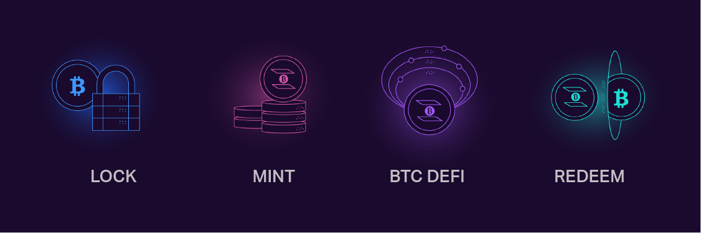

# InterBTC & Kintsugi Documentation

## Radically Open Bitcoin for Decentralized Finance 

**interBTC** is Bitcoin on any blockchain. A 1:1 Bitcoin-backed asset, fully collateralized, interoperable, and censorship-resistant. interBTC will be hosted as a Polkadot parachain and connected to Cosmos, Ethereum and other major DeFi networks. 

**Kintsugi** is Interlay’s canary network for interBTC, a testnet with real economic value deployed on Kusama (Polkadot’s canary network). Kintsugi and interBTC share the same code base - with the difference that Kintsugi will be 2-3 releases ahead of interBTC with more experimental features. 

### Issue, Trade, and Redeem

The life-cycle of interBTC follows the three main protocols:

- **Issue:** Lock your BTC with a Vault. Pick one, or run your own. Your BTC is always safe and insured by Vault collateral. 
- **Mint:** Get interBTC at a 1:1 ration to your locked BTC.
- **BTC DeFi:** Earn on your Bitcoin. Use interBTC as collateral, for lending, yield farming and more. On Polkadot, Kusama, Cosmos, Ethereum and other major DeFi platforms. 
- **Redeem:** Redeem interBTC for actual BTC on Bitcoin - trustless and anytime you want.

### Radically Open & Secured by Insurance

What makes interBTC unique is the strict dedication to being trustless and decentralized.

- **Secured by Insurance**. Vaults lock collateral on the interBTC parachain in various digital assets - in a MakerDAO-inspired multi-collateral system. If Vaults misbehave, their collateral is slashed and users reimbursed. As a user, you only trust that Bitcoin and the DeFi platform you use are secure. 

- **Radically Open**. Anyone can become a Vault and help secure interBTC, anytime. Yes, you can run your own Vault!

## Guides

**1.  [Learn about Kintsugi, the canary network on Kusama - going live NOW](kintsugi/overview.md)**

**2.  [Get a detailed overview of interBTC](start/overview.md)**

**3.  [Issue your first interBTC](start/issue.md)**

**4.  [Redeem interBTC for BTC](start/redeem.md)**

**5.  [Understand how a Vault works](vault/overview.md)**

**6.  [Operate your own Vault](vault/guide.md)**

**7.  [Build your own Dapps with interBTC](developers/integration.md)**

## Contributions

interBTC is an open-source project. We welcome contributions to the code and documentation. Feel free to checkout our [GitHub](https://github.com/interlay) or [Discord](https://discord.gg/KgCYK3MKSf).
