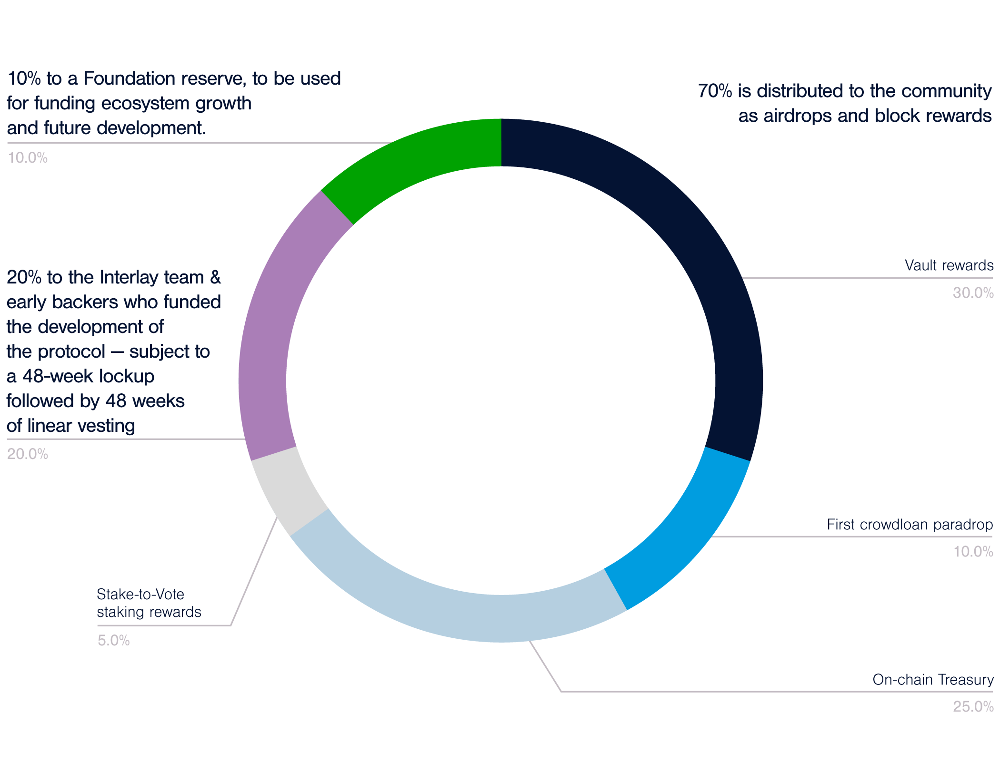

# Kintsugi Canary Network

**Kintsugi** is Interlay's canary network, an experiment with real economic value deployed on Kusama. Kintsugi and Interlay share the same code base - with the difference that Kintsugi focusses strictly on innovation and will always be ahead in terms of features. [Read more about Interlay's dual network model](https://medium.com/interlay/the-interlay-parachain-is-coming-to-polkadot-552a57ff8d1b).

## KINT Tokenomics

Kintsugi will be governed by its community from day 1 - via KINT, Kintsugi’s governance token. Kintsugi will go live via **a fair launch scheme**. 

_KINT tokens will be distributed to network participants, builders and early backers as airdrops and block-rewards. There will be no public sale or ICO._

Below is a summary of the Kintsugi token economy, as described in the [token economy whitepaper released by Kintsugi Labs](https://raw.githubusercontent.com/interlay/whitepapers/master/Kintsugi_Token_Economy.pdf).

### Key Functions of KINT

The KINT token’s main purposes are:

* **Governance**. KINT holders vote on governance proposals.
* **Staking**. To participate in governance, holders stake KINT and earn KINT staking rewards in return (5% of supply).
* **Utility**. Transaction fees can be paid in KINT.
* **Outlook**:  KINT will be tightly integrated into the bridge, offering token holders additional security and product benefits.

### Supply and Emission

KINT features an unlimited supply. The emission schedule is defined as follows: 

* 10 million KINT emitted over the first 4 years
* 2% annual inflation afterwards, indefinitely.

### Distribution

KINT will be controlled by the community:

* **70% is distributed to the community** as airdrops and block rewards.  
  - 30% to Vault rewards;
  - 35% to the on-chain Treasury;
  - 5% to stake-to-vote staking rewards.
* 30% is airdropped to the Interlay team, and early & future investors, who funded the development of the protocol - subject to a 1-year cliff followed by 1-year linear vesting.

Starting in year 5, only the community receives new KINT from the annual inflation.

**Full Tokenomic Details**

*For a detailed breakdown and explanation of the KINT distribution, check out the [token economy whitepaper released by Kintsugi Labs](https://raw.githubusercontent.com/interlay/whitepapers/master/Kintsugi_Token_Economy.pdf)*

### Vesting Schedules

<table>
<thead>
  <tr>
    <th colspan="2">Allocation</th>
    <th>% of initial 4yr KINT Supply</th>
    <th>Vesting / Distribution</th>
  </tr>
</thead>
<tbody>
  <tr>
    <td rowspan="6">On-Chain Treasury</td>
    <td>1st crowdloan</td>
    <td>10%</td>
    <td>30% liquid, 70% linearly vested over 48 weeks. Vesting start date backdated to parachain launch (13 October 2021).</td>
  </tr>
  <tr>
    <td>Crowdloan in-protocol rewards</td>
    <td>2%</td>
    <td>No vesting.</td>
  </tr>
  <tr>
    <td>Crowdloan reserve</td>
    <td>5%</td>
    <td>To be defined individually for each new crowdloan. </td>
  </tr>
  <tr>
    <td>LP rewards</td>
    <td>8%</td>
    <td>No vesting.</td>
  </tr>
  <tr>
    <td>Ecosystem reserve</td>
    <td>5%</td>
    <td>No vesting - unless determined by governance for specific allocations / grants. </td>
  </tr>
  <tr>
    <td>Rainy Day Reserve</td>
    <td>5%</td>
    <td>No vesting. </td>
  </tr>
  <tr>
    <td colspan="2">Vault Rewards</td>
    <td>30%</td>
    <td>No vesting. Distributed on a per-block basis. Early rewards highest, decreasing over 4 years. 30% of tota 4yr allocation in year 1, 30% in year 2, 20% in year 3, remaining 10% in year 4. After 4 years, Vaults receive 40% of the annual inflation.&nbsp;&nbsp;</td>
  </tr>
  <tr>
    <td colspan="2">Stake-to-Vote</td>
    <td>5%</td>
    <td>No vesting. Distributed on a per-block basis.</td>
  </tr>
  <tr>
    <td rowspan="2">Team &amp; Investors</td>
    <td>Current &amp; future team &amp; current investors </td>
    <td>20%</td>
    <td>48 weeks lockup, followed by 48 weeks linear vesting. Internal investor vs team breakdown to be released. </td>
  </tr>
  <tr>
    <td>Foundation Reserve (future development and ecosystem funding)</td>
    <td>10%</td>
    <td>Not liquid until spent. Vesting to be defined for each individual spend. </td>
  </tr>
</tbody>
</table>

### Circulating Supply

**Live circulating supply: [kintsugi.subscan.io](https://kintsugi.subscan.io/)** 

?> Circulating supply = liquid tokens that can be sold & purchased on the market. Excludes airdrop tokens that have not yet been claimed.

Due to the nature of the stake-to-vote governance mechanism of KINT, it is impossible to accurately predict the circulating supply (holds actively participating in governance may decide to stake KINT for prolonged periods). In addition, the reserves controlled by the on-chain treasury may be distributed to foster project development and ecosystem growth, as determined by community governance (KINT holders).

As such, the numbers below are **pure estimates and will very likely be subject to change over the first 2-3 years of the network's existence. Use with caution!**.

<table>
<thead>
  <tr>
    <th>Time (since parachain launch)</th>
    <th>in days</th>
    <th>Estimate % of total supply</th>
  </tr>
</thead>
<tbody>
  <tr>
    <td>Launch</td>
    <td>1</td>
    <td>4-6%</td>
  </tr>
  <tr>
    <td>1 month</td>
    <td>30</td>
    <td>6-8%</td>
  </tr>
  <tr>
    <td>2 months</td>
    <td>60</td>
    <td>7.5-9.5%</td>
  </tr>
  <tr>
    <td>3 months</td>
    <td>90</td>
    <td>9-11%</td>
  </tr>
  <tr>
    <td>4 months</td>
    <td>120</td>
    <td>11-13%</td>
  </tr>
  <tr>
    <td>5 months</td>
    <td>150</td>
    <td>12.5-15%</td>
  </tr>
  <tr>
    <td>6 months</td>
    <td>180</td>
    <td>14-16%</td>
  </tr>
  <tr>
    <td>1 year</td>
    <td>360</td>
    <td>~26%</td>
  </tr>
  <tr>
    <td>2 years</td>
    <td>720</td>
    <td>~56%</td>
  </tr>
</tbody>
</table>

## The Kintsugi Crowdloan

Kintsugi participated in the Kusama parachain auctions and supported a crowdloan to enable the community to vote on when Kintsugi should go live. Voting worked by locking KSM on the Kusama network.

Below is a summary of the Kintsugi crowdloan details, as described in the [token economy whitepaper released by Kintsugi Labs](https://raw.githubusercontent.com/interlay/whitepapers/master/Kintsugi_Token_Economy.pdf).

### Hard Facts

* **Target slot: 6 - 10**
* **Lease duration: 8 periods (maximum lease duration ~48 weeks)**
* **Max. lockup target: 200 000 KSM**

#### Crowdloan Airdrop: 10% (1 million KINT) of the initial 4-year supply

The main crowdloan airdrop will comprise 10% (1 million KINT) of the initial 4-year KINT supply, with the following vesting schedule:

* **30% transferrable** at launch
* Remaining **70% linearly vested** over 48-week parachain lease period.

Thereby, this airdrop will feature the following **special allocations**, to create a proactive crowdloan process:

* **Early**: 5% for first 3 days of crowdloan
* **Referral**: 5% for the referrer and referred
* **Strong supporter (new!)**: starting with 0.5% at 10 KSM, linearly increasing up to 5% if above 1000 KSM (min.: 10 KSM). *Applied retrospecively, incl. KSM lock-ups before announcement*.

* **Success**: up to 100 000 additional KINT if specific KSM lockup targets are achieved. See table:

Any KINT not used for the Core, Early, Referral and Success Airdrop will be distributed proportionally among all participants, further increasing the ratio of KINT per locked KSM.

#### Power User Bonus: 2% (200 000 KINT) of the initial 4-year KINT supply

To incentivize KBTC adoption, 200 000 KINT will be airdropped to crowdloan participants who then also run Vaults and mint KBTC on Kusama, once Kintsugi is live. These airdrops will happen over the course of the first parachain lease period. In addition, protocol governance may approve special KBTC LP programs for crowdloan participants.

