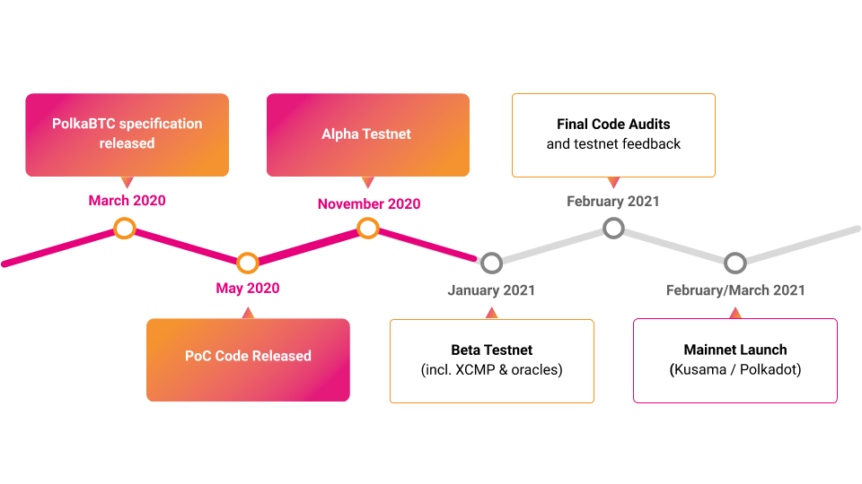

# Roadmap

The Interlay team is building a customized Substrate environment for PolkaBTC, optimized to verify Bitcoin payments. The BTC Parachain includes a Bitcoin cross-chain SPV client (BTC-Relay), integrations with secure price oracles and XCMP, as well as support for hardware wallets. In addition, Interlay is also building client software for Vaults, Staked Relayers (who make sure BTC-Relay is up to date), as well as an easy-to-use web interface.

[Interlay](https://interlay.io/) has previously released a [detailed technical specification](https://interlay.gitlab.io/polkabtc-spec/) and a [working PoC implementation](https://github.com/interlay/BTC-Parachain). After the successful pilot project, Interlay is now expediting efforts to complete the BTC Parachain in Q1 2021 - funded by a follow-up [Web3 Foundation grant](https://web3.foundation/grants/). A first Alpha testnet is scheduled for November 2020, a feature-ready Beta in January 2021. Sign up [here](https://forms.gle/7s1yGG3xEKyLhYnV7) to get early-access and test PolkaBTC in action.

The Alpha was successfully launched in November 2020 and has been operating at alpha.polkabtc.io since.

A feature-ready Beta testnet will be launched end of February 2021.

Once the audit of the code base is completed in February 2021 and parachains are enabled on Polkadot and Kusama, the BTC Parachain will go live: first on Kusama, then on Polkadot mainnet.

