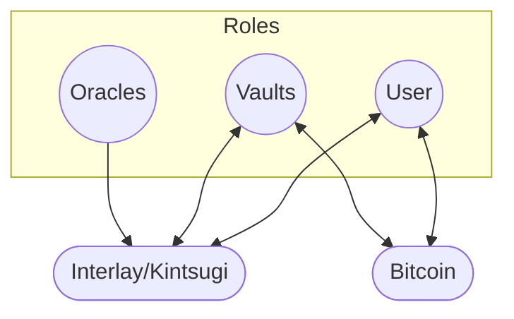
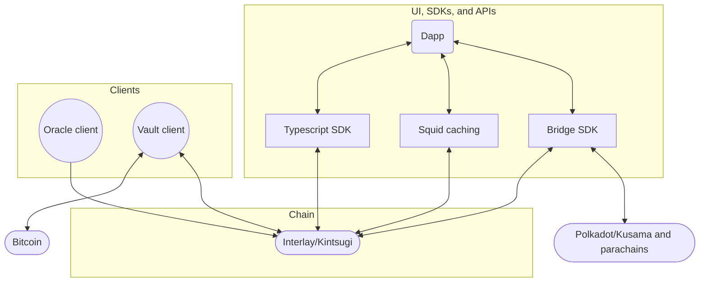
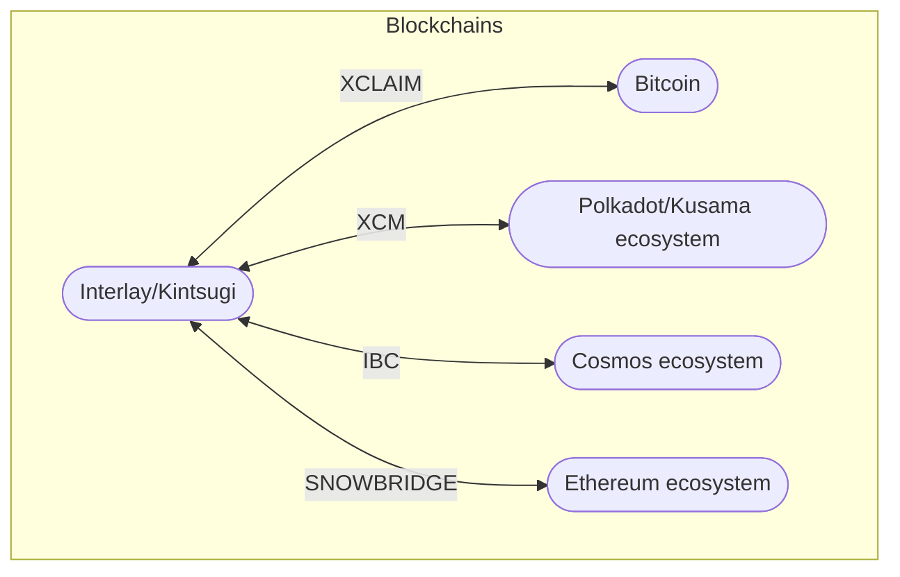

# Getting started

Decentralization first. The basis for the Interlay and Kintsugi networks is a decentralized Bitcoin bridge - the only of its kind. The desire to build decentralized technology is one of the key values that bind the Interlay and Kintsugi community together.

In the spirit of decentralization, we invite everyone to contribute to the projects: no matter what programming language or technical skills you might have, we love to have your contribution to the project.

## Technology we use

The Interlay project is built on many technologies including

- [Rust](https://www.rust-lang.org/)
- [Substrate](https://substrate.dev/)
- [TypeScript](https://www.typescriptlang.org/)
- [Polkadot.js](https://polkadot.js.org/docs/)
- [Subsquid](https://docs.subsquid.io/)
- [React](https://reactjs.org/)
- [Jupyter](https://jupyter.org/)

## Diving in

If you want to dive right in, here are a list of all "good first issues" across our main repositories.

- GitHub issues: https://github.com/orgs/interlay/projects/3/views/12

All our core code is open-source. We welcome contributions through issues and pull requests.

- Interlay chain: https://github.com/interlay/interbtc
- Interlay clients: https://github.com/interlay/interbtc-clients
- Interlay UI: https://github.com/interlay/interbtc-ui
- Interlay Typescript SDK: https://github.com/interlay/interbtc-api
- Interlay XCM Bridge SDK: https://github.com/interlay/bridge
- Interlay Squid GraphQL: https://github.com/interlay/interbtc-squid
- Economic security analysis: https://github.com/interlay/collateralization-analysis
- Documentation: https://github.com/interlay/interlay.github.io

## Understanding the Interlay Software Context

### Roles

In a simplified view, the Interlay and Kintsugi networks have three core roles:

- **User**: A user is anyone who wants to use the Interlay or Kintsugi network. This includes anyone who wants to issue or redeem IBTC/KBTC, anyone who wants to use the DeFi Hub to swap, LP, borrow, or lend, and anyone who wants to bridge Interlay or Kintsugi assets to other Polkadot and Kusama chains. In the future, users will also be able to bridge to Cosmos and Ethereum chains.
- **Vault**: A Vault has locked collateral. Vaults are responsible for issuing and redeeming iBTC and kBTC.
- **Oracle**: An Oracle is a trusted third party that provides the Interlay and Kintsugi networks with the latest Bitcoin price for the collateral assets listed in the BTC bridge and the assets listed in the lending protocol.

### Interlay Components

These roles interact with the different software components of the Interlay and Kintsugi networks:

- **Interlay/Kintsugi chain**: The Interlay and Kintsugi chains are built on Substrate and are responsible for managing the BTC bridge and the lending protocol. [Link to the repository](https://github.com/interlay/interbtc).
- **Vault client**: Vaults are implemented as an off-chain client that automates the process of issuing and redeeming iBTC and kBTC. [Link to the repository](https://github.com/interlay/interbtc-clients)
- **Oracle client**: Oracles are implemented as an off-chain client submitting data via a governance-whitelisted account. [Link to the repository](https://github.com/interlay/interbtc-clients).
- **Dapp**: The Dapp is a web application that allows users to interact with the Interlay and Kintsugi networks. The Dapp is built on React and uses the Interlay Typescript SDK to interact with the Interlay and Kintsugi chains. [Link to the repository](https://github.com/interlay/interbtc-ui).
- **Typescript SDK**: The Interlay Typescript SDK is a library that allows developers to interact with the Interlay and Kintsugi chains. The Interlay Typescript SDK is built on Polkadot.js. [Link to the repository](https://github.com/interlay/interbtc-api).
- **Bridge SDK**: The Bridge SDK is a library that wraps around bridging assets from and to chains via XCM. The XCM Bridge SDK is built on Polkadot.js. [Link to the repository](https://github.com/interlay/bridge).
- **Squid caching**: Squid caching is a caching layer storing all extrinsics, events, and blocks of the networks and exposing transformed views view of the chain state via GraphQL. The Squid caching is built on Subsquid. [Link to the repository](https://github.com/interlay/interbtc-squid).

### Cross-Chain Connectors

Lastly, the Interlay and Kintsugi networks interact with Bitcoin, the Polkadot and Kusama ecosystems, the Cosmos ecosystem, and the Ethereum ecosystem:

- **Bitcoin**: Briding of BTC is enabled via the Interlay and Kintsugi networks implementing the [XCLAIM protocol](https://www.xclaim.io/).
- **Polkadot/Kusama**: Assets and cross-chain interactions are enabled by [XCM](https://medium.com/polkadot-network/xcm-the-cross-consensus-message-format-3b77b1373392) with a homogenous consensus security provided by the Polkadot and Kusama relay chains.
- **Cosmos**: [IBC](https://ibcprotocol.org/) allows transfer of assets and other cross-chain interactions in the Cosmos ecosystem and any chain that enables IBC. It follows a heterogenous security model with each chain providing their own consensus security.
- **Ethereum**: Bridges to Ethereum and connected L2s are a work in progress. Initial bridging will be enabled through a centralized provider such as [Wormhole](https://wormholebridge.com/). The goal is to switch to the decentralized [Snowbridge](https://snowbridge.network/) bridge once it is ready.

