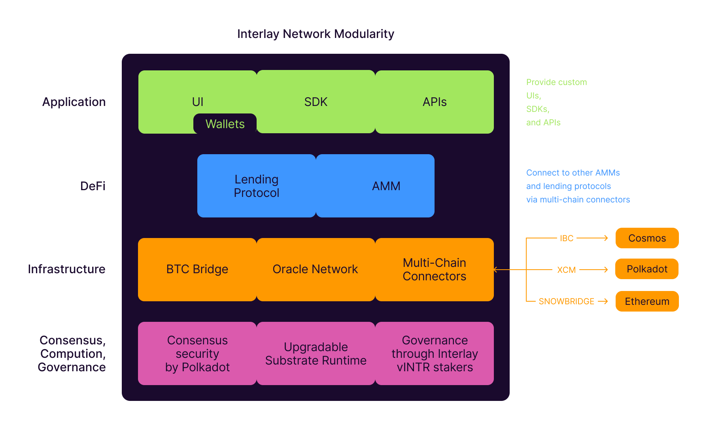
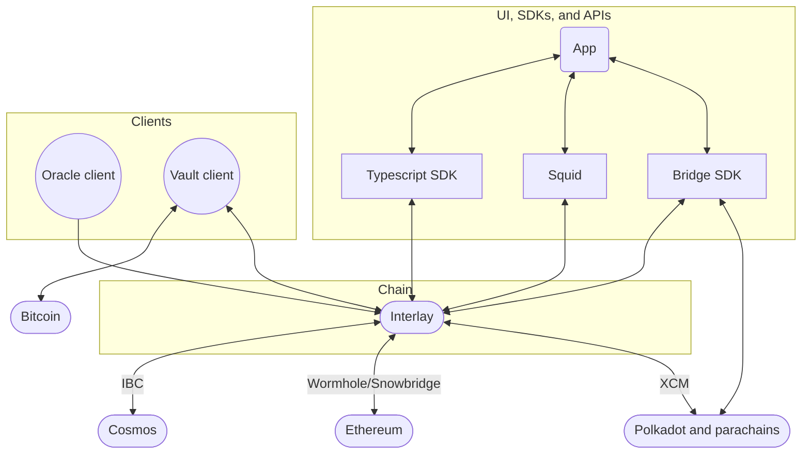

# Getting started

Decentralization first. The basis for the Interlay and Kintsugi networks is a decentralized Bitcoin bridge - the only of its kind. The desire to build decentralized technology is one of the key values that bind the Interlay and Kintsugi community together.

In the spirit of decentralization, we invite everyone to contribute to the projects: no matter what programming language or technical skills you might have, we love to have your contribution to the project.

## Technology we use

The Interlay project is built on many technologies including

- [Rust](https://www.rust-lang.org/)
- [Substrate](https://substrate.dev/)
- [TypeScript](https://www.typescriptlang.org/)
- [Polkadot.js](https://polkadot.js.org/docs/)
- [Subsquid](https://docs.subsquid.io/)
- [React](https://reactjs.org/)
- [Jupyter](https://jupyter.org/)

## Diving in

If you want to dive right in, here are a list of all "good first issues" across our main repositories.

- GitHub issues: https://github.com/orgs/interlay/projects/3/views/12

All our core code is open-source. We welcome contributions through issues and pull requests.

- Interlay chain: https://github.com/interlay/interbtc
- Interlay clients: https://github.com/interlay/interbtc-clients
- Interlay UI: https://github.com/interlay/interbtc-ui
- Interlay Typescript SDK: https://github.com/interlay/interbtc-api
- Interlay XCM Bridge SDK: https://github.com/interlay/bridge
- Interlay Squid GraphQL: https://github.com/interlay/interbtc-squid
- Economic security analysis: https://github.com/interlay/collateralization-analysis
- Documentation: https://github.com/interlay/interlay.github.io

## Roles

In a simplified view, the Interlay and Kintsugi networks have four core roles:

- **Users**: A user is anyone who wants to use the Interlay or Kintsugi network. This includes anyone who wants to issue or redeem IBTC/KBTC, anyone who wants to use the DeFi Hub to swap, LP, borrow, or lend, and anyone who wants to bridge Interlay or Kintsugi assets to other Polkadot and Kusama chains. In the future, users will also be able to bridge to Cosmos and Ethereum chains.
- **Vaults**: A Vault has locked collateral. Vaults are responsible for issuing and redeeming iBTC and kBTC. They also submit Bitcoin block headers to the BTC-Relay.
- **Oracles**: An Oracle is a trusted third party that provides the Interlay and Kintsugi networks with the latest Bitcoin price for the collateral assets listed in the BTC bridge and the assets listed in the lending protocol.
- **Builders**: Builders interact and build new products that integrate or are based on the Interlay and Kintsugi networks. Builders can use Rust as well as the EVM to deploy smart contracts on the Interlay and Kintsugi networks with access to the BTC light client and the runtime native functions. Builders can also build new frontends, wallet integrations, analytics, and many more with the open APIs and SDKs.

## Interlay Stack

### Consensus, Computation, Governance

- **Computation**: The base layer is the [interBTC chain](https://github.com/interlay/interbtc). The interBTC chain is built on substrate and executes computations as part of its WASM runtime. Runtime code is written in Rust.
- **Consensus**: Consensus is reached by sequencers (called collators in the Dotsama world) submitting the Interlay chain blocks to the Polkadot validators. The Polkadot validators verify that the Interlay chain blocks are valid based on the runtime code stored on the relay chain. Interlay uses [BABE and GRANDPA](https://docs.substrate.io/learn/consensus/) as its consensus mechanism.
- **Governance**: Interlay users submit governance proposals to change either (1) the state of the runtime, e.g., configuration parameters or transferring funds, or (2) the runtime code itself. Governance is implemented as a fork of the gov v1 Polkadot pallet in the [interBTC chain democracy pallet](https://github.com/interlay/interbtc/tree/master/crates/democracy).

### Infrastructure

- **BTC Bridge**: The bridge is based on the [XCLAIM](https://xclaim.io) protocol. A specification of the implemented protocol can be found [here](https://spec.interlay.io). The on-chain implementation is split up across multiple pallets including [btc-relay](https://github.com/interlay/interbtc/tree/master/crates/btc-relay), [issue](https://github.com/interlay/interbtc/tree/master/crates/issue), [redeem](https://github.com/interlay/interbtc/tree/master/crates/redeem), [replace](https://github.com/interlay/interbtc/tree/master/crates/replace), [vault registry](https://github.com/interlay/interbtc/tree/master/crates/vault-registry), [nomination](https://github.com/interlay/interbtc/tree/master/crates/nomination), [fee](https://github.com/interlay/interbtc/tree/master/crates/fee), 
- **Oracle Network**: The oracles consists of a [pallet in the runtime](https://github.com/interlay/interbtc/tree/master/crates/oracle) and off-chain oracle clients.
- **Multi-chain connectors**
  - *Polkadot/Kusama/HydraDX/Moonbeam...*: Assets and cross-chain interactions are enabled by [XCM](https://medium.com/polkadot-network/xcm-the-cross-consensus-message-format-3b77b1373392) with a homogenous consensus security provided by the Polkadot and Kusama relay chains to facility communication across all Polkadot and Kusama parachains.
  - *Cosmos*: [IBC](https://ibcprotocol.org/) allows transfering of assets and other cross-chain interactions in the Cosmos ecosystem and any chain that enables IBC. It follows a heterogenous security model with each chain providing their own consensus security.
  - *Ethereum and other EVM chains*: Bridges to Ethereum, other EVM chains, and connected L2s are a work in progress. Initial bridging will be enabled through a centralized provider such as [Wormhole](https://wormholebridge.com/). The goal is to switch to the decentralized [Snowbridge](https://snowbridge.network/) bridge once it is ready.

### DeFi

- **Lending**: The lending protocol is based on the [Compound v2 protocol](https://compound.finance/docs). The implementation is mostly contained in the [loans pallet](https://github.com/interlay/interbtc/tree/master/crates/loans).
- **AMM**: The AMM implements Uniswap v2-style general swaps and Curve v1-style stable swaps. The general swaps are implemented in the [dex general pallet](https://github.com/interlay/interbtc/tree/master/crates/dex-general) and the stable swaps are implemented in the [dex stable pallet](https://github.com/interlay/interbtc/tree/master/crates/dex-stable). Trade routing is done via the [dex swap router pallet](https://github.com/interlay/interbtc/tree/master/crates/dex-swap-router).

### Programmable

- **Rust smart contracts**: Rust smart contracts are enabled through the [contracts pallet](https://github.com/paritytech/substrate/tree/master/frame/contracts). Contracts are written in macros using [ink!](https://use.ink/) and compiled to WASM. The advantage of ink! is that it allows for a Rust-like syntax and type system while still being compatible with the Substrate runtime. This should enable it easily for application to reuse their code to go from a smart contract to a chain with on-demand blocks to a full-fledged appchain.
- **EVM smart contracts**: While EVM contracts are the most widely deployed contracts, we see the use for EVM contracts mostly in making use of existing toolin like adding [Safe multi-sigs and account abstraction](https://docs.safe.global/learn/safe-core/safe-core-account-abstraction-sdk), integration with hardware wallets, and EVM wallets.

### Application

- **UI**: [A reference UI](https://github.com/interlay/interbtc-ui/) is built on React and uses the Interlay Typescript SDK to interact with the Interlay and Kintsugi chains. Anyone can deploy this UI. Moreover, other parts of the stack are served by different UIs. For example, governance is operated by [subsquare](https://github.com/opensquare-network/subsquare).
- **SDK**: The [Interlay Typescript SDK](https://github.com/interlay/interbtc-api) is a Typescript SDK that allows developers to interact with the Interlay and Kintsugi chains.
- **API**: Interlay provides RPC and graphql [APIs](developers/api.md) to interact with the Interlay and Kintsugi chains.

## Interlay Software Components

- **Interlay substrate chain**: The Interlay and Kintsugi chains are built on Substrate.
  - [Repository](https://github.com/interlay/interbtc)
  - [Rustdocs](https://docs.interlay.io/interbtc/)

- **Vault client**: Vaults are implemented as an off-chain client.
  - [Repository](https://github.com/interlay/interbtc-clients)
  - [Rustdocs](https://docs.interlay.io/interbtc-clients/vault/index.html)

- **Oracle client**: Oracles are implemented as an off-chain client submitting data via a governance-whitelisted account.
  - [Repository](https://github.com/interlay/interbtc-clients)
  - [Rustdocs](https://docs.interlay.io/interbtc-clients/oracle/index.html)

- **App**: The app is a web application that allows users to interact with the Interlay and Kintsugi networks. The Dapp is built on React and uses the Interlay Typescript SDK to interact with the Interlay and Kintsugi chains.
  - [Repository](https://github.com/interlay/interbtc-ui)

- **Typescript SDK**: The Interlay Typescript SDK is a library that allows developers to interact with the Interlay and Kintsugi chains. The Interlay Typescript SDK is built on Polkadot.js.
  - [Repository](https://github.com/interlay/interbtc-api)
  - [TypeScript Docs](https://docs.interlay.io/interbtc-api/)

- **Bridge SDK**: The Bridge SDK is a library that wraps around bridging assets from and to chains via XCM. The XCM Bridge SDK is built on Polkadot.js.
  - [Repository](https://github.com/interlay/bridge)

- **Squid**: Squid caching is a caching layer storing all extrinsics, events, and blocks of the networks and exposing transformed views view of the chain state via GraphQL. The Squid caching is built on Subsquid.
  - [Repository](https://github.com/interlay/interbtc-squid)

