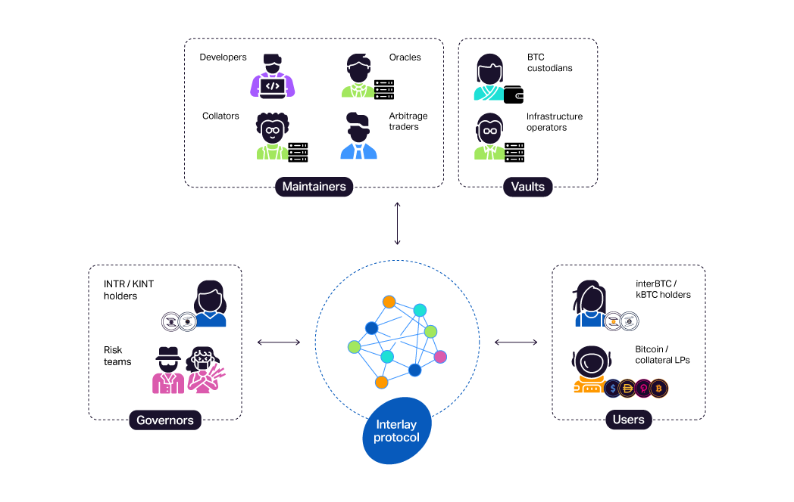

# Interlay Network 101

## Introduction

Interlay is a decentralized network dedicated to connecting crypto-currencies like Bitcoin with DeFi platforms like Polkadot and Ethereum. The Interlay network is hosted as a Polkadot parachain and will be connected to Cosmos, Ethereum and other major DeFi networks. Read more about Interlay’s vision of blockchain interoperability.

**[interBTC](/getting-started/overview?id=interbtc-bitcoin-on-any-blockchain)**, Interlay’s flagshipt product, is Bitcoin on any blockchain. A 1:1 Bitcoin-backed asset, fully collateralized, interoperable, and censorship-resistant.

**[Kintsugi](../kintsugi/overview)** is Interlay’s canary network, an experiment with real economic value deployed on Kusama. Kintsugi and Interlay share the same code base - with the difference that Kintsugi focusses strictly on innovation and will always be ahead in terms of features. Read more about Interlay’s dual network model.

### High level overview - see this [ info slide deck](https://docs.google.com/presentation/d/1Z3S55W6zu16WgGfOLMk0Y1bQvPbEHzQZF_B0SFESI-Q/)
Includes team background, interBTC, Kintsugi, comparison to other wrapped Bitcoin versions, and roadmap.

### Explanatory Videos

#### Interlay in 1 Minute

<iframe width="560" height="315" src="https://www.youtube.com/embed/h_LZhiS6Gho" frameborder="0" allow="accelerometer; autoplay; clipboard-write; encrypted-media; gyroscope; picture-in-picture" allowfullscreen></iframe>

Recommended videos:
- [Interlay in 20mins](https://www.youtube.com/watch?v=1buT9r77J7Q&ab_channel=Interlay)
- [Secure Cross-Bridges for DeFi](https://www.youtube.com/watch?v=Ywa0EUMosnk&ab_channel=Interlay)
- [Interlay origins @ Scaling Bitcoin 2018](https://youtu.be/FI9cwksTrQs?t=6410)

#### For more videos, check out the [ Interlay YouTube channel](https://www.youtube.com/channel/UCiO00-2FXx_V0HSSmr1-c7Q)

## Networks

### Interlay Mainnet

Substrate chain, secured by Polkadot's PoS as a parachain. 12-second block times, ~1500 transactions per second.

- [Dapp (app.interlay.io)](https://app.interlay.io/)
- [DAO Governance](https://interlay.subsquare.io/)
- Blockchain explorers:
  - [Subscan](https://interlay.subscan.io/)
  - [Polkaholic (incl. XCM tracker)](https://interlay.polkaholic.io/)
  - [Polkadot.js](https://polkadot.js.org/apps/?rpc=wss%3A%2F%2Fapi.interlay.io%2Fparachain#/explorer)
- Wallets:
  - [Polkadot.js (Signer, browser)](https://polkadot.js.org/extension/)
  - [Subwallet (browser)](https://subwallet.app/)
  - [Talisman (browser)](https://talisman.xyz/)
  - [Nova (mobile)](https://novawallet.io/)
  - [Fearless (mobile)](https://fearlesswallet.io/)
  - [Subscan multisig (multisig tool, needs another brower wallet)](https://multisig.subscan.io/)
  - Ledger (hardware, coming soon)
- [Testnet](https://testnet.interlay.io/)

### Kintsugi (Canary network)

Canary network (experimental network with real economic value). Substrate chain, secured by Kusama's PoS as a parachain. 12-second block times, ~1500 transactions per second.

- [What is a canary network?](../kintsugi/overview.md)
- [Dapp (kintsugi.interlay.io)](https://kintsugi.interlay.io/)
- [DAO Governance](https://kintsugi.subsquare.io/)
- Blockchain explorers:
  - [Subscan](https://kintsugi.subscan.io/)
  - [Polkaholic (incl. XCM tracker)](https://kintsugi.polkaholic.io/)
  - [Polkadot.js](https://polkadot.js.org/apps/?rpc=wss%3A%2F%2Fapi-kusama.interlay.io%2Fparachain#/explorer)
- Wallets:
  - [Polkadot.js (Signer, browser)](https://polkadot.js.org/extension/)
  - [Subwallet (browser)](https://subwallet.app/)
  - [Talisman (browser)](https://talisman.xyz/)
  - [Nova (mobile)](https://novawallet.io/)
  - [Fearless (mobile)](https://fearlesswallet.io/)
  - [Subscan multisig (multisig tool, needs another brower wallet)](https://multisig.subscan.io/)
  - Ledger (hardware, coming soon)
- [Testnet](https://kintnet.interlay.io/)