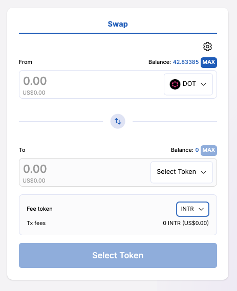
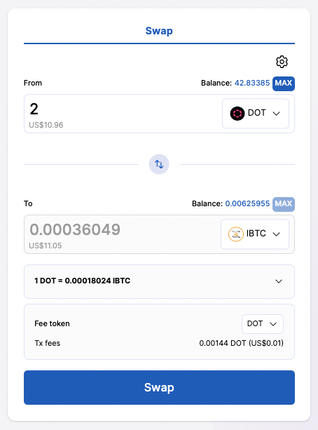
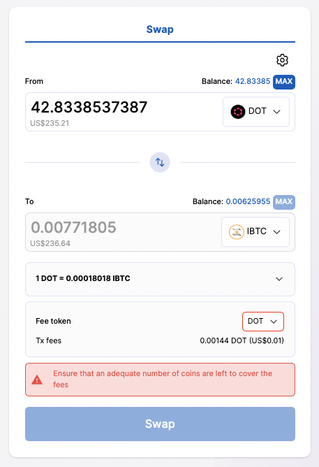

# Custom Fees Guide

Our dapp no longer limits the user to using solely the Interlay (and Kintsugi) native token (INTR/KINT) to pay transaction fees. Any asset listed in the AMM pools can now be used to pay for transaction fees.

Under the hood, the selected fee token (e.g., DOT) is swapped into the native token (e.g., INTR) to cover fees.

You can select the fee token on every transaction via a "Fee token" selector on each part of the app where you can make a transaction.

When you click inside the "Fee token" selector, a modal with the available options for pays fees is shown. This modal shows your balance of each token (not the fees you would pay in the token).

After inserting all information for the transaction and selecting the fee token, the app will give an estimate on how much fees you will have to pay in the selected fee token.

When completing the inputs, an estimation of the fees is provided. Please ensure that you have enough tokens to cover for fees in at least one of the available fee tokens. If you need to add more tokens, please check the [asset onramp guide](/guides/assets).

