# Governance

Anyone can steer the development of the Kintsugi and Interlay networks.
Before participating, we recommend to learn about [Kintsugi's governance](kintsugi/governance).

Following this guide, you will learn the most important aspects of being active in governance:

- [x] [Gauging interest via an off-chain proposal](#off-chain-proposals)
- [x] [Creating a public proposal](#create-a-public-on-chain-proposal)
- [x] [Showing support for proposals to put them up for a referendum](#show-support-for-a-proposal)
- [x] [Creating a Treasury proposal](#create-a-treasury-proposal)
- [x] [Voting on referenda](#vote-on-referenda)
- [x] [Technical Committee: Fast-track a proposal](#fast-track-a-proposal)
- [x] [Templates for common proposals](#templates-common-governance-proposals)

### Required Tokens

The minimum vKINT/vINTR required to make a proposal in governance is as follows:

<!-- tabs:start -->

#### **Interlay (Mainnet)**

250 vINTR

#### **Kintsugi (Canarynet)**

5 vKINT

#### **Testnet-Kintsugi**

5 vKINT

#### **Testnet-Interlay**

5 vINTR

<!-- tabs:end -->

?> Before participating in governance, you will need to have staked your KINT or INTR tokens. Please follow [the guide](guides/stake).

## Off-Chain Voting

Off-chain proposals are a way to coordinate and gauge the communities opinion on a proposal before making an on-chain proposal. Since the entire process is off-chain, it's free to create proposals and to vote.

This process is recommended for new proposals and where members of governance are not sure if the community would agree with their proposal.

Go to https://opensquare.io/space/kintsugi/ or https://opensquare.io/space/interlay/ to create and vote on off-chain proposals.

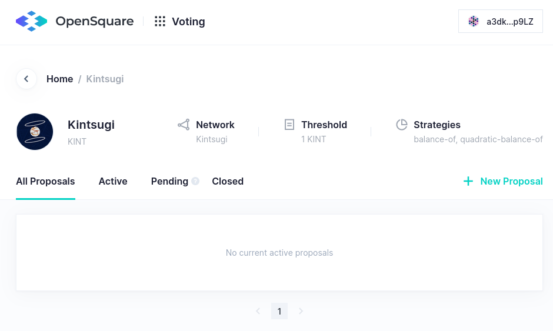

### Creating a New Proposal

Connect the wallet in the top right and then click on "New Proposal" to create a new off-chain proposal.

### Vote on a New Proposal

Connect the wallet in the top right and then select the proposal to vote on.

## Governance Platform

Both Kintsugi and Interlay use the SubSquare governance platform to discuss and vote on proposals.

?> **Important**: You need to convince the community that your proposal is useful and deserves backing. Only proposals with sufficient backing from the community go to vote. For this, you need to upload a description on SubSquare and participate in the discussion.

<!-- tabs:start -->

#### **Interlay (Mainnet)**

[interlay.subsquare.io](https://interlay.subsquare.io/)

#### **Kintsugi (Canarynet)**

[kintsugi.subsquare.io](https://kintsugi.subsquare.io/)

<!-- tabs:end -->

### 1. Login with your wallet

- Select the wallet you use, e.g., polkadot.js, Talisman, SubWallet, and connect it to the governance platform.
- Select the account you want to use.

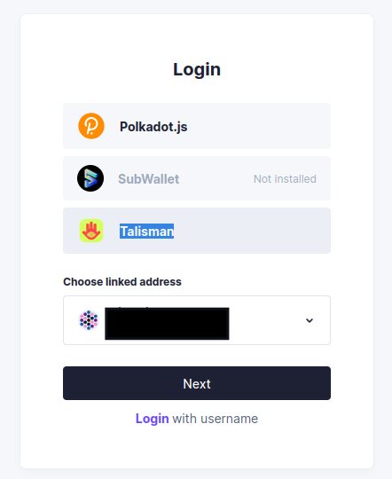

## On-Chain Proposal

Anyone can make a proposal if they have locked enough governance tokens.
This involves two steps:

1. Creating the on-chain proposal via Polkadot.js
2. Adding text/arguments/explanation to your proposal via the [governance platform](#governance-platform)

### Step 1: Submit Proposal via Polkadot.js

?> We recommend you reach out the community on [Discord](https://discord.gg/interlay) in the #product-feedback channel before creating a proposal.

#### Option A for simple proposals: Submitting a Preimage and a Proposal in two transactions

##### 1. Create and submit a Preimage

Governance can change the runtime code as well as all sorts of parameters. In the first step, decide what the proposal you are about to create should change. The exact changes you want to make are encoded in a so called "Preimage".

See [common proposals](#templates-common-governance-proposals) for detailed guides on frequently used proposal forms.

Go to Governance -> Preimages -> Submit preimage and propose the change you desire. In the example below, we are setting the minimum required amount of KSM for Vaults to register to 1 KSM. Hit "Sign and Submit" to submit the preimage.

?> Note down the preimage hash as you will need it in the next step.

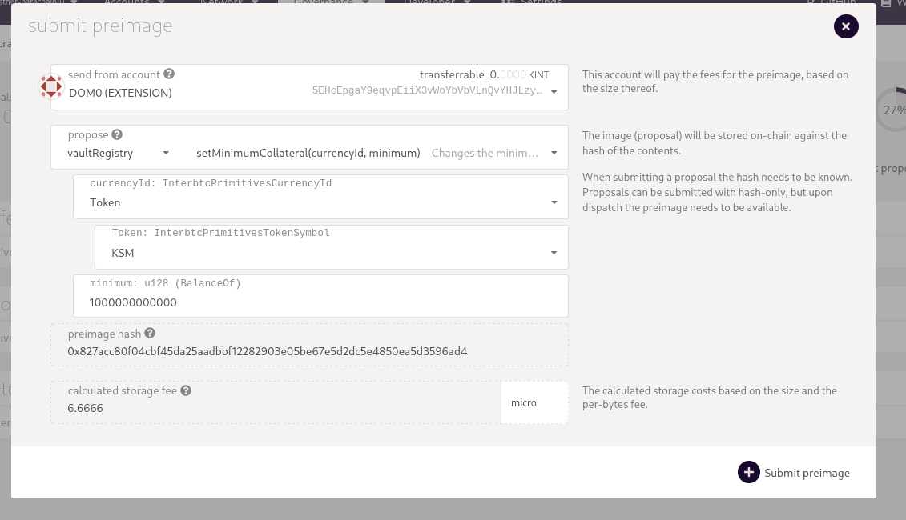

##### 2. Submit a Proposal

Now that the preimage has been uploaded, it is time to create the actual governance proposal.

Go to Governance -> Democracy -> submit proposal and insert the preimage hash as well as the amount of vKINT/vINTR to lock for the proposal. Hit "Sign and Submit" to submit the proposal.

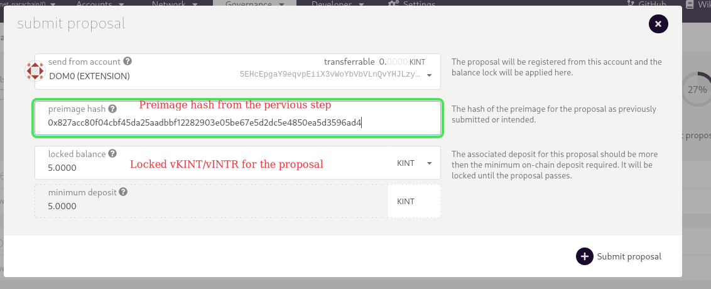

It takes some time and might require a hard-refresh (Ctrl + Shift + r) of the browser and eventually the proposal will show up in Governance -> Democracy.

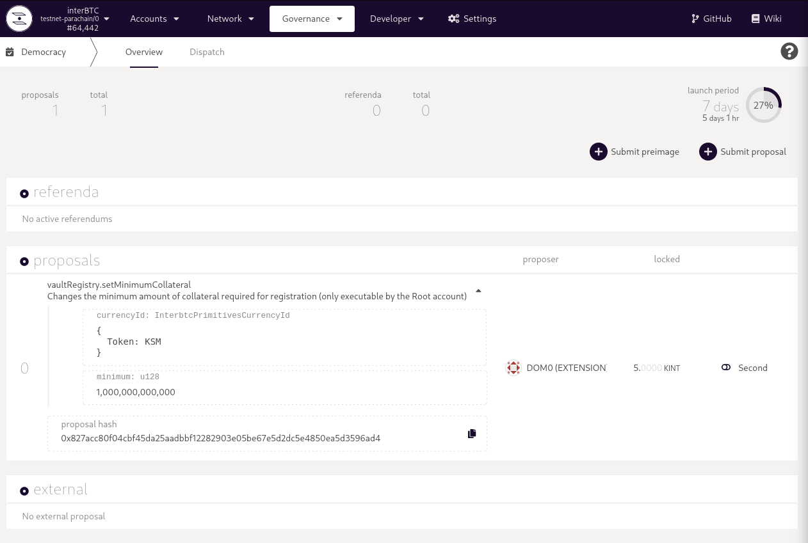

#### Option B for complex proposals and technical users: Submit the preimage and proposal in one transaction

If you have a pre-image already prepared (e.g. prepared using another tool, recommended for complex preimages with many parameters/calls), then you can simply submit the `hex-encoded call` to save time (instead of manually recreating the preimage in polkadot.js).

Go to Developer -> Extrinsics -> democracy -> propose, select `Inline` as option and insert the hex encoded call of your preimage in the "inline" field. Submit and sign the transaction.

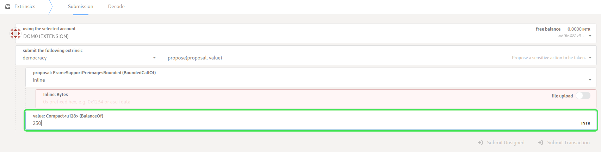

### Step 2: Add Proposal Text

Now it is time to add the text, explaining and arguing in favor of your proposal.

?> **This is the most important part!** Kintsugi and Interlay are decentralized networks. You need to convince the community that your proposal is useful and deserves backing. Only proposals with sufficient backing from the community go to vote.

#### 1. Log into SubSquare

See [above](#governance-platform).

#### 2. Find and edit your proposal

Go to "Proposals" and select your proposal from the list.

?> If you connected the same account as the one you used to create the proposal, you will be able to add title and text.

## Show Support for a Proposal

Once a proposal is created, governance participants are asked to support proposals. One proposal per week is promoted to a referendum.

You can see all proposals for Interlay at https://interlay.subsquare.io/democracy/proposals.

You can see all proposals for Kintsugi at https://kintsugi.subsquare.io/democracy/proposals.

### 1. Make sure you are logged-in

Make sure to log-in as described [above](#_1-login-with-your-wallet).

### 2. Select a Proposal

First, click on the proposal you would like to vote on from the list.
You will see a description for the proposal, for example the one below:

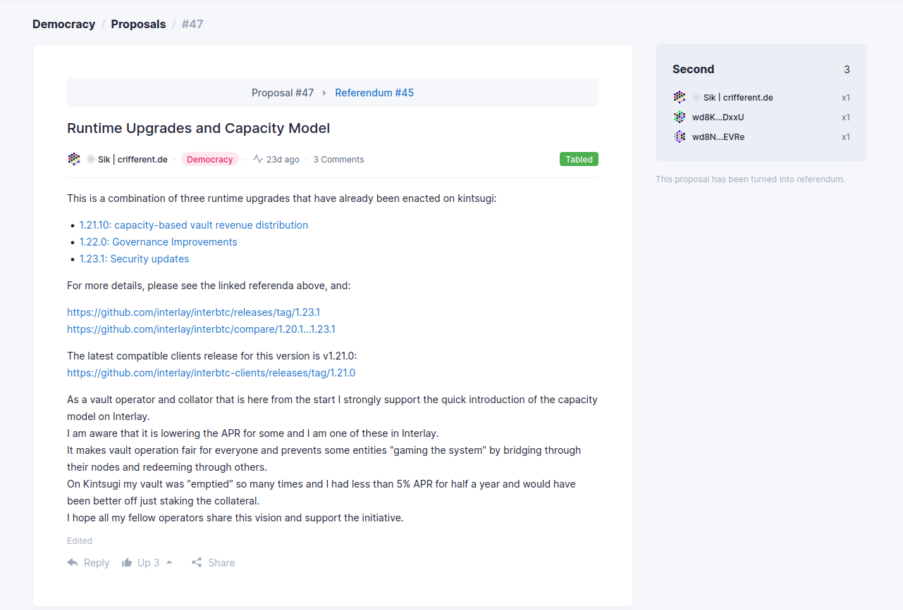

### 3. Second a Proposal

On the side of the proposal, you see a modal that will allow you to second the proposal with your staked governance tokens, i.e., vINTR or vKINT.

## Create a Treasury Proposal

Anyone can make a treasury proposal if they have locked enough KINT or INTR. Follow the steps outlined [here](#On-Chain-Proposal) to create a new proposal. The preimage / proposal should be a call to `democracy.spendFromTreasury`. The function takes only two arguments: the amount to transfer, and the account of the beneficiary. The amount is the amount of the native token (i.e. INTR or KINT) to be transferred, and it's entered in planck. INTR uses 10 decimals while KINT uses 12 decimals, So on Interlay to transfer 1 INTR, you enter 10^10, while on Kintsugi to transfer 1 KINT, you enter 10^12.  An example is shown below:

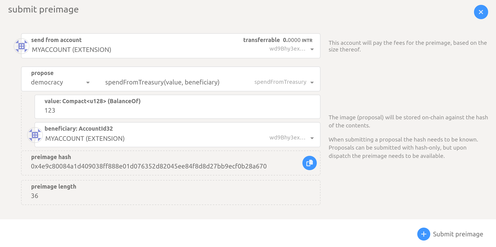

## Vote on Referenda

After a set number of blocks, the proposal with the highest backing staked governance tokens will be put up for a vote.
Once a proposal is decided to be voted on, it is called a *referendum*.

### SubSquare

You can see all referenda for Interlay at https://interlay.subsquare.io/democracy/referendums.

You can see all referenda for Kintsugi at https://kintsugi.subsquare.io/democracy/referendums.

#### 1. Make sure you are logged-in

Make sure to log-in as described [above](#_1-login-with-your-wallet).

#### 2. Select a Referendum

First, click on the referendum you would like to vote on from the list of referenda.
You will see a description for the referendum, for example the one below:

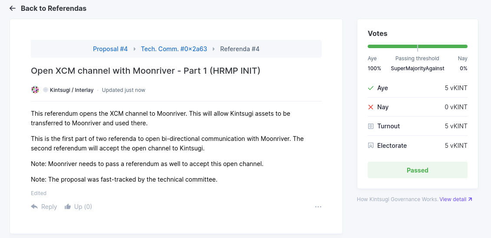

#### 3. Vote on a Referendum

On the side of the referendum, you see a modal that will allow you to vote on the referendum with your staked governance tokens, i.e., vINTR or vKINT.

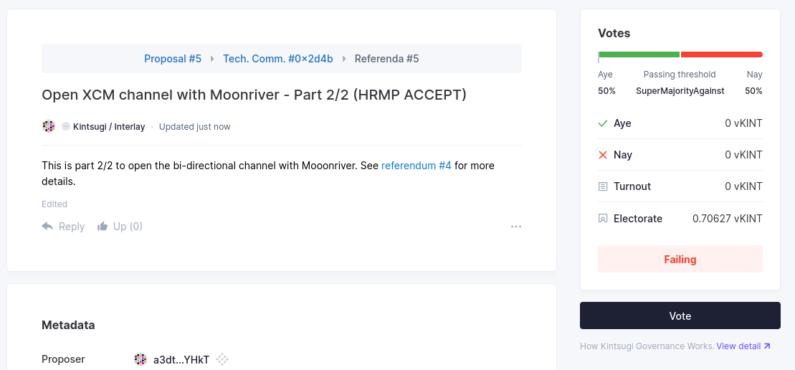

To place a vote, you will send an on-chain transaction locking the staked governance tokens for the period of the vote.
After the vote has passed, the staked governance tokens are returned to your account.

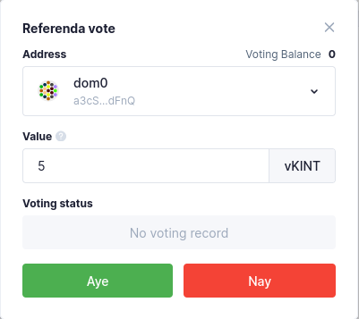

#### 4. Check the Vote Outcome

Once the voting period is over, you will see the result of the referendum in the same modal that you voted through.

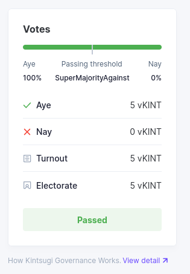

## Fast-track a Proposal

If you are a member of the Interlay or Kintsugi Technical Committee, you can propose to fast-track proposals.

- Go to Governance -> Tech. comm. -> Proposals -> Submit proposal
- Enter the id of the proposal which you propose to fast-track to a referendum
- Enter the delay for the enactment of the referendum. For almost instant enactment us a small block number like 3, for a large delay, use a larger number of blocks.

?> Make sure to set at least 1 block delay to allow for the enactment of the referendum.

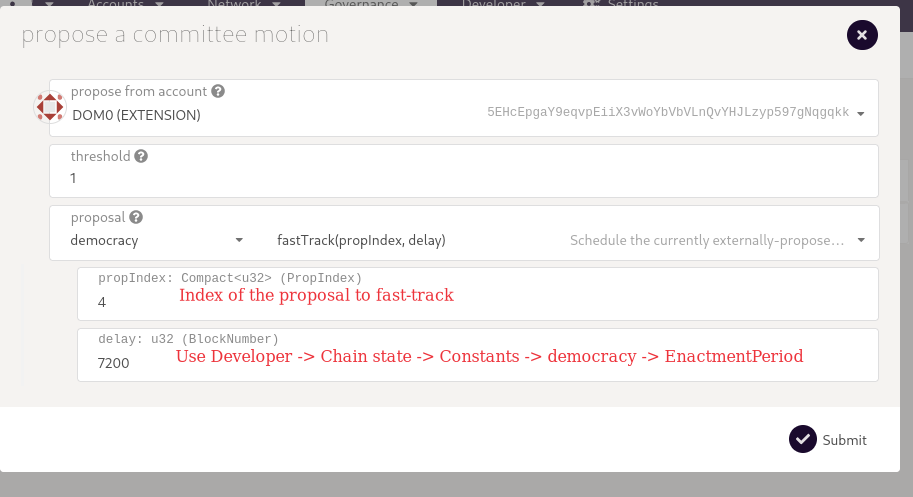

## Templates: Common Governance Proposals

### Pre-approve a future course of action

Show instructions

If you want to make governance pre-approving some future course of action (i.e, **no on-chain effects take place right now!**), the best way is to summarize the proposal in a PDF and have the community vote on "timestamping" the document on the blockchain:

1. Upload PDF to IPFS, e.g. using [https://www.pinata.cloud/](https://www.pinata.cloud/)
2. Fetch the file URL (e.g. [https://gateway.pinata.cloud/ipfs/QmPxBAPaweBtMDiGXAmf2eQPdnx75xsP7XsZQ1TqhxHGCs](https://gateway.pinata.cloud/ipfs/QmPxBAPaweBtMDiGXAmf2eQPdnx75xsP7XsZQ1TqhxHGCs))
3. Create a proposal that creates an on-chain remark (writes some data to the chain).
 * Go to [https://polkadot.js.org/apps/#/democracy](https://polkadot.js.org/apps/#/democracy) (“Governance” tab). Make sure you are connected to the correct network
 * Click `Submit preimage`, under propose select `system` and then select `remark(remark)` from the second dropdown
 * Under `remark: Bytes` enter the message you want to write to the chain. Simply copy & paste the IPFS URL of the PDF file, e.g. [https://gateway.pinata.cloud/ipfs/QmPxBAPaweBtMDiGXAmf2eQPdnx75xsP7XsZQ1TqhxHGCs](https://gateway.pinata.cloud/ipfs/QmPxBAPaweBtMDiGXAmf2eQPdnx75xsP7XsZQ1TqhxHGCs)
 * Submit the preimage

Sidenote: please add the following message at the top of your proposal text on Subsquare (see below):

"*This referendum, if passed, will create the following on-chain remark: <copy+pase the IPFS URL here>*"

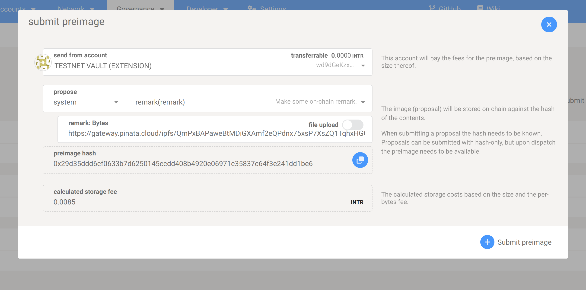

### Add or Adjust Bridge Collateral Thresholds

Show instructions

Collateral thresholds need to be adjusted based on a `collateral` to `wrapped` basis, e.g., KSM <> KBTC or DOT <> IBTC.

There are three thresholds that can be adjusted at the same time via `utility.batchAll`. It's also possible to adjust a single threshold in a governance proposal. This instructions covers the more complex case of adjusting all thresholds at the same time.

#### 1. Create the batch call to adjust the thresholds

- Go to https://polkadot.js.org/apps/#/extrinsics
- Select `utlity` -> `batchAll`
- Add three call items:

  - vaultRegistry.setSecureCollateralThreshold
  - vaultRegistry.setPremiumRedeemThreshold
  - vaultRegistry.setLiquidationCollateralThreshold

For each call select:

1. The `collateral` currency

  - For native assets, use `Token.Ticker`, e.g., `Token.DOT`
  - For foregin assets, use `ForeignAssets.Id`, e.g., `ForeignAsset.2` for LKSM on Kintsugi. You can find the correct foreign assets by going to https://polkadot.js.org/apps/#/chainstate -> assetRegistry -> metadata (unselect include option)

2. The `wrapped` currency, typically `Token.KBTC` or `Token.IBTC`
3. The new `threshold`. Thresholds are numbers like 1.65 = 165% encoded in a fixed type representation with 18 decimals. So a threshold of 165% would be 1.65 * 10^18 = 1,650,000,000,000,000,000.

!> Ensure that that the three thresholds are set such that secureCollateralThreshold > premiumRedeemThreshold > liquidationCollateralThreshold.

Keep this tab open for now.

**Examples**:

LKSM: https://polkadot.js.org/apps/?rpc=wss%3A%2F%2Fapi-kusama.interlay.io%2Fparachain#/extrinsics/decode/0x02020c3d090102000000000b0000b49376e2fa1800000000000000003d0a0102000000000b0000650742fae51600000000000000003d0b0102000000000b0000514c516f1f140000000000000000

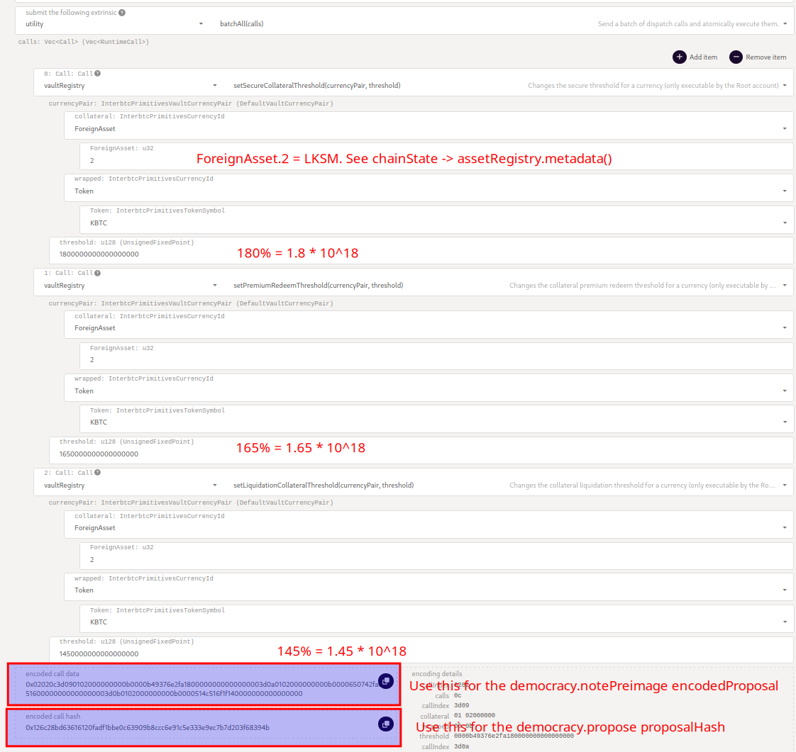

KSM: https://polkadot.js.org/apps/?rpc=wss%3A%2F%2Fapi-kusama.interlay.io%2Fparachain#/extrinsics/decode/0x02020c3d09000a000b0000a0d88557341600000000000000003d0a000a000b0000514c516f1f1400000000000000003d0b000a000b000002c01c870a120000000000000000

#### 2. Create the proposal

Open a new browser tab.

- Go to https://polkadot.js.org/apps/#/extrinsics
- Select `utlity` -> `batchAll`
- Add two call items:

  - `democracy.notePreimage`

    - `encodedProposal`: the encoded call data from the threshold batch call in Step 1 above.

  - `democracy.propose`

    - `proposalHash`: the encoded call hash from the threshold batch call in Step 1 above.
    - `value`: the [minimum vKINT/vINTR amount](guides/governance?id=required-tokens) required for making a proposal denominated in planck.

**Examples**:

LKSM: https://polkadot.js.org/apps/?rpc=wss%3A%2F%2Fapi-kusama.interlay.io%2Fparachain#/extrinsics/decode/0x020208460a390102020c3d090102000000000b0000b49376e2fa1800000000000000003d0a0102000000000b0000650742fae51600000000000000003d0b0102000000000b0000514c516f1f1400000000000000004600126c28bd63616120fadf1bbe0c63909b8ccc6e91c5e333e9ec7b7d203f68394b1f00000025a4000a8bca2204

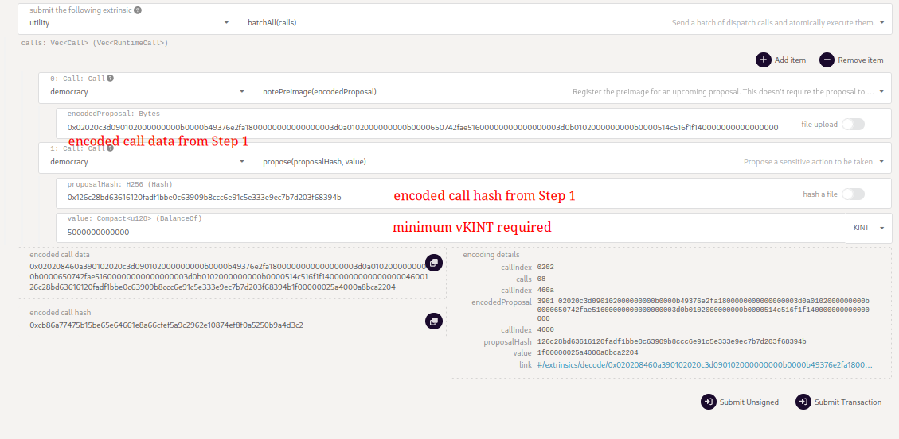

KSM: https://polkadot.js.org/apps/?rpc=wss%3A%2F%2Fapi-kusama.interlay.io%2Fparachain#/extrinsics/decode/0x020208460a150102020c3d09000a000b0000a0d88557341600000000000000003d0a000a000b0000514c516f1f1400000000000000003d0b000a000b000002c01c870a1200000000000000004600aa254fd7bc66a221ddd4d11ef8543bf8b6848bd67e3618246b18b54aaee7ff5f0b005039278c04

### Update the system collateral ceiling

Show instructions

#### 1. Create the batch call to adjust the thresholds

- Go to https://polkadot.js.org/apps/#/extrinsics
- Select `vaultRegistry` -> `setSystemCollateralCeiling`
- Set the collateral currency

  - For native assets, use `Token.Ticker`, e.g., `Token.DOT`
  - For foreign assets, use `ForeignAssets.Id`, e.g., `ForeignAsset.2` for LKSM on Kintsugi. You can find the correct foreign assets by going to https://polkadot.js.org/apps/#/chainstate -> assetRegistry -> metadata (unselect include option)

- Set the wrapped currency to `Token.KBTC` on Kintsugi, or to `Token.IBTC` on Interlay.
- Set the desired ceiling. Keep in mind the number of decimals of the currency. For foreign assets, the number of decimals is included in the metadata queried above. `DOT` and `INTR` have 10 decimals, while `KSM` and `KINT` have 12 decimals. For example, to set the ceiling to 5 `KINT`, enter  5 * 10^12 = 5,000,000,000,000. Furthermore, the ceiling must be less than `2^128 / 1e18 / 10^(tokenDecimals)` to prevent overflows in the code.

#### 2. Create the proposal

Open a new browser tab.

- Go to https://polkadot.js.org/apps/#/extrinsics
- Select `utlity` -> `batchAll`
- Add two call items:

  - `democracy.notePreimage`

    - `encodedProposal`: the encoded call data from the call in Step 1 above.

  - `democracy.propose`

    - `proposalHash`: the encoded call hash from the call in Step 1 above.
    - `value`: the [minimum vKINT/vINTR amount](guides/governance?id=required-tokens) required for making a proposal denominated in planck.

### Update Vault Block Rewards

Show instructions

The Vault block rewards are distributed with the `vaultAnnuity` pallet and are controlled by the `rewardPerBlock` storage item.

Since there is no direct setter for this storage item, governance proposals need to manually overwrite the storage item to update the INTR or KINT forwarded to Vaults per block.

!> There are pitfalls here. Updating storage values requires writing to raw storage and in the worst case other parts of the parachain could be overwritten. Proceed with caution.

?> There is a fixed amount of tokens available to the annuity pallet. Setting a too high value will lead to reward depletion.

#### 1. Storage Key: Get the system rewards per block key

- Go to https://polkadot.js.org/apps/?rpc=wss%3A%2F%2Fapi.interlay.io%2Fparachain#/chainstate
- `vaultAnnuity` -> `rewardPerBlock`
- Note down the encoded storage key

**Examples**:

!> DO NOT use this storage unless you verified that it is the current correct storage key for the network you wish to make the prposal for on the live network. Storage keys might change.

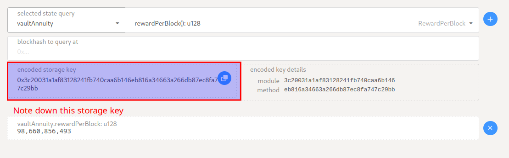

#### 2. Storage Value: Represent the desired rewards in hex

1. Decide what the new block reward should be in INTR or KINT per block.
2. Convert the INTR or KINT to their planck denomination.
3. Convert the INTR or KINT planck into a little endian encoded hex.
4. Pad the hex representation to be 16 bytes.

**Examples**:

1. New desired INTR per block: `35.6621004566` INTR
2. Planck representation: 35.6621004566 * 10^10 = `356,621,004,566`
3. Little endian hex: `0x16AF440853` ([online hex converter](https://www.save-editor.com/tools/wse_hex.html))
4. Padding added to 16 bytes: `0x16AF4408530000000000000000000000`

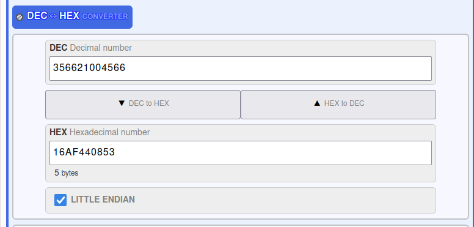

#### 3. Create the set storage call

- Go to https://polkadot.js.org/apps/?rpc=wss%3A%2F%2Fapi.interlay.io%2Fparachain#/extrinsics
- `system` -> `setStorage`

  - `Bytes`: the storage key determined in Step 1
  - `Bytes`: the storage value determined in Step 2

Keep this tab open for now.

**Examples**:

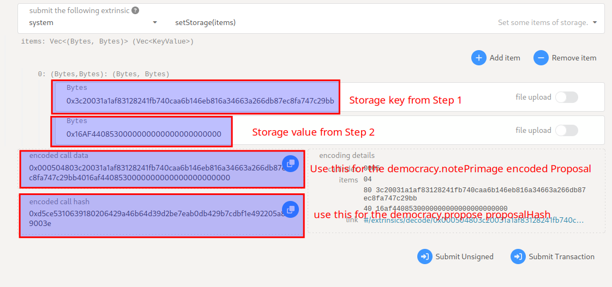

Update to 35.6621004566 INTR per block:
https://polkadot.js.org/apps/?rpc=wss%3A%2F%2Fapi.interlay.io%2Fparachain#/extrinsics/decode/0x000504803c20031a1af83128241fb740caa6b146eb816a34663a266db87ec8fa747c29bb4016af4408530000000000000000000000

#### 4. Create the proposal

!> At this point, be 100% confident that the proposal sets the right storage value to the right storage key.

Open a new browser tab.

- Go to https://polkadot.js.org/apps/#/extrinsics
https://polkadot.js.org/apps/?rpc=wss%3A%2F%2Fapi.interlay.io%2Fparachain#/extrinsics/decode/0x030208460ad4000504803c20031a1af83128241fb740caa6b146eb816a34663a266db87ec8fa747c29bb4016af44085300000000000000000000004600d5ce5310639180206429a46b64d39d2be7eab0db429b7cdbf1e492205a89003e1b0000a0bd52f8b1404b05Update to - Select `utlity` -> `batchAll`
- Add two call items:

  - `democracy.notePreimage`

    - `encodedProposal`: the encoded call data from Step 3 above.

  - `democracy.propose`

    - `proposalHash`: the encoded call hash from Step 3 above.
    - `value`: the [minimum vKINT/vINTR amount](guides/governance?id=required-tokens) required for making a proposal denominated in planck.

**Examples**:

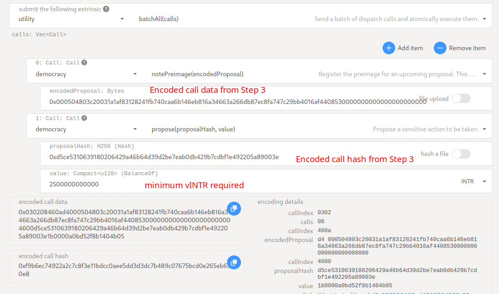

Update to 35.6621004566 INTR per block:
https://polkadot.js.org/apps/?rpc=wss%3A%2F%2Fapi.interlay.io%2Fparachain#/extrinsics/decode/0x030208460ad4000504803c20031a1af83128241fb740caa6b146eb816a34663a266db87ec8fa747c29bb4016af44085300000000000000000000004600d5ce5310639180206429a46b64d39d2be7eab0db429b7cdbf1e492205a89003e1b0000a0bd52f8b1404b05

