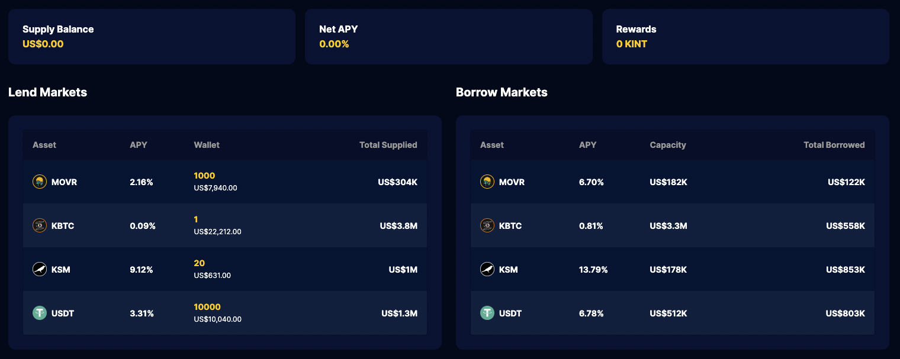
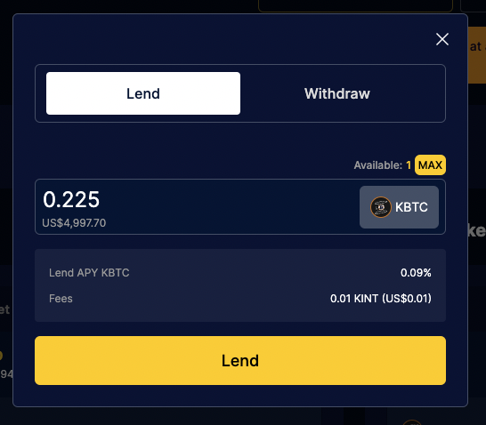
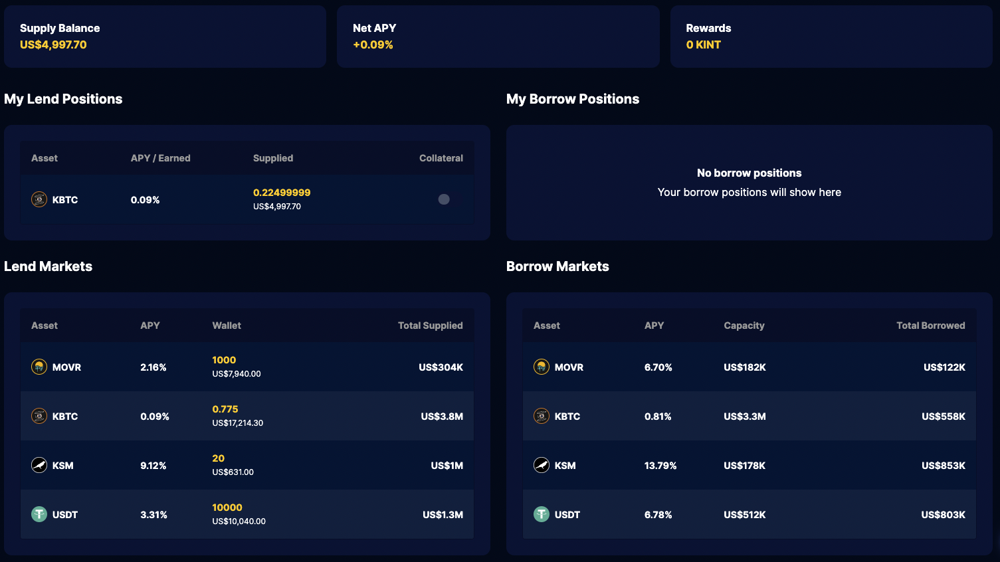
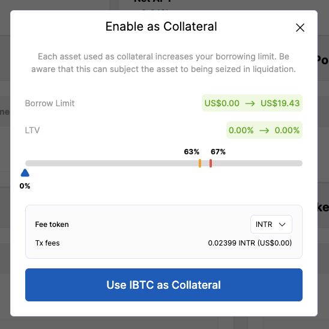
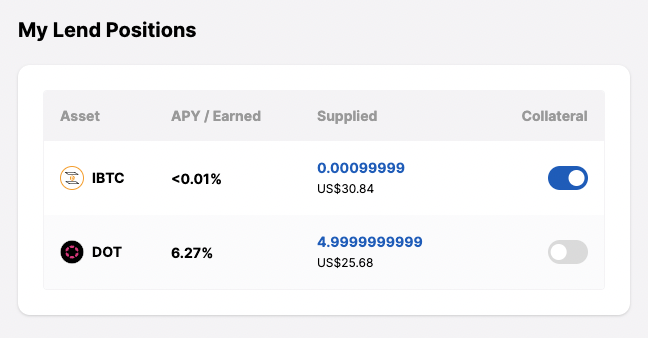
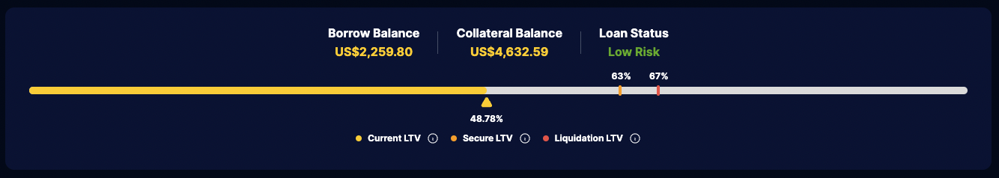
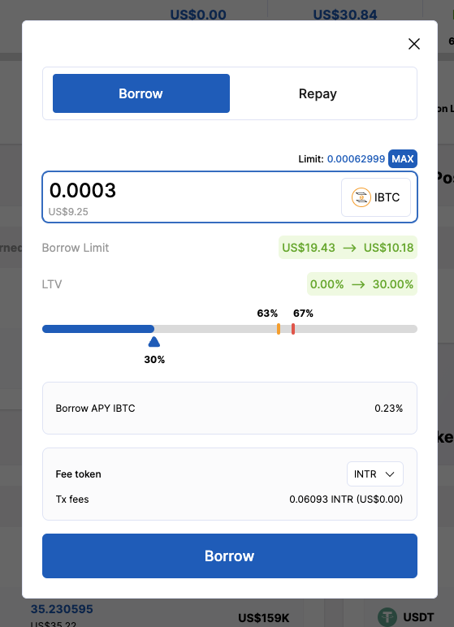
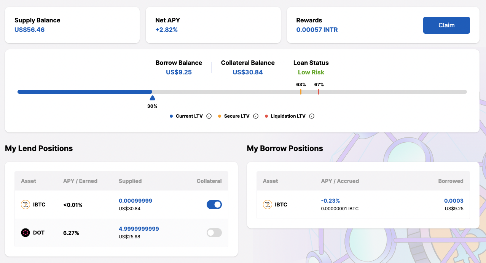
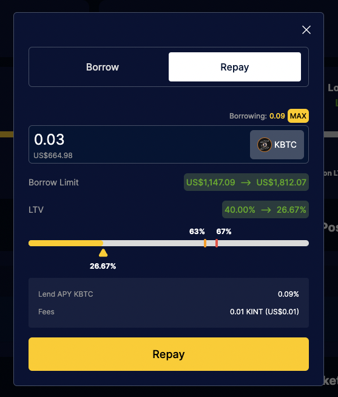

# Lend and Borrow

The lending protocol allows users to trustlessly lend and borrow. Assets that are supplied to the lending pool start earning interest immediately, and can be used as a security deposit for over-collateralized borrowing. Borrowers can repay their loan at any time, along with the interest they owe, while lenders can only withdraw their deposit if there is more liquidity left in the pool (i.e. not borrowed) than the amount to be withdrawn. Interest rates are variable and depend on the supply and demand of each asset.

## Prerequisites

Make sure you have a compatible [wallet plugin](guides/wallets-explorers.md#substrate-wallets) installed.

## Lend and Borrow

At the end of this guide you will have:

- [x] [Supplied an asset and started earning interest](#_3-deposit-to-a-lending-market)
- [x] [Enabled the deposit as borrow collateral](#_4-enable-the-collateral-toggle)
- [x] [Borrowed using the collateral](#_5-borrow)
- [x] [Repaid a loan](#_6-repay-a-loan)
- [x] [Withdrawn part of the supplied amount](#_7-withdraw-a-deposit)

### 1. Go to the lending page

<!-- tabs:start -->

#### **Interlay**

Coming soon!

#### **Kintsugi**

Coming soon!

#### **Testnet-Kintsugi**

[kintnet.interlay.io/lending](https://kintnet.interlay.io/lending)

#### **Testnet-Interlay**

[testnet.interlay.io/lending](https://testnet.interlay.io/lending)

<!-- tabs:end -->

There are three markets available in the screenshot attached. You can take a look at the various interest rates and decide which ones you are interested in supplying or borrowing.

### 2. Bring tokens for lending and transaction fees

You will need some tokens to pay for transaction fees (KINT on Kintsugi, INTR on Interlay). Additionally, you also need tokens to deposit into the lending pool.

<!-- tabs:start -->

#### **Interlay**

A list of exchanges with INTR listings can be found on [Coingecko](https://www.coingecko.com/en/coins/interlay). Those exchanges should also have the assets in the Interlay lending markets listed.

#### **Kintsugi**

A list of exchanges with KINT listings can be found on [Coingecko](https://www.coingecko.com/en/coins/kintsugi). Those exchanges should also have the assets in the Kintsugi lending markets listed.

#### **Testnet**

On testnet, you can obtain some tokens (KINT/INTR, KBTC/IBTC, KSM/DOT, USDT) by clicking on the "Tokens Faucet" button on the right-hand side of the top bar.

<!-- tabs:end -->

### 3. Deposit to a lending market

Select a lending market and enter the amount you wish to supply.

Observe the "My Lend Positions" table that has been populated with the deposit.

### 4. Enable the collateral toggle

!> **Attention:** Deposits that are enabled as collateral are subject to liquidation when the borrowed balance becomes undercollateralized.

In the "My Lend Positions" table, in the "Collateral" column, click on the toggle of the deposit you wish to enable as collateral. Doing so will allow you to take out an overcollateralized loan that is backed by this deposit.

If there are deposits in multiple asset types, it is easy to see which one is enabled as collateral and which one is not.

Whenever there is collateral, a section dedicated to your LTV (loan-to-value) appears, which will provide your with in-depth insights on the status of your positions

### 5. Borrow

Select an asset from the "Borrow Markets" table and enter the amount you wish to borrow. Note that if the loan-to-value ratio increases too much, your collateral deposits could get liquidated.

The loan is now visible in the "My Borrow Positions" table.

### 6. Repay a loan

When you are ready to repay a loan, click on an item in the "My Borrow Positions" and enter an amount. There is a graph that shows how your loan-to-value (LTV) ratio will improve as a result.

### 7. Withdraw a deposit

Click on an item in the "My Lend Positions" and select the "Withdraw" tab. You can withdraw the full deposit by clicking on the blue amount next to the "Limit:" text, or do a partial withdraw by entering a custom amount. Depending on the interest rates, you should be able to withdraw more than the initially deposited amount.

## Liquidate Loans

To ensure that loans are always over-collateralized, such that borrowers maintain an economical interest to repay their loans, under-collateralized loans need to be liquidated. This can be done by repaying the borrowed tokens on behalfs of the borrower to receive the borrowers collateral, including a premium. This guide instructs users how to process a liquidation of an under-collateralized loan using polkadot.js.

At the end of this guide you will know how to:

- [x] [Funded your wallet with the debt token and gas token](#_1-fund-wallet)
- [x] [Liquidated a borrow position using polkadot.js](#_2-liquidate-borrow-position)
- [x] [Withdraw the received collateral tokens](#_3-withdraw-collateral-optional)
- [x] [Batch liquidations](#batch-liquidations)

### 1. Fund wallet

1. The wallet needs as small amount of KINT tokens to pay for the gas fees.
2. The wallet needs to be funded with the amount of borrowed tokens which shall be repaid. E.g. if the liquidator aims to liquidate a debt position of 1,000 USDT, the wallet needs to have at least this amount in the respective borrowed currency, in this example, USDT.

All tokens that can be used in the money market can also be traded on Kintsugi DEX. For alternative options see [Other DEXs](#other-dexs)

### 2. Liquidate borrow position

1. Go to [https://polkadot.js.org/apps/#/extrinsics](https://polkadot.js.org/apps/#/extrinsics) and select Kitnsugi network
2. Set up the parameters for the call
   1. _using the selected account_: `your_accound_address` (Kintsugi address, starting with ‘a3…’)
   2. _submit the following extrinsic_: `loans.liquidateBorrow()`
   3. _borrower:_ `target_account_address` (Kintsugi address of the borrower to liquidate, starting with ‘a3…’)
   4. _liquidationAssetId:_ Borrowed currency to repay
      1. Select `Token` for KINT, kBTC, KSM
      2. Select `ForeignAsset` for other tokens
         1. see [here](#asset-registry) for `id:token` mapping
   5. _repayAmount:_ `amount_to_be_repaid` , note that the amount depends on the number of decimals the token uses. See [here](#asset-registry) for details.
   6. _collateralAssetId:_ The currency to receive in exchange for liquidating the borrower's loan. The liquidation premium is also paid in this currency. Note that this currency has to be one of the collateral currencies used by the liquidated borrower. Also note that while `collateralAssetId` represents the underlying currency of a lending market (e.g. KBTC), the liquidator receives its qToken version instead (e.g. QKBTC), which can be redeemed for KBTC from the lending market (see [withdraw collateral](#_3-withdraw-collateral-optional)).
      1. Select `Token` for KINT, kBTC, KSM
      2. Select `ForeignAsset` for other tokens
         1. see [here](#asset-registry) for `id:token` mapping
3. Submit the transaction

### Example

This example would liquidate a $1,000 USDT position in order to receive kBTC as collateral.

### 3. Withdraw collateral (optional)

The liquidator will receive `LendTokens` as a result of the liquidation call in step 2. These tokens still remain in the liquidity pool of the lending market and keep accruing interest. To receive the underlying token, the user can either withdraw the qTokens manually via the UI as described [here](#_7-withdraw-a-deposit) or construct an extrinsic by using polkadot.js as follows:

1. Set up the parameter for the call
   1. _using the selected account_: `your_accound_address` (Kintsugi address, starting with ‘a3…’)
   2. _submit the following extrinsic_: `loans.redeemAll` to redeem all supplied token of a given currency or `loans.redeem` to only redeem a specified amount. This could be required if the received currency is already used as collateral by the liquidator to secure a loan. In this case, not all of the tokens could be redeemed and the user needs to specify the amount via `loans.redeem`
   3. _assetId_:
      1. Select `Token` for KINT, kBTC, KSM
      2. Select `ForeignAsset` for other tokens
         1. see [here](#asset-registry) for `id:token` mapping

### Batch Liquidations

It is also possible to reduce the required amount needed to liquidate a position, by splitting the amount of debt to be repaid into several calls with smaller amounts. This does require to swap the received `collateral tokens` back into the `debt token` after the collateral has been claimed.

Hence, the batched call would look something like this:

[(`liquidate_borrow`, `redeem_all`, `swap_exact_input`), (`liquidate_borrow`, `redeem_all`, `swap_exact_input`), …]

### Asset Registry

Can be queried via [https://polkadot.js.org/apps/#/chainstate](https://polkadot.js.org/apps/#/chainstate) by selecting `assetRegistry.metadata`

### Underlying Tokens

Can be queried via [https://polkadot.js.org/apps/#/chainstate](https://polkadot.js.org/apps/#/chainstate) by selecting `loans.underlyingAssetId`

### Other DEXs

This list contains some alternative options to swap the tokens listed on Kintsugis lending market:

- [Solarbeam (Moonriver)](https://app.solarbeam.io/exchange/swap)
- [Bifrost (Bifrost)](https://bifrost.app/swap)
- [Parallel Heiko (Heiko)](https://app-heiko.parallel.fi/swap)
- [Karura (Karura)](https://apps.karura.network/swap)
