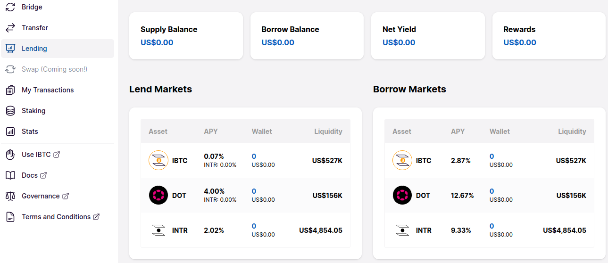
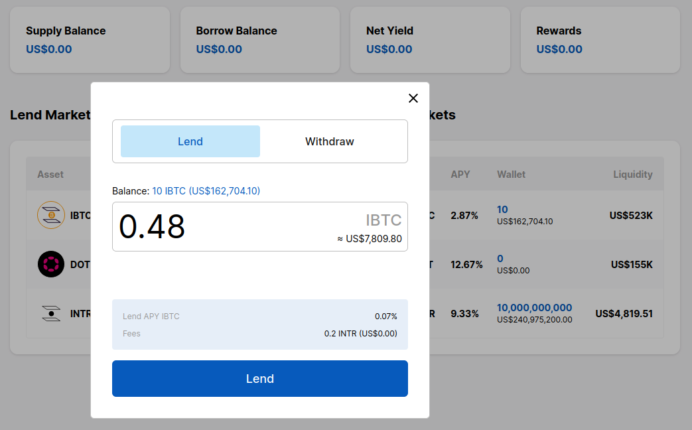
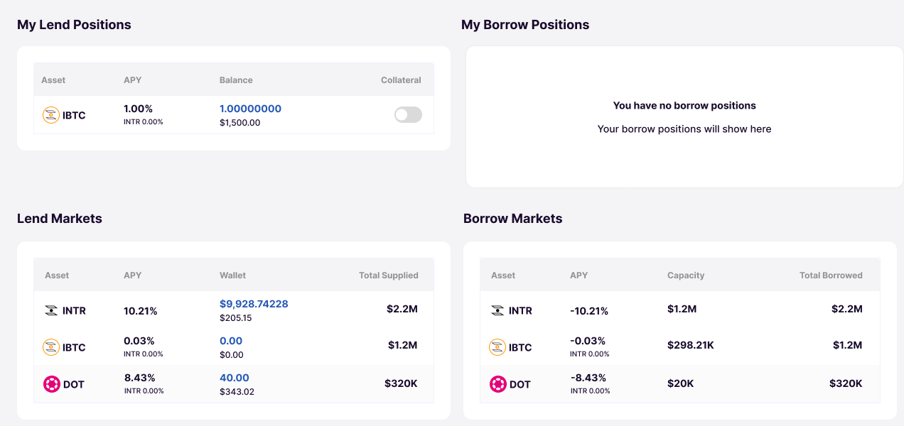
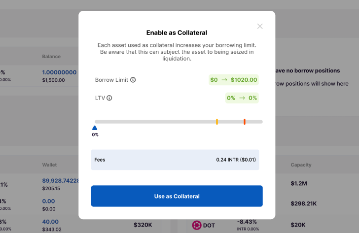
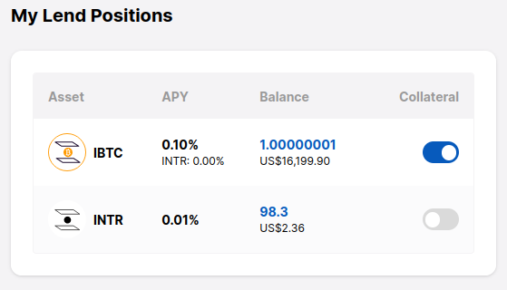
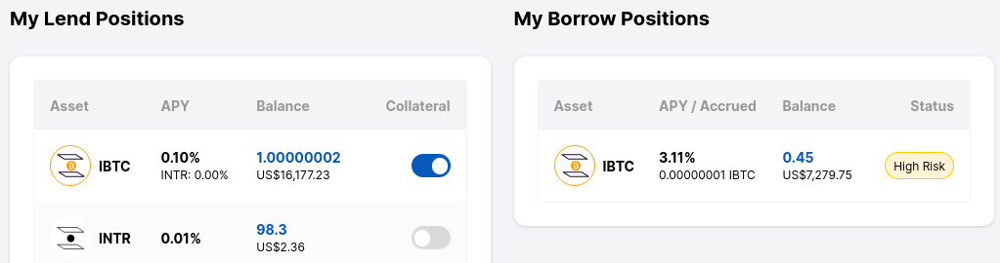
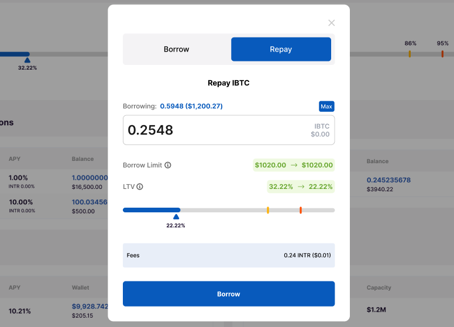
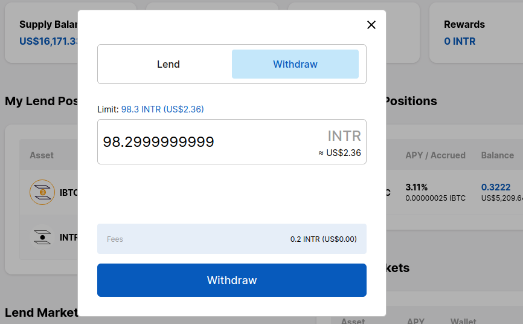

# Lend and Borrow

The lending protocol allows users to trustlessly lend and borrow. Assets that are supplied to the lending pool start earning interest immediately, and can be used as a security deposit for over-collateralized borrowing. Borrowers can repay their loan at any time, along with the interest they owe, while lenders can only withdraw their deposit if there is more liquidity left in the pool (i.e. not borrowed) than the amount to be withdrawn. Interest rates are variable and depend on the supply and demand of each asset.

At the end of this guide you will have:

- [x] [Supplied an asset and started earning interest](#_3-deposit-to-a-lending-market)
- [x] [Enabled the deposit as borrow collateral](#_4-enable-the-collateral-toggle)
- [x] [Borrowed using the collateral](#_5-borrow)
- [x] [Repaid a loan](#_6-repay-a-loan)
- [x] [Withdrawn part of the supplied amount](#_7-withdraw-a-deposit)

## Prerequisites

Make sure you have a compatible [wallet plugin](guides/wallets-explorers.md#substrate-wallets) installed.

## Lend and Borrow

### 1. Go to the lending page

<!-- tabs:start -->
#### **Interlay**

Coming soon!

#### **Kintsugi**

Coming soon!

#### **Testnet-Kintsugi**

[kintnet.interlay.io/lending](https://kintnet.interlay.io/lending)

#### **Testnet-Interlay**

[testnet.interlay.io/lending](https://testnet.interlay.io/lending)
<!-- tabs:end -->

There are three markets available in the screenshot attached. You can take a look at the various interest rates and decide which ones you are interested in supplying or borrowing.

### 2. Obtain funds to pay the transaction fees and lend

You will need some of the native on-chain currency (KINT on Kintsugi, INTR on Interlay) to pay the transaction fee. Additionally, to prevent spam, you will need to place a small deposit which will be returned to you once the request has been completed.

<!-- tabs:start -->
#### **Interlay**

A list of exchanges with INTR listings can be found on [Coingecko](https://www.coingecko.com/en/coins/interlay).

#### **Kintsugi**

A list of exchanges with KINT listings can be found on [Coingecko](https://www.coingecko.com/en/coins/kintsugi).

#### **Testnet**

On testnet, you can obtain some test KINT/INTR by clicking on the "KINT/INTR Faucet" button on the right-hand side of the top bar.
<!-- tabs:end -->

You may also want to [issue](guides/bridge.md#issue-ibtckbtc) some testnet IBTC/KBTC first, so you can then lend it.

### 3. Deposit to a lending market

Select a lending market and enter the amount you wish to supply.

Observe the "My Lend Positions" table that has been populated with the deposit. 

### 4. Enable the collateral toggle

!> **Attention:** Deposits that are enabled as collateral are subject to liquidation when the borrowed balance becomes undercollateralized.

In the "My Lend Positions" table, in the "Collateral" column, click on the toggle of the deposit you wish to enable as collateral. Doing so will allow you to take out an overcollateralized loan that is backed by this deposit.

If there are deposits in multiple asset types, it is easy to see which one is enabled as collateral and which one is not. 

### 5. Borrow

Select an asset from the "Borrow Markets" table and enter the amount you wish to borrow. Note that if the loan-to-value ratio increases too much, your collateral deposits could get liquidated.

The loan is now visible in the "My Borrow Positions" table.

### 6. Repay a loan

When you are ready to repay a loan, click on an item in the "My Borrow Positions" and enter an amount. There is a graph that shows how your loan-to-value (LTV) ratio will improve as a result. 

### 7. Withdraw a deposit

Click on an item in the "My Lend Positions" and select the "Withdraw" tab. You can withdraw the full deposit by clicking on the blue amount next to the "Limit:" text, or do a partial withdraw by entering a custom amount. Depending on the interest rates, you should be able to withdraw more than the initially deposited amount.

