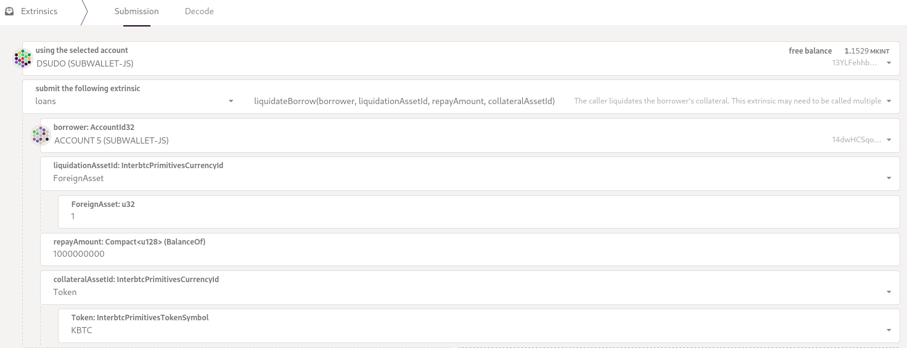
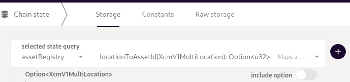
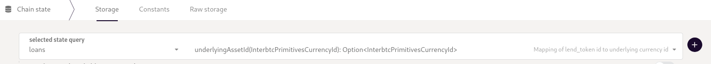

# Liquidation Guide

This guide instructs users how to process a liquidation of an under-collateralized loan using polkadot.js.

At the end of this guide you will know how to:

- [x] [Funded your wallet with the debt token and gas token](#fund-wallet)
- [x] [Liquidated a borrow position using polkadot.js](#liquidate-borrow-position)
- [x] [Withdraw the received collateral tokens](#withdraw-collateral-optional)
- [x] [Batch liquidations](#batch-liquidations)

## Steps

### **Fund wallet**

1. The wallet needs as small amount of KINT tokens to pay for the gas fees.
2. The wallet needs to be funded with the amount of borrowed tokens which shall be repaid. E.g. if the liquidator aims to liquidate a debt position of 1,000 USDT, the wallet needs to have at least this amount in the respective borrowed currency, in this example, USDT.

All tokens that can be used in the money market can also be traded on Kintsugi DEX. For alternative options see [Other DEXs](#other-dexs)

### **Liquidate borrow position**

1. Go to [https://polkadot.js.org/apps/#/extrinsics](https://polkadot.js.org/apps/#/extrinsics) and select Kitnsugi network
2. Set up the parameters for the call
    1. **using the selected account**: `your_accound_address` (Kintsugi address, starting with ‘a3…’)
    2. **submit the following extrinsic**: `loans.liquidateBorrow()`
    3. **borrower:** `target_account_address` (Kintsugi address, starting with ‘a3…’)
    4. **liquidationAssetId:** Currency which needs to be repaid
        1. Select `Token` for KINT, kBTC, KSM
        2. Select `ForeignAsset` for other tokens
            1. see [here](#asset-registry) for `id:token` mapping
    5. **repayAmount:** `amount_to_be_repaid` , note that the amount depends on the number of decimals the token uses. [See](#asset-registry) here for details.
    6. **collateralAssetId:** The underlying of the currency to be received. E.g: For kBTC the liquidator will receive the lend token of kBTC which can be redeemed for kBTC (see [withdraw collateral](#withdraw-collateral-optional))
        1. Select `Token` for KINT, kBTC, KSM
        2. Select `ForeignAsset` for other tokens
            1. see [here](#asset-registry) for `id:token` mapping
    
3. Submit the transaction

### **Example**

This example would liquidate a $1,000 USDT position in order to receive kBTC as collateral.

### **Withdraw collateral (optional)**

The liquidator will receive `LendTokens` as a result of the liquidation call in step 2. These tokens still remain in the liquidity pool of the lending market and keep accruing interest. To receive the underlying token 

1. Set up the parameter for the call
    1. **using the selected account**: `your_accound_address` (Kintsugi address, starting with ‘a3…’)
    2. **submit the following extrinsic**: `loans.redeemAll` to redeem all supplied token of a given currency or `loans.redeem` to only redeem a specified amount. This could be required if the received currency is already used as collateral by the liquidator to secure a loan. In this case, not all of the tokens could be redeemed and the user needs to specify the amount via `loans.redeem`
    3. **assetId**: 
        1. Select `Token` for KINT, kBTC, KSM
        2. Select `ForeignAsset` for other tokens
            1. see [here](#asset-registry) for `id:token` mapping

# Batch Liquidations

It is also possible to reduce the required amount needed to liquidate a position, by splitting the amount of debt to be repaid into several calls with smaller amounts. This does require to swap the received `collateral tokens` back into the `debt token`  after the collateral has been claimed.

Hence, the batched call would look something like this:

`[(`liquidate_borrow`, `redeem_all`, `swap_exact_input`), (`liquidate_borrow`, `redeem_all`, `swap_exact_input`), …]

## Asset Registry

Can be queried via [https://polkadot.js.org/apps/#/chainstate](https://polkadot.js.org/apps/#/chainstate) by selecting `assetRegistry.metadata`

## Underlying Tokens

Can be queried via [https://polkadot.js.org/apps/#/chainstate](https://polkadot.js.org/apps/#/chainstate) by selecting `loans.underlyingAssetId`

# Other DEXs

This list contains some alternative options to swap the tokens listed on Kintsugis lending market:
- [Solarbeam (Moonriver)](https://app.solarbeam.io/exchange/swap)
- [Bifrost (Bifrost)](https://bifrost.app/swap)
- [Parallel Heiko (Heiko)](https://app-heiko.parallel.fi/swap)
- [Karura (Karura)](https://apps.karura.network/swap)