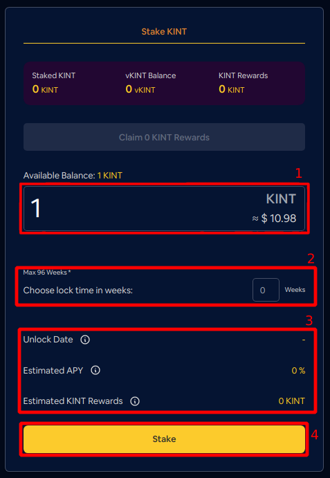
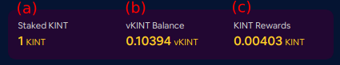
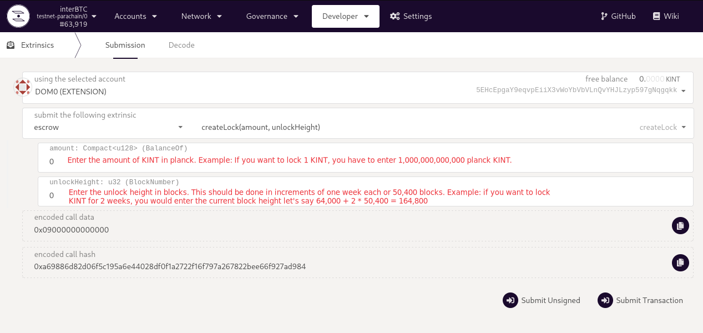
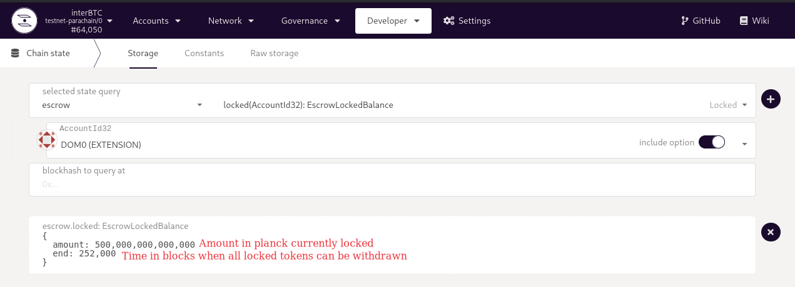
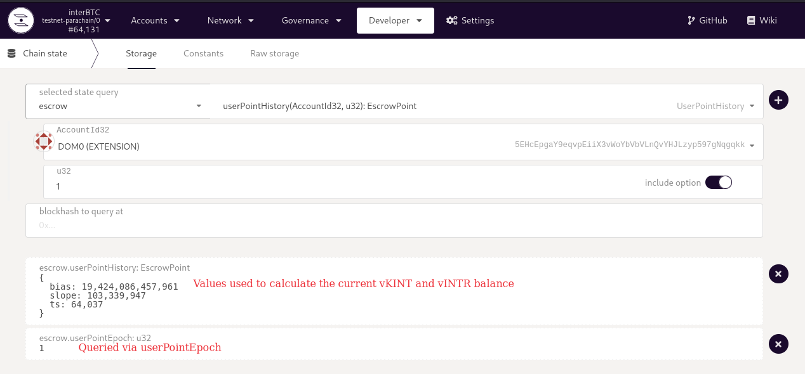

# Stake

Staking allows two things in the Kintsugi and Interlay networks:
- Participate in governance by obtaining vKINT tokens form staking KINT or vINTR tokens from staking INTR
- Earning staking rewards by locking KINT or INTR

Following this guide, you will learn:

- [x] [Staking your KINT/INTR tokens](#stake-kint-or-intr)
- [x] Extending your lock time to increase your vKINT/vINTR stake
- [x] Withdrawing staking rewards
- [x] Withdrawing staked KINT/INTR tokens

### Short Primer on Stake-to-Vote

When staking KINT or INTR to receive vKINT or vINTR, the amount of vKINT or vINTR received depends on two factors:

- **The amount of KINT/INTR staked**. The higher the amount of staked KINT/INTR, the more vKINT/vINTR is generated.
- **How long KINT/INTR is staked**. The longer KINT/INTR are staked, the more vKINT/vINTR is generated.

Read more about the motivation and principles in the [Governance](/getting-started/governance.md) section.

#### Important considerations

- Minimum staking duration is 1 week. Maximum staking duration = 2x parachain lease period (e.g. 96 weeks on Kintsugi).  You can stake in increments of 1 week (e.g. 2 weeks, 5 weeks, ...)

- You get 1 vKINT (or vINTR) if you stake 1 KINT (or INTR) for the maximum possible period. For reference, please check the maximum staking periods for [Kintsugi](kintsugi/governance#hard-facts) and [Interlay](interlay/governance#hard-facts).
```
1 vKINT = 1 KINT staked for 96 weeks (maximum staking duration on Kintsugi) 
```

- vKINT/vINTR amounts decrease linearly as time progresses, unless the lock is extended.

- The lock duration is **per account**! This means: if you lock 1 KINT to 48 weeks and want to add 100 KINT later, you have 2 options:

  - (A) Lock 100 KINT for 48 weeks or more
  - (B) Use another account to lock the 100 KINT for shorter durations

**Example**

- You **stake** `10` KINT for `96` weeks. This will get you `10` vKINT.
- In `48` weeks, you will have `5` vKINT left since `50%` of the lock period has passed.
- You **extend** your current lock by `24` weeks. You now have `7.5` vKINT since your KINT are locked for `(48+24) = 72` weeks and `72/96= 75%`. 
- In 24 weeks, you will again have `5` vKINT (since the remaining lock is `48` weeks which is `50`% of the maximum lock period of `96` weeks). 
- You **add** `10` KINT to your stake and **extend** the lock by 24 weeks. You now have ``15`` vKINT (``20 KINT x (48 + 24)/96 weeks``)
- If you now want to stake `100` KINT for `2 weeks` you will need to do this via a second account. 

## Stake KINT or INTR

You can lock KINT/INTR to receive vKINT/vINTR. If you plan to participate in governance, please check the [minimum staking requirements per network](guides/governance#required-tokens).

### App

The easiest way to stake KINT/INTR is via the Staking DApp!

<!-- tabs:start -->

#### **Kintsugi**
[kintsugi.interlay.io/staking](https://kintsugi.interlay.io/staking)


#### **Interlay**

Coming soon

#### **Testnet**

[testnet.interlay.io/staking](https://testnet.interlay.io/staking)
<!-- tabs:end -->

?> We use Kintsugi as example in the following - Interlay staking looks and works the same.


1. In the staking app, enter the amount you want to stake.
3. Enter the staking period *in weeks*. Minimum 1 week, maximum 96 weeks for KINT (longer for INTR)
4. Review the unlock date and the reward estimates.

?> Note: The reward estimates may change as more or less people stake.

4. Click "Stake" and sign the transaction.




5. You can now see (a) the amount of staked KINT, (b) your voting power in vKINT (also used to calculate rewards), and (c) your staking rewards available for withdrawal.



!> **Risk vs Return**: The more and the longer you lock, the more rewards you can earn. However, once your tokens are staked you can only withdraw them at the end of the staking period. Please DYOR and familiarize yourself with the [risks of staking](https://cryptogeeks.org/risks-of-staking-crypto/).
### Polkadot.js (Advanced)
<details>
<summary>
Click to expand
</summary>

?> This is a low-level interface intended for advanced users.

Make sure you connect to the correct parachain in [polkadot.js.org/apps](https://polkadot.js.org/apps).

#### 1. Lock KINT/INTR

- Go to Developer -> Extrinsics -> escrow -> createLock
- Enter the `amount` of tokens you would like to lock. For KINT, convert by 1 KINT = 1 * 10^12 planck KINT. For example, if you want to lock 50 KINT, you would enter 50,000,000,000,000 planck KINT.
- Enter the time the KINT should be locked for. KINT will not be accessible before the lock expires. The `unlockHeight` is specified in numbers of blocks and rounds down to the closest week. One week is equal to 50,400 blocks. For example, if the chain is currently at block height 100,000 and you wish to lock tokens for 10 weeks, you would enter current block height + 10 weeks * 50,400 blocks = 100,000 + 10 * 50,400 = 604,000.
- Submit the extrinsic to lock the tokens.



#### 2. Check locked KINT/INTR

- Go to Developer -> Chain Sate -> escrow -> locked
- The `amount` is the KINT locked in planck KINT
- The `end` is the block number at which all KINT can be withdrawn



#### 3. Check vKINT/vINTR balance

The vKINT and vINTR balances decrease linearly over time.
To calculate the current balance, we use the following [formula](https://spec.interlay.io/spec/escrow.html#point):

`balance = bias - (slope * (now - height))`

- `now`: Go to Explorer and note down the current block height. This is the now value.
- `bias`, `height`, and `slope`: Go to Developer - Chain State -> escrow -> userPointEpoch and note down the current epoch. Then go to Developer - Chain State -> escrow -> userPointHistory and insert your account as well as the epoch from the previous step. This will give the current `bias` and `slope` as well as the `height` (see `ts`) in which tokens were locked.

In the example in the images, we have 500 KINT locked for four weeks. This results in:

19,424,086,457,961 - (103,339,947 * (64,100 - 64,037)) = 19,417,576,041,300 planck vKINT = 19.4 vKINT



</details>


## Extend Staking Lock

### App

Will be added soon.

## Withdraw Staking Rewards

### App

Will be added soon.

## Withdraw Staked KINT or INTR

### App

Will be added soon.
