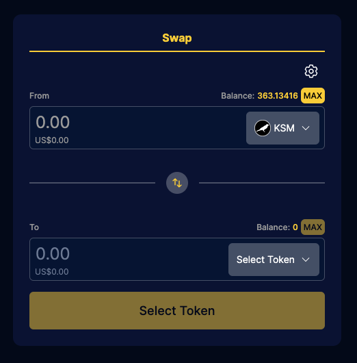
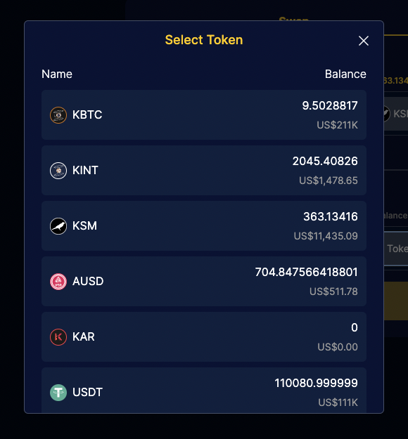
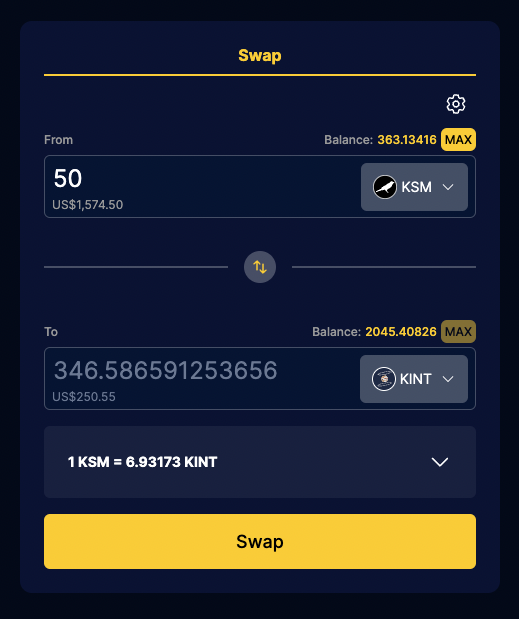
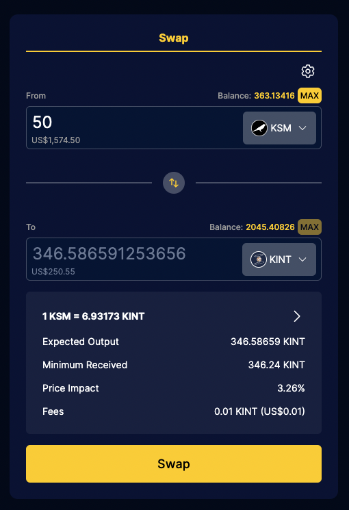

# Swap

Swapping is very straightforward: a user selects a token that they own and a token they would like to trade it for. Executing a swap sells the currently owned token for equivalent amount of the desired token.

## Prerequisites

Make sure you have a compatible [wallet plugin](guides/wallets-explorers.md#substrate-wallets) installed.

## Swap

At the end of this guide you will have:

- [x] [Conducted a swap](#4-make-the-swap)

### 1. Go to the swap page

<!-- tabs:start -->

#### **Interlay**

[app.interlay.io/swap](https://app.interlay.io/swap)

#### **Kintsugi**

[kintsugi.interlay.io/swap](https://kintsugi.interlay.io/swap)

#### **Testnet-Kintsugi**

[kintnet.interlay.io/swap](https://kintnet.interlay.io/swap)

#### **Testnet-Interlay**

[testnet.interlay.io/swap](https://testnet.interlay.io/swap)

<!-- tabs:end -->

### 2. Bring tokens for swap and transaction fees

You will need some tokens to pay for transaction fees (KINT on Kintsugi, INTR on Interlay). Additionally, you also need tokens to be able to swap for another token.

<!-- tabs:start -->

#### **Interlay**

A list of exchanges with INTR listings can be found on [Coingecko](https://www.coingecko.com/en/coins/interlay). Those exchanges should also have the assets in the Interlay lending markets listed.

#### **Kintsugi**

A list of exchanges with KINT listings can be found on [Coingecko](https://www.coingecko.com/en/coins/kintsugi). Those exchanges should also have the assets in the Kintsugi lending markets listed.

#### **Testnet**

On testnet, you can obtain some tokens (KINT/INTR, KBTC/IBTC, KSM/DOT, USDT) by clicking on the "Tokens Faucet" button on the right-hand side of the top bar.

<!-- tabs:end -->

### 3. Select token to buy

Start by selecting the token that you want to buy. You can see the available tokens by clicking on the "Select Token" element. This will open a modal with a list of each available token, along with your balances.

From this list, select the token that you desire. If you want to change the token to sell, you just need to follow the same flow.

### 4. Setup swap amounts

When you select your tokens, now you will need to provide the amount of token that you want to sell. After specifying the amount of tokens that you want to sell, a calculation will take place and the amount of tokens you will get will be shown.

### 4. Make the Swap

At this stage, you are ready to conduct the swap, but before procceding, there are couple of things that might be of your interest to config or beware of:

#### Price Impact

You can access the price impact of your current swap setup by expanding the element with the current token exchange rate.

You can visit this [documentation](https://support.uniswap.org/hc/en-us/articles/8671539602317-What-is-Price-Impact-) for a more in-depth explanation about this topic.

#### Slippage

You can access the current slippage and chang it by pressing the top right cog element, which will open a modal where you can customize your slippage.

You can visit this [documentation](https://support.uniswap.org/hc/en-us/articles/8643879653261-What-is-Price-Slippage-) for a more in-depth explanation about this topic.
