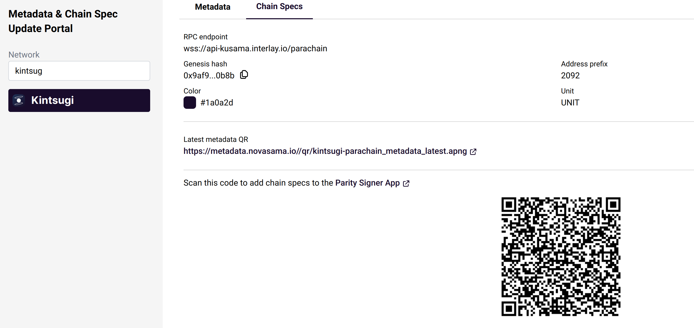
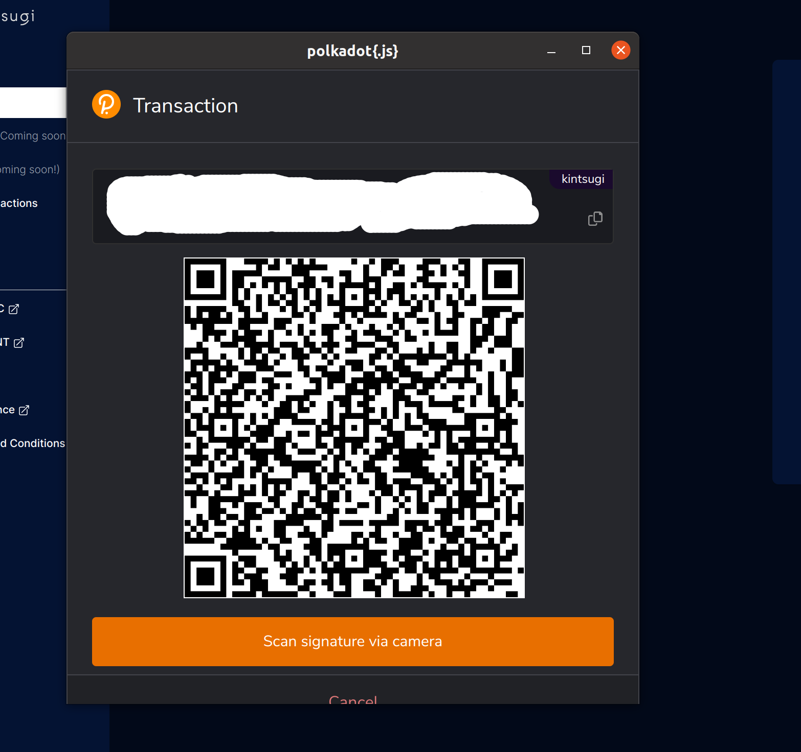
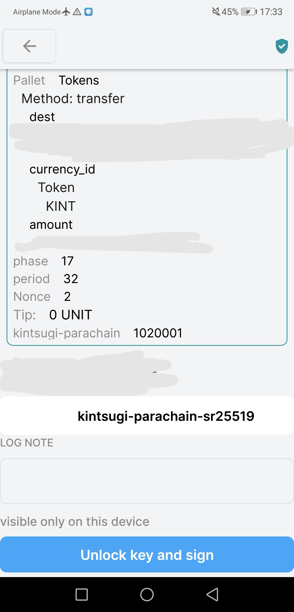
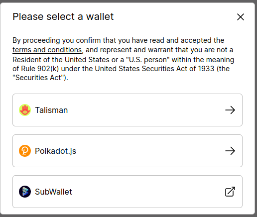
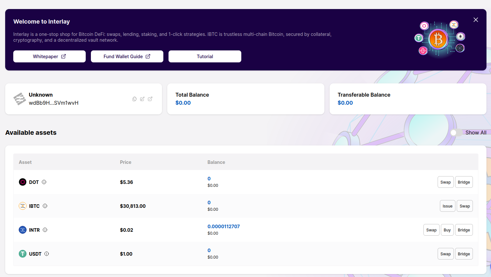

# Wallets and Explorers

Interacting with any blockchain requires to have a wallet.

At the end of this guide you will have:

- [x] [Created an account for Interlay](#creating-an-account)
- [x] [Learned how to check your balances in explorers](#substrate-explorers)
- [x] [Installed and created a Bitcoin wallet](#bitcoin-wallets)
- [x] [Checked your BItcoin balances on Bitcoin explorers](#bitcoin-explorers)
- [x] [Testnet only: requested testnet KSM and testnet BTC](#testnet-faucets)

## Creating an Account

Choose a browser, web, mobile, or hardware wallet below and create an account following the instructions in the links.

### Browser Wallets

To interact with the Interlay/Kintsugi Dapp you will need a Substrate-compatible browser extension.

#### [Talisman](https://talisman.xyz/)

1. **Install** the Talisman extension in your browser: [https://talisman.xyz/download](https://talisman.xyz/download)
2. Follow the instructions to create a new account or import an existing one.

#### [polkadot.js](https://polkadot.js.org/extension/)

1. **Install** the polkadot-js extension in your browser: [https://polkadot.js.org/extension/](https://polkadot.js.org/extension/).

2. **Create account**. Go to the plus sign at the top of the extension and click on "create new account" and follow the instructions.

#### [SubWallet](https://subwallet.app/)

Guide: https://docs.subwallet.app/dapps-user-guide/interlay

### Web Wallets

<!-- tabs:start -->
#### **Interlay**

#### Polkadot.js Apps

Go to [https://polkadot.js.org/apps/?rpc=wss%3A%2F%2Fapi.interlay.io%2Fparachain#/explorer](https://polkadot.js.org/apps/?rpc=wss%3A%2F%2Fapi.interlay.io%2Fparachain#/explorer)

#### Talisman

Go to [Talisman](https://app.talisman.xyz/)

#### **Kintsugi**

#### Polkadot.js Apps

Go to [https://polkadot.js.org/apps/?rpc=wss%3A%2F%2Fapi-kusama.interlay.io%2Fparachain#/explorer](https://polkadot.js.org/apps/?rpc=wss%3A%2F%2Fapi-kusama.interlay.io%2Fparachain#/explorer)

#### Talisman

Go to [Talisman](https://app.talisman.xyz/)

#### **Testnet-Kintsugi**

#### Polkadot.js Apps

Go to [https://polkadot.js.org/apps/?rpc=wss%253A%252F%252Fapi-dev-kintsugi.interlay.io%252Fparachain#/explorer](https://polkadot.js.org/apps/?rpc=wss%253A%252F%252Fapi-dev-kintsugi.interlay.io%252Fparachain#/explorer)

#### **Testnet-Interlay**

#### Polkadot.js Apps

Go to [https://polkadot.js.org/apps/?rpc=wss%3A%2F%2Fapi-testnet.interlay.io%2Fparachain#/explorer](https://polkadot.js.org/apps/?rpc=wss%3A%2F%2Fapi-testnet.interlay.io%2Fparachain#/explorer)

<!-- tabs:end -->

### Mobile Wallets

<!-- tabs:start -->

#### **Interlay**

#### [Fearless Wallet](https://fearlesswallet.io/)

Supports Android, iOS and Chrome.

#### [Nova wallet](https://novawallet.io/)

Supports Android and iOS.

#### **Kintsugi**

#### [Fearless Wallet](https://fearlesswallet.io/)

Supports Android, iOS and Chrome.

#### [Math wallet](https://mathwallet.org/kintsugibtc-wallet/en/)

Supports Android, iOS and Chrome.

#### [Nova wallet](https://novawallet.io/)

Supports Android and iOS.

<!-- tabs:end -->

### Hardware Wallets

<!-- tabs:start -->
#### Polkadot Vault

[Polkadot Vault](https://signer.parity.io/) is a mobile app which turns your iOS or Android device into a dedicated hardware wallet for Polkadot, Kusama, and any other Substrate-based chain. It allows you to keep your private keys offline while still being able to conveniently sign transactions in an air-gapped way using QR codes.

1 [Follow this guide to install and setup Polkadot Vault on your mobile device](https://paritytech.github.io/parity-signer/tutorials/Start.html)

1. Add Kintsugi / Interlay networks.

 

- On your Desktop, navigate to https://nova-wallet.github.io/metadata-portal/ 
- Select Kintsugi / Interlay as the desired chain. 
- Click on `Chain Specs`
- On your Polkadot Vault, click `Scan`, scan the QR code and click `Add new chain`.
- (Optional) Update Metadata: `Scan` the moving QR code in the `Metadata` tab

2. Add accounts to Polkadot.js via QR code

 

- **If using  Polkadot.js browser extension**: 
  * `Settings` > `open extension in new window`. 
  * In the new window: `Settings` > `Allow QR Camera Access`. 
  * Allow camera access in the browser pop-up. 
  * Click `+` > `Attach external QR-signer account` > Scan Polkadot Vault QR code (see below) using the device camera

- **If using Polkadot.js apps**: 
  * On [Polkadot.js apps](https://polkadot.js.org/apps/#/accounts), click on `+` > `Attach external QR-signer account`. 
  * Scan Polkadot Vault QR code (see below) using the device camera

- **Show Key QR code on Polkadot Vault app**
  * Open the `Keys` tab in the bottom menu;
  * Select the network you will be using from the dropdown menu next to chain;
  * Select your desired account or sub-account;
  * You will see a QR code which you need to scan with your device camera.

3. Sign transactions using Polkadot Vault

 

!> Always make sure you are scanning a QR code signed by a trusted verifier.

- When you sign a transaction with the **account you imported via the QR code**, you will be prompted to `Scan signature via camera`

  

- Scan the QR code using the Polkadot Vault app and click on `Unlock key and sign`.

  

- Your Polkadot Vault will now display a QR code. To complete signing the transaction, siwthc back to your Desktop andclick on `Scan signature via camera`. Scan the QR code displayed on your mobile device.

#### Ledger (soon)

The Interlay Ledger app is currently under review and will appear in the Ledger Live store soon. 

The Kintsugi Ledger app is being developed. 

<!-- tabs:end -->

### Understanding Accounts and Addresses

Polkadot uses [address formats](https://wiki.polkadot.network/docs/build-ss58-registryhttps://wiki.polkadot.network/docs/learn-accounts#address-format) for different chains. That way, you can use the same account and have unique addresses on each chain. By default, all addresses can be automatically converted between different chains.

For example, the `Alice` account can take the following formats:

- **Generic Substrate**: 5GrwvaEF5zXb26Fz9rcQpDWS57CtERHpNehXCPcNoHGKutQY
- **Polkadot**: 15oF4uVJwmo4TdGW7VfQxNLavjCXviqxT9S1MgbjMNHr6Sp5
- **Kusama**: HNZata7iMYWmk5RvZRTiAsSDhV8366zq2YGb3tLH5Upf74F
- **Kintsugi**: a3f1Q33MZ6B82T7rwQ1Ke1Qekzuxe8yRbfvRxkPh11jdsrTLR
- **Interlay**: wdCJ8CsZchTEfUP8Xz1eZKNRjW5cuYjJ9fh6pcZNXezsysBrJ

You can use the same account across different chains in the Polkadot ecosystem.

## Connecting your Accounts

Go to the Interlay app for the network you want to connect to and click on select wallet in the topbar. You will then be asked to select an installed wallet.

<!-- tabs:start -->

#### **Interlay**

https://app.interlay.io/wallet

#### **Kintsugi**

https://kintsugi.interlay.io/wallet

#### **Testnet-Kintsugi**

https://kintnet.interlay.io/wallet

#### **Testnet-Interlay**

https://testnet.interlay.io/wallet

<!-- tabs:end -->

You can then select your account.

Once the wallet is connected, you will see the address of your connect account, total balance, transferable balance, and an overview of available assets.

## Substrate Explorers

<!-- tabs:start -->

#### **Interlay**

#### Subscan

[interlay.subscan.io](https://interlay.subscan.io/)

#### Sub.id (Balances only)

Go to [sub.id](https://sub.id/#/) and enter your account.

#### Polkadot.js Apps

Go to [https://polkadot.js.org/apps/?rpc=wss%3A%2F%2Fapi.interlay.io%2Fparachain#/accounts](https://polkadot.js.org/apps/?rpc=wss%3A%2F%2Fapi.interlay.io%2Fparachain#/accounts)

#### **Kintsugi**

#### Subscan

[kintsugi.subscan.io](https://kintsugi.subscan.io/)

#### Sub.id (Balances only)

Go to [sub.id](https://sub.id/#/) and enter your account.

#### Polkadot.js Apps

Go to [https://polkadot.js.org/apps/?rpc=wss%3A%2F%2Fapi-kusama.interlay.io%2Fparachain#/accounts](https://polkadot.js.org/apps/?rpc=wss%3A%2F%2Fapi-kusama.interlay.io%2Fparachain#/accounts)

#### **Testnet-Kintsugi**

#### Polkadot.js Apps

Go to [https://polkadot.js.org/apps/?rpc=wss%253A%252F%252Fapi-dev-kintsugi.interlay.io%252Fparachain#/accounts](https://polkadot.js.org/apps/?rpc=wss%253A%252F%252Fapi-dev-kintsugi.interlay.io%252Fparachain#/accounts)

#### **Testnet-Interlay**

#### Polkadot.js Apps

Go to [https://polkadot.js.org/apps/?rpc=wss%3A%2F%2Fapi-testnet.interlay.io%2Fparachain#/accounts](https://polkadot.js.org/apps/?rpc=wss%3A%2F%2Fapi-testnet.interlay.io%2Fparachain#/accounts)

<!-- tabs:end -->

## Bitcoin Wallets

You can use basically **any** Bitcoin wallet to interact with the KBTC (on Kintsugi) and interBTC (on Interlay).

<!-- tabs:start -->

#### **Bitcoin Mainnet**
For a general overview of Bitcoin wallets you can consult [bitcoin.org's wallet selector](https://bitcoin.org/en/choose-your-wallet?step=5).

!> Attention: do **not** use mainnet Bitcoin wallets for Kintsugi / Interlay **testnet**

#### **Bitcoin Testnet**

For testnet, you can also pick one of the following Bitcoin wallets that support testnet accounts:

- **GreenAddress**: https://test.greenaddress.it/en/ (Android and IOS)
- **Bitcoin Testnet Wallet**: https://play.google.com/store/apps/details?id=de.schildbach.wallet_test (Android only)
- **Electrum**: https://electrum.org/#home (Linux, Windows, macOS and Android)
- **Bitpay**: https://bitpay.com/wallet/ (Linux; Guide here: https://support.bitpay.com/hc/en-us/articles/360015463612-How-to-Create-a-Testnet-Wallet)
<!-- tabs:end -->

#### Hardware Wallets

You can also use your hardware wallet. The following are tested and have Bitcoin mainnet and testnet support:

<!-- tabs:start -->

#### **Bitcoin Mainnet**

- **Ledger**: https://www.ledger.com/
- **Trezor**: https://trezor.io/

!> Attention: do **not** use mainnet Bitcoin wallets for Kintsugi / Interlay **testnet**

#### **Bitcoin Testnet**

- **Ledger**: https://www.ledger.com/ (Guide: https://coinguides.org/ledger-testnet/)
- **Trezor**: https://trezor.io/ (Guide: https://wiki.trezor.io/Bitcoin_testnet)

<!-- tabs:end -->

## Bitcoin Explorers

<!-- tabs:start -->

#### **Bitcoin Mainnet**

There are many Bitcoin Mainnet explorers. We find the following have the best user experience:

**[Blockstream](https://blockstream.info/)**
**[Blockchain.com](https://www.blockchain.com/explorer)**

#### **Bitcoin Testnet**

**[Blockstream Testnet Explorer](https://blockstream.info/testnet/)**

<!-- tabs:end -->

## Testnet Faucets

To test, you will need testnet tokens. Please follow the steps below.

Attention:

- Testnet tokens have no economic value.
- Do not use real BTC or other mainnet assets on testnet!

### 1. Getting testnet KINT/INTR

You can get testnet KINT/INTR for transaction fees by clicking on the faucet link in the top bar.

?> These testnet KINT/INTR are only usable on testnet. They are **not real KINT/INTR and have no economic value**.

### 2. Getting testnet BTC

Make sure you have at least some testnet BTC in your wallet.
You can get testnet BTC by clicking on the faucet link in the top bar of testnet.interlay.io, or from one of the following faucets:

- [https://bitcoinfaucet.uo1.net/](https://bitcoinfaucet.uo1.net/)
- [https://coinfaucet.eu/en/btc-testnet/](https://coinfaucet.eu/en/btc-testnet/)
- [https://kuttler.eu/en/bitcoin/btc/faucet/](https://kuttler.eu/en/bitcoin/btc/faucet/)
- [https://tbtc.bitaps.com/](https://tbtc.bitaps.com/)

### 3. Getting testnet tokens for Vaults

If you are going to run a [Vault on testnet](/vault/installation?id=installing-the-vault-client), the Vault client will automatically request transaction fee tokens (KINT/INTR) and collateral tokens (KSM/DOT) on registration.

?> These testnet KINT/INTR/KSM/DOT are only usable on testnet. They are **not real KINT/INTR/KSM/DOT and have no economic value**.
