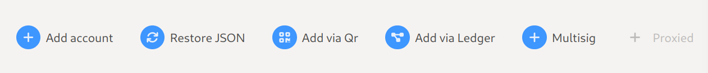
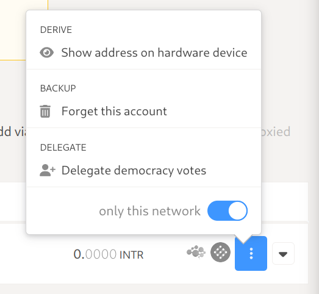
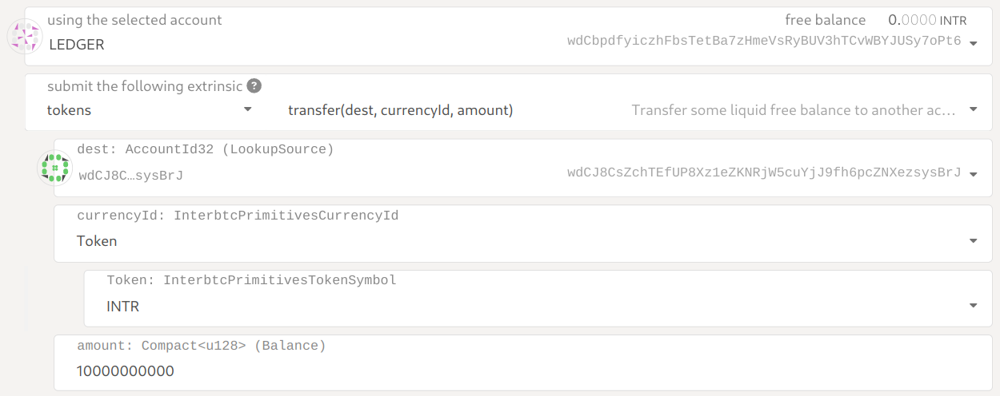
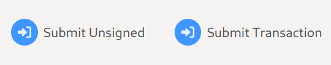

# Ledger (WIP)

## User Guide

!> Make sure the Interlay app is open on your Ledger device!

1. Open the [Polkadot-JS Apps UI](https://polkadot.js.org/apps/?rpc=wss%3A%2F%2Fapi.interlay.io%2Fparachain#/explorer) on the Interlay network
2. Go to the "Settings" tab and select the option "Attach Ledger via WebUSB" for "manage hardware connections". Click "Save" to keep your settings.
3. Go to the "Account" tab and you will see a new button that says "Add via Ledger". Click it.
4. Set your account name, and choose the account type and address index. (You should now be able to find a new account with the type "ledger")

### Address

You can verify a public address on the Ledger device by clicking "Show address on hardware device".

### Transactions

Go to the "Extrinsics" tab and craft the "Submission". Supported calls are listed [here](https://github.com/Zondax/ledger-interlay#tokens).

Click the "Submit Transaction" button.

The app will now display the transaction information, review this and then "REJECT" to cancel or "APPROVE" to sign.

## Developers

Follow the build instructions specified [here](https://github.com/Zondax/ledger-interlay).
