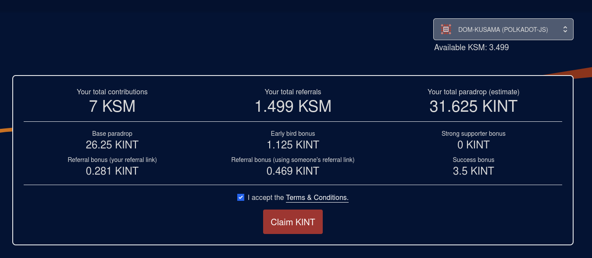
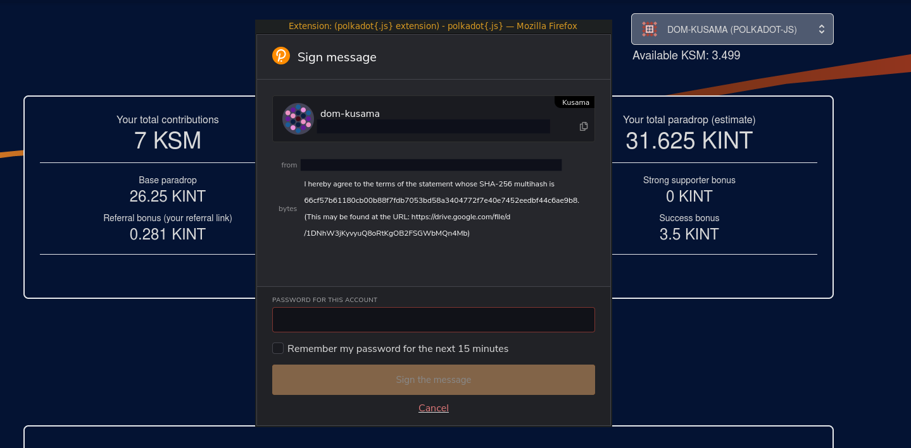
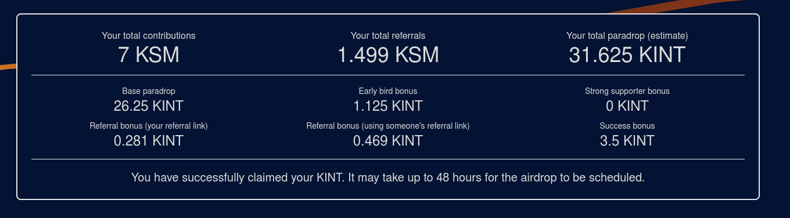
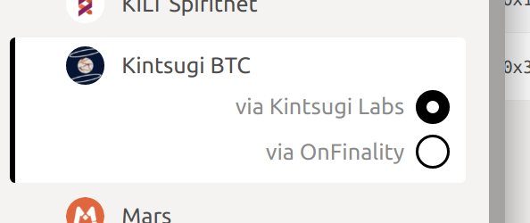
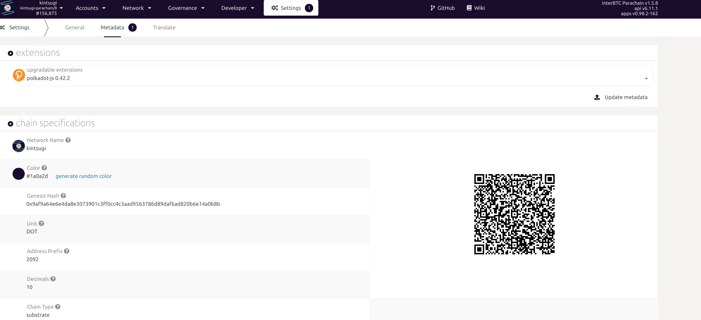
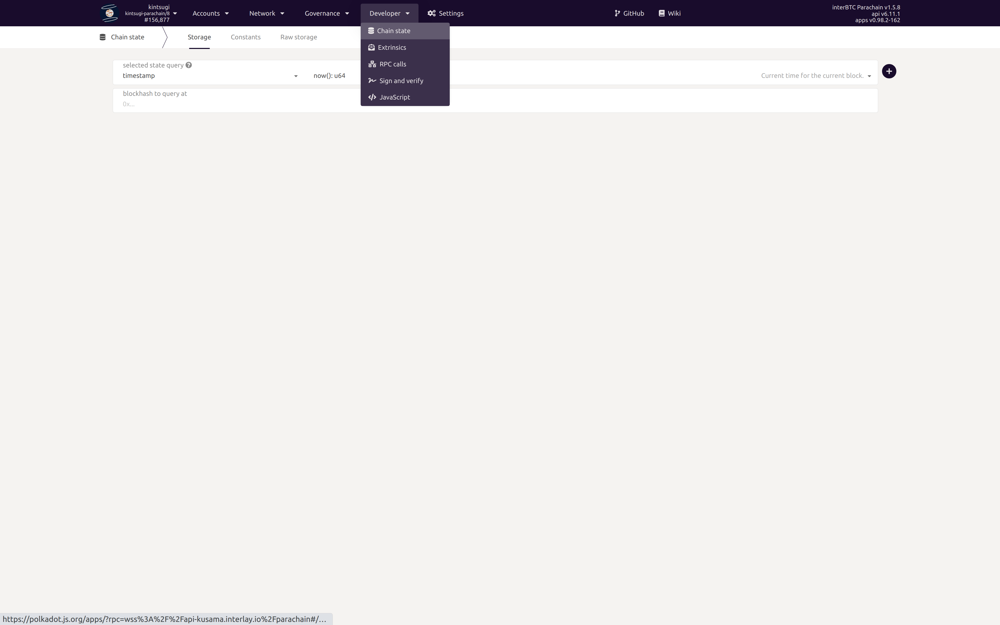
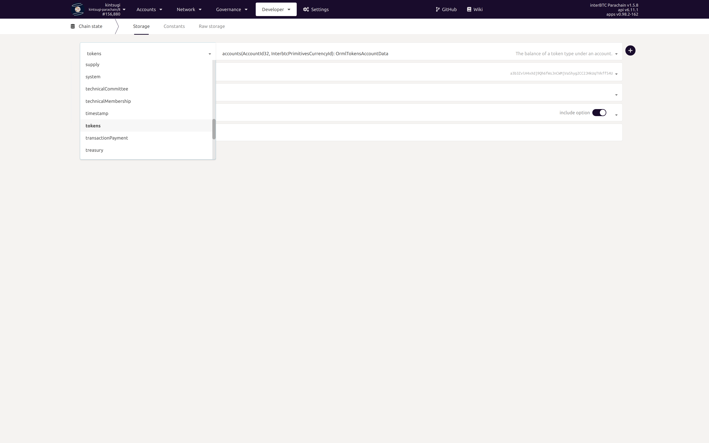
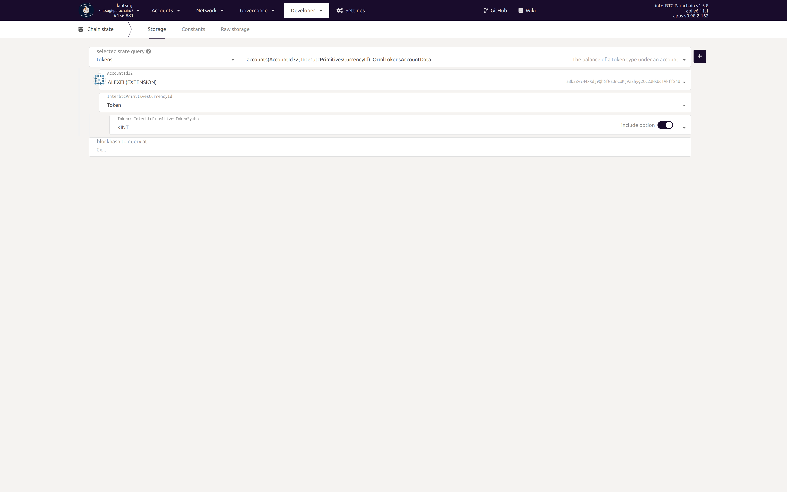
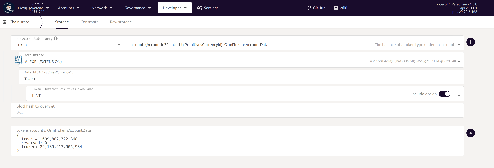
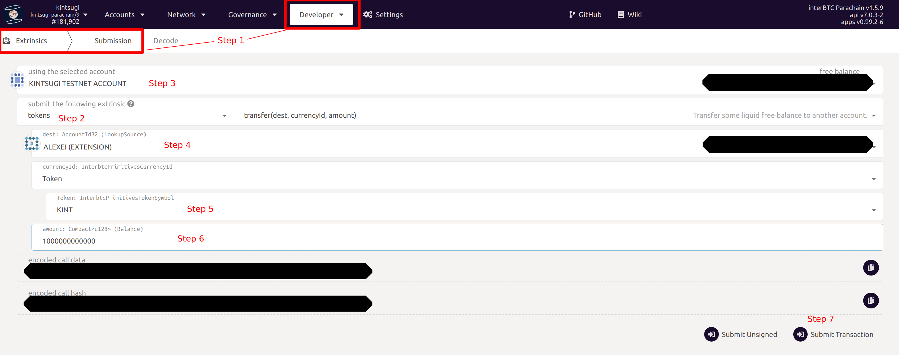

# The Kintsugi Crowdloan

Kintsugi participates in the Kusama parachain auctions and supports a crowdloan to enable the community to vote.
To participate in the crowdloan, you need to lock your KSM and vote for Kintsugi to become a parachain.

Below is a summary of the Kintsugi crowdloan details, as described in the [token economy whitepaper released by Kintsugi Labs](https://raw.githubusercontent.com/interlay/whitepapers/master/Kintsugi_Token_Economy.pdf).

## Hard Facts

* **Target slot: 6 - 10**
* **Lease duration: 8 periods (maximum lease duration ~48 weeks)**
* **Max. lockup target: 200 000 KSM**

### Crowdloan Airdrop: 10% (1 million KINT) of the initial 4-year supply

The main crowdloan airdrop will comprise 10% (1 million KINT) of the initial 4-year KINT supply, with the following vesting schedule:

* **30% transferrable** at launch
* Remaining **70% linearly vested** over 48-week parachain lease period.

Thereby, this airdrop will feature the following **special allocations**, to create a proactive crowdloan process:

* **Early**: 5% for first 3 days of crowdloan
* **Referral**: 5% for the referrer and referred
* **Strong supporter (new!)**: starting with 0.5% at 10 KSM, linearly increasing up to 5% if above 1000 KSM (min.: 10 KSM). *Applied retrospecively, incl. KSM lock-ups before announcement*.

* **Success**: up to 100 000 additional KINT if specific KSM lockup targets are achieved. See table:

Any KINT not used for the Core, Early, Referral and Success Airdrop will be distributed proportionally among all participants, further increasing the ratio of KINT per locked KSM.

### Power User Bonus: 2% (200 000 KINT) of the initial 4-year KINT supply

To incentivize kBTC adoption, 200 000 KINT will be airdropped to crowdloan participants who then also run Vaults and mint kBTC on Kusama, once Kintsugi is live. These airdrops will happen over the course of the first parachain lease period. In addition, protocol governance may approve special kBTC LP programs for crowdloan participants.

## Participating in the Crowdloan

The crowdloan is a fully permissionless event - you make your own judgement on if and how you would like to participate.

We recommend the following ways to participate:

1. Participate via the [Kintsugi crowdloan website](https://kintsugi.interlay.io/) using the Polkadot.js browser extension.
2. Participate via partner exchanges.
3. Participate via partner mobile wallets.

## Claiming KINT

Follow this guide to claim KINT. This guide applies the following contributors:

* Contributions via https://kintsugi.interlay.io/, please use the account that you have used for the contribution
* Contributions via https://polkadot.js.org/apps/#/, please use the account that you have used for the contribution
* Contributions via the Bifrost SALP (https://bifrost.app/vcrowdloan?tab=ksm), please use the account that you have used for the contribution on the Bifrost app

Other contributions, e.g., via exchanges will airdrop KINT tokens through other means. If you have contributed via any other means than the ones listed above, please contact the provider of the contribution for the KINT airdrop.

### 1. Go to the KINT claim website at [ https://kintsugi.interlay.io/](https://kintsugi.interlay.io/)

Scroll down to the claim form. If you have contributed to the Kintsugi crowdloan, you will see your estimated KINT airdrop together with your KSM locked.

You MUST read and accept the terms and conditions to qualify for the airdrop.

### 2. Sign the Terms and Conditions by clicking the "Claim KINT" button

You will be asked to sign the terms and conditions via the polkadot.js extension.

?> There are **no** transaction fees for signing the T&Cs.

### 3. Successfully claimed KINT

It may take up to 48 hours to see and access your KINT in your wallet. Thank you for participating.

## Checking KINT Balance

Withing ~48 hours of accepting the T&Cs and submitting the claim form, you should receive airdropped tokens in you account. Follow these steps to check your balance.

!> Polkadot.js Accounts tab will **not show your KINT balance**. Kintsugi has a generic multi-currency pallet, which allows adding any token easily. However, Polkadot.js does not support this - yet. **Follow the instructions below to view your KINT balance via Polkadot.js Developer tab**

### 1. Go to [ https://polkadot.js.org/apps/?rpc=wss%3A%2F%2Fapi-kusama.interlay.io%2Fparachain#/explorer](https://polkadot.js.org/apps/?rpc=wss%3A%2F%2Fapi-kusama.interlay.io%2Fparachain#/explorer)

Make sure you check that "Hosted by Kinstugi Labs" is selected in the explorer sidebar.

### 2. Update Metadata

Go to the "Settings" > "Metadata" tab.
Click "Update metadata".

?> In some cases, there is no "update" button shown - but the QR code will change automatically. This means the metadata was updated.

### 3. View Balance in Developer > Chain state > Token

In the "Developer" tab select "Chain state".

Then, in the dropdown, select the "token" pallet.

Select your Account in the top-level dropdown, and select "KINT" in the currency selector dropdown (see image).

Then click "+" in the top right of the form.

You will now see your KINT balance as follows:

?> Amounts are shown in **micro KINT** - the smallest currency unit on Kintsugi. To get to the actual KINT **divide by 1,000,000,000,000** (remove 12 decimal points). This is a Polkadot.js feature.

- **free** shows your **total KINT balance**
- **frozen** shows how much of your KINT are **still vesting**

## Transfer KINT

1. To transfer KINT, select "Extrsinsics" in the "Developer".

2. In the dropdown, select the "tokens" pallet.

3. Enter the source account.
   
4. Enter the destination account.

5. Select "KINT" in the "Token" dropdown.

6. Enter the amount **in micro KINT**.
7. Press "Sign Transaction". In the opened modal, enter your account password, and then click "Sign and Submit".

You will see a green success message after 10-20 seconds in the top right if the transfer was successful.

?> Reminder: 1 KINT = 1,000,000,000,000 micro KINT (12 zeroes).

