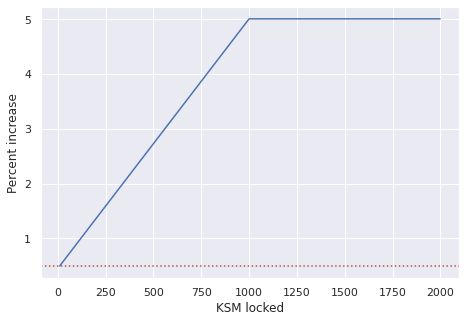

# The Kintsugi Crowdloan

Kintsugi participates in the Kusama parachain auctions and supports a crowdloan to enable the community to vote.
To participate in the crowdloan, you need to lock your KSM and vote for Kintsugi to become a parachain.

Below is a summary of the Kintsugi crowdloan details, as described in the [token economy whitepaper released by Kintsugi Labs](https://raw.githubusercontent.com/interlay/whitepapers/master/Kintsugi_Token_Economy.pdf).

## Hard Facts

* **Target slot: 6 - 10**
* **Lease duration: 8 periods (maximum lease duration ~48 weeks)**
* **Max. lockup target: 200 000 KSM**

### Crowdloan Airdrop: 10% (1 million KINT) of the initial 4-year supply

The main crowdloan airdrop will comprise 10% (1 million KINT) of the initial 4-year KINT supply, with the following vesting schedule:

* **30% transferrable** at launch
* Remaining **70% linearly vested** over 48-week parachain lease period.

Thereby, this airdrop will feature the following **special allocations**, to create a proactive crowdloan process:

* **Early**: 5% for first 3 days of crowdloan
* **Referral**: 5% for the referrer and referred
* **Strong supporter (new!)**: starting with 0.5% at 10 KSM, linearly increasing up to 5% if above 1000 KSM (min.: 10 KSM). *Applied retrospecively, incl. KSM lock-ups before announcement*.

* **Success**: up to 100 000 additional KINT if specific KSM lockup targets are achieved. See table:

Any KINT not used for the Core, Early, Referral and Success Airdrop will be distributed proportionally among all participants, further increasing the ratio of KINT per locked KSM.

### Power User Bonus: 2% (200 000 KINT) of the initial 4-year KINT supply

To incentivize kBTC adoption, 200 000 KINT will be airdropped to crowdloan participants who then also run Vaults and mint kBTC on Kusama, once Kintsugi is live. These airdrops will happen over the course of the first parachain lease period. In addition, protocol governance may approve special kBTC LP programs for crowdloan participants.

