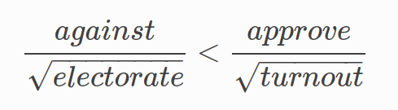
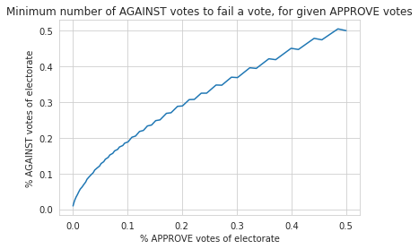

# Optimistic Stake-Based Governance

Kintsugi's governance model is inspired by [Polkadot’s governance structure](https://wiki.polkadot.network/docs/learn-governance), yet introduces two major modifications: (1) optimistic governance and (2) stake-to-vote.

?> While many DeFi protocols bet on "gradual decentralization", Interlay focuses **on decentralization from day 1**. This entails a higher risk during the early days of the network, as the community learns to organize - but this risk ultimately pays off in the mid and long run. Kintsugi hence serves as an experiment, betting on the strength of the community.  

## Optimistic Governance

To promote a more active governance process and avoid the “lazy voter” problem, Kintsugi implements “optimistic governance”. This means:

- **No Council**, only public proposals from community
- Community can elect a **Technical Committee** to fast-track proposals
- Referenda are **Super-Majority Against (Negative Turnout Bias)** by default

#### Super-Majority Against (Negative Turnout Bias)

An important distinction is the negative turnout bias (Super-Majority Against​) voting threshold. This is best summarized in the [Polkadot wiki](https://wiki.polkadot.network/docs/learn-governance):

> A heavy super-majority of nay votes is required to reject at low turnouts, but as turnout increases towards 100%, it becomes a simple majority-carries vote.

The outcome of a vote is determined by the following formula:

where

- `against` are the votes against a proposal ("nay")
- `approve` are the votes in favor of a proposal ("aye")
- `electorate` is the total voting power of the network
- `turnout` is the vote turnout (`against + approve`)

Below, we visualize the percentage of `against` (in relation to the `electorate`) votes necessary to fail a proposal:

As we can see, at low turnouts, the number of `against` votes must be significantly higher than the `approve` votes. As we get closer to 100% turnout we get closer to 50% `against` versus 50% `approve`.

?> The idea behind this that proposals which the community do not deem impactful (e.g. minor parameter changes, small treasury proposals, etc.) will tend to pass, unless strongly opposed. If a disputed vote starts gaining higher turnouts, we move towards a traditional simple majority vote.

## Stake-to-Vote

To vote on governance proposals, users must lock KINT with the Kintsugi parachain (escrow)- minting vKINT, a non-transferable token representing each user's voting power at any given point in time.

- The longer KINT are locked, the more vKINT are minted.
- As time progresses, the vKINT balance decreases linearly - unless the lock is extended accordingly.

The **minimum lock period is 1 week, the maximum lock period is 96 weeks** (2x the maximum parachain lease period on Kusama).

?> The idea is simple: **the longer KINT are locked**, the **more voting power** a voter has, since the voter has a **longer-term stake in the health and success** of Kintsugi.

## Technical Committee

Kintsuigi also exhibits a Technical Committee (TC) of developer teams, voted on by the community governance. The TC can make emergency proposals which, if accepted by the council, are “fast-tracked” and executed quickly, e.g. in case of critical software bugs.

At launch, the Interlay team will represent the Technical Committee to ensure bug fixes can be fast-tracked if necessary. The community can elect another TC or increase the number of TC seats whenever it wants through a proposal.

!> The TC has **no veto power**! The TC can merely fast-track proposals - but can never interfere with governance votes.

## Treasury

The on-chain Treasury is managed by community governance.