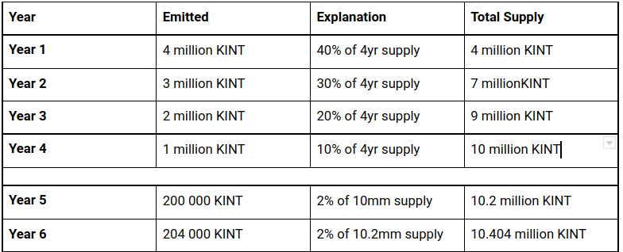
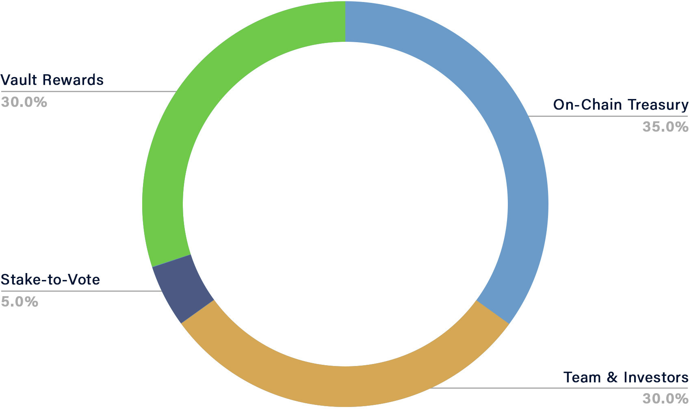
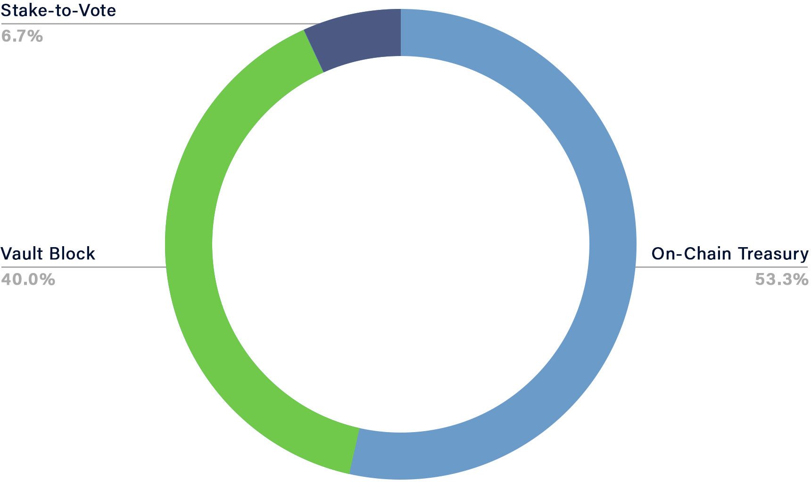

# KINT Tokenomics

Kintsugi will be governed by its community from day 1 - via KINT, Kintsugi’s governance token. Kintsugi will go live via **a fair launch scheme**. 

_KINT tokens will be distributed to network participants, builders and early backers as airdrops and block-rewards. There will be no public sale or ICO._

Below is a summary of the Kintsugi token economy, as described in the [token economy whitepaper released by Kintsugi Labs](https://raw.githubusercontent.com/interlay/whitepapers/master/Kintsugi_Token_Economy.pdf).

### Key Functions of KINT

The KINT token’s main purposes are:

* **Governance**- KINT holders vote on governance proposals and elect council members to make operational decisions. 
* **Utility**. Mit-term, Kintsugi will support transaction fee payments in KINT and other digital assets, in addition to KSM. 

### Supply and Emission

KINT features an unlimited supply. The emission schedule is defined as follows: 

* 10 million KINT emitted over the first 4 years (4:3:2:1 million) 
* 2% annual inflation afterwards, indefinitely.

Specifically, the emission schedule for the first 6 years looks as follows:

### Distribution

KINT will be controlled by the community:

* **70% is distributed to the community** as airdrops and block rewards.  
* 30% is airdropped to the Interlay team, and early & future investors, who funded development of the protocol - subject to 1 year followed by 1 year linear vesting.

Starting in year 5, only the community receives new KINT from the annual inflation.

<table>
  <tr>
   <td>

Distribution of the initial 4-year supply.
   </td>
   <td>

Distribution of the 2% annual inflation starting in year 5.
   </td>
  </tr>
</table>

---
**For a detailed breakdown and explanation of the KINT distribution, check out the [token economy whitepaper released by Kintsugi Labs](https://raw.githubusercontent.com/interlay/whitepapers/master/Kintsugi_Token_Economy.pdf)**