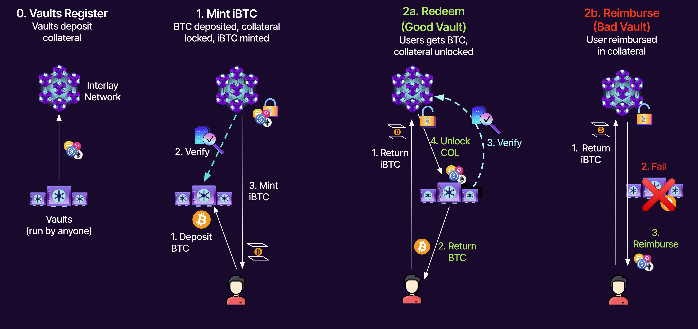

# Decentralized Bitcoin Bridge

The main building block of Interlay is a decentralized Bitcoin bridge
that enables minting of iBTC - a multi-chain 1:1 Bitcoin-backed asset.
The design follows the [XCLAIM framework](https://eprint.iacr.org/2018/643) introduced in
2018, with considerable functional and security
improvements.

## Vaulted Bitcoin

The Interlay Bitcoin bridge introduces a new kind of "wrapped\" asset:
*vaulted* Bitcoin. iBTC is a fully fungible, tokenized representation of
BTC on other blockchains that allows the owner to redeem it for BTC at a
1:1 ratio *or, in case of bridge failure, for insurance collateral in
other digital assets at a premium rate*.

The Interlay bridge is maintained by an open (anyone-can-join) network
of over-collateralized *vault* operators. Each BTC deposited by a user
into a vault is insured by collateral provided by the operator. This
collateral is used to automatically reimburse iBTC owners in case of
operator failure.

1.  **Vaults register**: Once at least one Vault has locked collateral
    on the Interlay chain, users can start minting iBTC.

2.  **Mint iBTC**: User requests to issue and sends BTC (on Bitcoin) to
    the Vault address provided by the Interlay chain. The Vaults
    collateral is now locked and the Interlay chain issues iBTC to the
    user at a 1:1 ratio to the deposited BTC, minus fees.

3.  **Use iBTC**: iBTC can now be used in Interlay DeFi and on other
    chains as a fully fungible asset.

4.  **Successful redeem**. User returns iBTC to the Interlay chain and
    requests a redeem. One or more Vaults send BTC to the user (on
    Bitcoin), minus fees, and prove this to the Interlay chain. The
    Vaults collateral is unlocked. A user can redeem with any Vault they
    like.

5.  **Failed redeem**. If a Vault does not send BTC to the user within a
    pre-defined period (currently 48h), the user can decide whether
    to (a) retry with another Vault or (b) trade iBTC for the Vaults
    collateral. In both cases, the user receives a premium, slashed from
    the Vaults collateral.

From economic perspective, the Interlay bridge functions similar to a
peer-to-peer lending protocol. Users deposit BTC to borrow iBTC at a 1:1
rate. Vaults receive the deposited BTC as a loan, in return for locking
collateral. iBTC represents a claim on the deposited BTC at a 1:1 rate
or the vault's collateral at a premium rate.

## Collateral

Following the [MakerDAO model](https://docs.makerdao.com/), each Vault has
exactly one collateral asset, while an operator can open multiple
different Vaults using the same account. Collateral assets must be
white-listed by a governance vote. Each asset undergoes a risk
assessment by community and external risk teams, defining the ceiling
(i.e., the absolute amount allowed in the system) and the following
safety thresholds per collateral:

-   **Secure threshold** (e.g. 160%). The target collateralization rate
    at the time of minting. The secure threshold defines how much iBTC
    can be minted with a Vault.

-   **Premium Redeem** (e.g. 120%). Redeeming with Vaults below this
    threshold is incentivized: the redeemer claims a small, volume-based
    premium (e.g. 5%) charged to the Vault.

-   **Liquidation** (e.g. 110%). Vault positions that fall below this
    threshold are automatically liquidated by consensus nodes.

Interesting collateral assets include BTC-correlated L1 tokens,
fiat-backed stablecoins, and interest-bearing assets e.g., liquid
staking tokens, lending positions or even AMM LP tokens.

## Liquidations

Liquidations ensure that the following invariant between the amount of
iBTC minted and collateral locked $\mathit{COL}$ holds for each Vault:

$$ \mathit{iBTC} \leq \mathit{COL} \cdot \mathit{exchangeRate_{\mathit{(BTC,COL)}}} \cdot \mathit{liquidationRate}$$

When a Vault is liquidated the bridge considers the BTC lost (the Vault
is allowed to keep the BTC) and instead uses the liquidated Vault's
collateral to temporarily back the value of iBTC. *Any* iBTC owner can
then re-balance the bridge by "burning\" iBTC to claim the collateral at
a premium rate (e.g. 110%).

## BTC Relay

The Interlay parachain tracks and verifies the state of the Bitcoin
blockchain using a built-in light client. The
so-called *BTC-Relay* verifies block headers and proofs of transactions
being included in the Bitcoin blockchain, handling forks when needed.

This allows the Bitcoin bridge to enforce correct behavior on
participants and penalize malicious actions, making it *economically
trustless*: both users and Vault must submit cryptographic proofs to
confirm correct execution of iBTC mint and redeem requests, or incur
penalties otherwise.

## Bridge Security

An in-depth security analysis is provided in the original, peer-reviewed
[XCLAIM paper](https://eprint.iacr.org/2018/643) and the [Interlay specification](https://spec.interlay.io/) . The
open-source implementation has been subject to multiple audits,
with [reports available online](/about/audits.md).

In summary, the two main properties of the Bitcoin bridge are
decentralization and *economic* trustlessness.

-   **Decentralization** is achieved by allowing anyone to register as a
    Vault operator, without requiring any form of permission. The bridge
    is also *censorship-resistant*: the minting process is
    *non-interactive*, meaning there is no action that must *or can* be
    taken by Vault operators to interfere with or prohibit creation of
    iBTC.

-   **(Economic) Security** is achieved by requiring Vault operators to
    over-collateralize their BTC positions and cryptographically prove
    correct redemption of BTC. Liquidations ensure that users can always
    redeem BTC or are reimbursed in collateral, facing no economic
    damage.

Economic security holds under the assumption that (i) the
bridge is aware of the current exchange rate between BTC and collateral
assets (i.e., assumes robust price feeds), and (ii) that the value of the
collateral does not devalue faster than the time it takes a liquidator
to complete a successful arbitrage trade, i.e., include the liquidation
transaction in the Interlay chain and exchange the claimed collateral
for BTC or iBTC.

## iBTC vs Competitors

Centralized solutions are quick to build. As such, there exist a number of centralized and trusted wrapped Bitcoin providers, mostly operating on Ethereum. However, Bitcoin was created with a vision of decentralization - and Interlay's mission is to ensure Bitcoin on other chains follows the same principles.

We provide a comparison below, using [this peer-reviewed cross-chain analysis framework](https://fc21.ifca.ai/papers/139.pdf):

- **wBTC** was created by BitGo, a crypto-custody company. All BTC locked in wBTC is held by BitGo. You cannot freely join to become a BTC custodian (only BitGo has custody), and there is no insurance against failure. Users must trust BitGo. If BTC is lost, stolen or subject to regulatory events, wBTC will have no value backing it. If using USD stablecoins as analogy, the equivalent of wBTC is USDT/USDC.
- **renBTC** is a product of the Ren protocol, a crypto-startup that pivoted from Republic Protocol (a former protocol for dark pools, aka privacy-preserving trading). The BTC locked in renBTC is reportedly[1,](https://www.theblockcrypto.com/news+/76787/ren-bitcoin-wallet-decentralization)[2](https://decrypt.co/40110/massive-honeypot-ren-holds-100m-bitcoin-centralized-wallet) held in a multisig controlled by the Ren team. It appears that Ren's Dark Nodes (part of the former dark pool protocol) are not responsible for the BTC custody - and hence it is not possible for new users to help secure Ren's locked BTC, making it a centralized protocol. Just like with wBTC, there is no insurance to reimburse users if BTC is lost - users must simply trust the Ren team. Using the USD stablecoin analogy, the equivalent of renBTC is USDT/USDC.
- **tBTC v1** deployed an arguably decentralized version of BTC on Ethereum, similar to the design initially proposed in the XCLAIM paper (i.e., similar to interBTC). The BTC locked in tBTC is locked with Signers, who share control over the BTC keys using ECDSA threshold signatures. Signers provide collateral in ETH, which is used to reimburse users if BTC is lost. While at launch/during the initial period, not everyone could become a Signer, participation is open to everyone now. Due to tBTC v1 being a single-collateral system (ETH only), Signers [reportedly](https://tian7eth.medium.com/an-analyse-of-a-liquidation-of-tbtc-system-on-mainnet-82c70c9743e6) suffered from frequent liquidations, when the BTC/ETH price was volatile.**tBTC v2** is moving closer to the model that was envisioned (but not deployed) by Ren[3](https://evandrosaturnino.medium.com/why-does-a-trustless-bitcoin-in-defi-matter-77c0d544f0d9): BTC will be controlled by a group of 50-100 Signers sampled from a larger set. Rather than ETH, insurance will then be locked in KEEP tokens and cover a fraction of the locked BTC value.

**interBTC**, for comparison:

- **Anyone** can become a Vault in interBTC, making it fully **decentralized**;
- Vaults cannot prevent users from minting interBTC, making it **censorship resistant**
- Vaults lock **collateral in different assets (MakerDAO-like multi-collateral system)**, making the price peg **more stable** and avoiding frequent liquidations. This also allows to use interest bearing assets, such as liquid staking assets, as collatera, making interBTC **more capital efficient**.
- If BTC is lost or stolen, users are **reimbursed in collateral at a beneficial rate** (~110%), making it **financially trustless**.

Using the USD stablecoin analogy, **interBTC is comparable to multi-collateral DAI - but better, because interBTC can be redeemed for BTC but DAI cannot be redeemed for physical USD**. 
