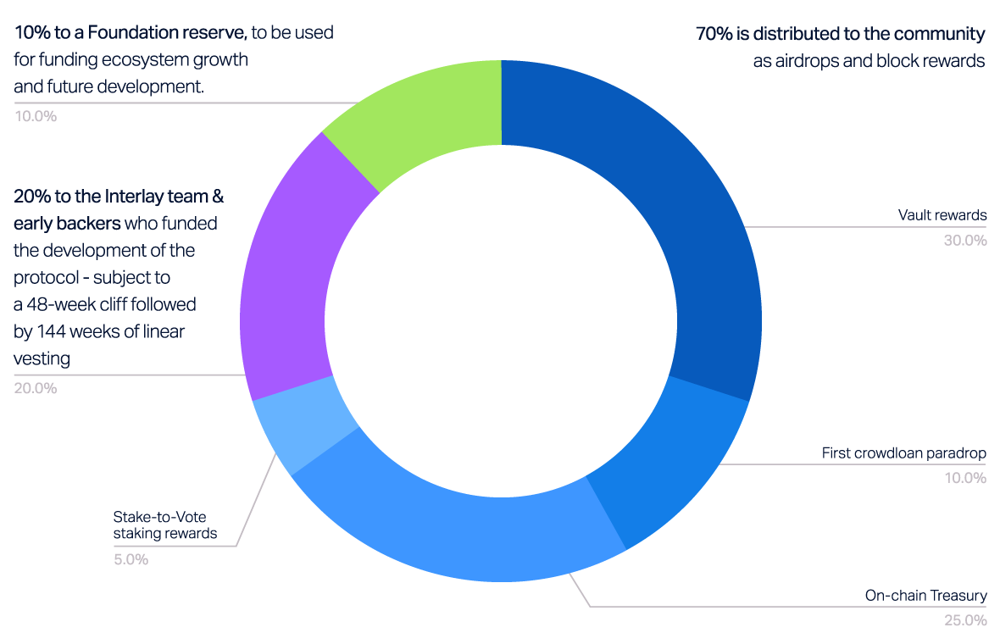

# INTR Tokenomics

Interlay is governed by its community from day 1 - via INTR, Interlay’s governance and utility token.

?> _INTR tokens will be distributed to network participants, builders and early backers as airdrops and block-rewards. There will be no public sale or ICO._

Below is a summary of the Interlay token economy, as described in the [token economy whitepaper released by Kintsugi Labs](https://github.com/interlay/whitepapers).

## Key Functions of INTR

The INTR token’s main purposes are:

- **Stake-to-vote**. Lock INTR to participate in governance & earn staking rewards. The longer the lock, the higher to voting power & staking rewards.
- **Utility**. Transaction and cross-chain fees can be paid in INTR.
- **Collateral**. INTR can be used as one of the collaterals to back iBTC and other Interlay assets.
- **Outlook: Product benefits**: In the future, INTR may offer stakers additional security and product benefits, e.g. better liquidation and collateral rates, or lower swap fees.

## Supply and Emission

INTR features an **unlimited supply**. The emission schedule is defined as follows: 

* 1 billion (1,000,000,000) INTR emitted over the first 4 years
* 2% annual inflation afterwards, allocated to the protocol treasury to fund future development and maintenance.

## Distribution

INTR is controlled by the community:

* **70% is distributed to the community** as airdrops and block rewards.  
  - 30% as Vault rewards;
  - 10% as first crowdloan paradrop;
  - 25% to the on-chain Treasury;
  - 5% to stake-to-vote staking rewards.
* 20% to the Interlay team & early backers who funded the development of the protocol - subject to a 48-week cliff followed by 144 weeks of linear vesting.
* 10% to a Foundation reserve, to be used for funding ecosystem growth and future development.

Starting in year 5, the community receives 100% of newly minted INTR as part of the 2% annual inflation.

*For a detailed breakdown and explanation of the INTR distribution, check out the [token economy whitepaper](https://github.com/interlay/whitepapers)*

## Emission and Vesting Schedules

<table>
<thead>
  <tr>
    <th>Allocation</th>
    <th>% of initial 4yr INTR Supply</th>
    <th>Emission</th>
    <th>Vesting / Distribution</th>
  </tr>
</thead>
<tbody>
  <tr>
    <td>1st crowdloan airdrop</td>
    <td>10%</td>
    <td>Airdrop shortly after parachain launch </td>
    <td>30% liquid when transfers are enabled, 70% linearly vested over parachain lease period (~96 weeks) </td>
  </tr>
  <tr>
    <td>On-chain Treasury (controlled by community governance)</td>
    <td>25%</td>
    <td>Allocation at launch</td>
    <td>No vesting</td>
  </tr>
  <tr>
    <td>Vault Rewards</td>
    <td>30%</td>
    <td>On a per-block basis</td>
    <td>No vesting</td>
  </tr>
  <tr>
    <td>Stake-to-Vote Rewards</td>
    <td>5%</td>
    <td>On a per-block basis</td>
    <td>No vesting</td>
  </tr>
  <tr>
    <td>Team &amp; early backers </td>
    <td>20%</td>
    <td>Airdrop shortly after parachain launch </td>
    <td>48 weeks lockup, followed by 144 weeks linear vesting. Internal investor vs team breakdown to be released. </td>
  </tr>
  <tr>
    <td>Foundation reserve (future development and ecosystem funding)</td>
    <td>10%</td>
    <td>Airdrop shortly after parachain launch </td>
    <td>Not liquid until spent. Vesting to be defined for each individual spend. </td>
  </tr>
</tbody>
</table>

### Circulating Supply

**Live circulating supply: [interlay.subscan.io](https://interlay.subscan.io/)** 

?> Circulating supply = liquid tokens that can be sold & purchased on the market. Excludes airdrop tokens that have not yet been claimed.