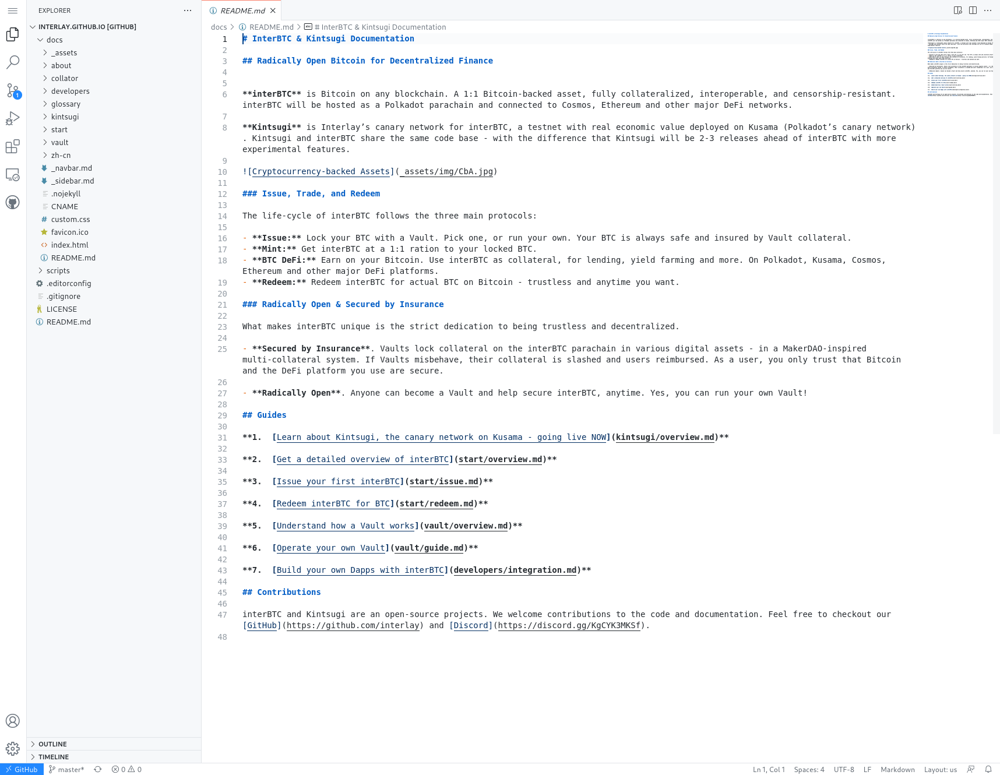

# Translation Guide

The Kintsugi and Interlay networks should be accessible to anyone. By adding new translations, anyone can contribute to the success of the two networks.

At the end of this guide, you will have:

- [x] Added a translation of the documentation in any language.
- [x] Made a request with your new translation to be reviewed by the Interlay team.

?> We accept partial translations as we understand that translating every document is time consuming and are thankful for all contributions --- big and small.

## Prerequisites

- Make sure you have a GitHub account. If you don't already have one, create one on [GitHub](https://github.com/)

## Adding new translations

This guide will walk you through the process of editing the documentation if you are not a developer. This is best if you have never heard about git before and you have not worked with any code before.

?> This guide is best for non-technical people. You only need a GitHub account.

?> If you are familiar with git, please follow the [technical guide](#adding-new-translations-for-developers)

### 1. Open the documentation in the web editor

Go to https://github.dev/interlay/interlay.github.io

If this is your first time using it, GitHub will ask you to set a theme for the editor. You can use the defaults or set your own.

When the website has loaded, it should look like the screenshot below.
On the left-hand side, you can see all the files of the project and the main window (the one overwritten with "README.md") is where you can edit files.



### 2. Adding a new translation

#### a. Create a working environment for your translation

First, we will create a working environment for your new translation.

- Click on "master" in the footer bar.
- Click on "Create New Branch" in the pop-up
- Type the name of your branch. For example, "dom/chinese-translation".

In this environment, you can make any changes without affecting the current code. It will also allow you to safe your current state and pick up the translation at a later point.

[step2a](../_assets/vid/translation-step2a.mp4 ':include :type=video controls width=100%')

#### b. Add a folder for your language or use the existing documentation folder for that language

Create a new folder inside `docs/` with the [ISO 639-1 language code](https://en.wikipedia.org/wiki/List_of_ISO_639-1_codes) as the name. For example, a Spanish translation is placed in `docs/es`.
If a folder for your language already exists, please do not create a new one, but extend the documentation from the existing folder.

?> Tip: For a new language, you can copy `translation-template` folder. It has all the folders and files but without any translations yet.

[step2b](../_assets/vid/translation-step2b.mp4 ':include :type=video controls width=100%')

#### c. Start translating documents

In the current language folder, create new files. The folder structure of the translation needs to be the same as the original English documentation.
If you copied the `translation-template` that is already taken care of.

?> Tip: It's easy to open the English version of the document right next to the current one as shown in the video.

Add the translations file by file.
We accept partial translations as we understand that translating every document is time consuming and are thankful for all contributions --- big and small.

Documents should be translated with the following priority:

1. `README.md`
1. Documents in the `kintsugi` folder
1. Documents in the `start` folder
1. Documents in the `vault` folder
1. Any other documents

When translating the files, make sure to update any links to go to your translated page, by prepending e.g. `es/` to the link. If you do not do this, the link will go to the English page.

The documentation contains several charts and diagrams, but we currently unable to provide a way to edit these. It is being looked into, but for now the English images can be used.

[step2c](../_assets/vid/translation-step2c.mp4 ':include :type=video controls width=100%')

#### d. Saving your work

After you have translated a documented, you can save your work.

- Go to the git icon on the right hand side in the navigation.
- Enter a comment about what you have changed. For example "docs: added the German translation".
- Hit the :heavy_check_mark: button to save (commit) your work.

You can repeat this step everytime you have a new document finished. Once you save (commit) your work, it will be saved on GitHub and you can come back to your translation at any time. Your work will not be lost if you close your web-editor at that point.

[step2d](../_assets/vid/translation-step2d.mp4 ':include :type=video controls width=100%')

### 3. Request to include your translation

As a last step, your translation needs to be merged into the existing documentation.

- Go to https://github.com/interlay/interlay.github.io
- If you recently saved your work, there will be a yellow-ish banner at the top asking you to open a "Compare & Pull Request". Click on this.
- Click on "Create pull request".

Opening the pull request notifies the INterlay team. They will review your work.

[step3](../_assets/vid/translation-step3.mp4 ':include :type=video controls width=100%')


#### Optional: Preview your work

Everytime you make a pull request contribution, a preview of the work will be displayed.
Click on the "Preview" link and you will see a preview of the current documentation.
In the drop-down on the top right, you can select the language.

?> Note: If the language has not been added before, there might not be a link available to the language in the top-menu.

[step3a](../_assets/vid/translation-step3a.mp4 ':include :type=video controls width=100%')

## Adding new translations for developers

If you have used git before and have a locally installed text editor, then this guide is for you.

?> This guide is best for developers that have used git and local markdown editing before.

All you need is a local git setup and a simple text editor. Windows Notepad, Notepad, VSCode, sublime text, vim or any of the sorts is perfectly adequate.

### 1. Clone the repository locally

```shell
git@github.com:interlay/interlay.github.io.git
```

### 2. Create a fork

```shell
git checkout -b your-name/your-language
```

### (Optional) 3. Preview your work as you translate

Install and start docsify locally:

```shell
yarn global add docsify-cli
yarn global add docsify-cli
```

### (Optional) 4. Add your translation folder

If a folder for your language does not already exists, add a folder.

In your fork, create a new folder inside `docs/` with the [ISO 639-1 language code](https://en.wikipedia.org/wiki/List_of_ISO_639-1_codes) as the name. For example, a Spanish translation would be placed in `docs/es`. Place a copy of all existing documentation (excluding translations) into the newly created folder. In Linux, this can be achieved by running the following:

```shell
cp -r \
  docs/translation-template \
  <newly created folder>
```

### 5. Add your translation

Add the translations file by file. We accept partial translations as we understand that translating every document is time consuming and are thankful for all contributions --- big and small.

Documents should be translated with the following priority:

1. `README.md`
1. Documents in the `kintsugi` folder
1. Documents in the `start` folder
1. Documents in the `vault` folder
1. Any other documents

When translating the files, make sure to update any links to go to your translated page, by prepending e.g. `es/` to the link. If you do not do this, the link will go to the English page.

The documentation contains several charts and diagrams, but we currently unable to provide a way to edit these. It is being looked into, but for now the English images can be used.

### 6. Safe and commit your work

After you have modified one or more documents, we recommend to safe your work and commit it.

```shell
git add .
git commit -m "docs: YOUR_CONTRIBUTION"
git push
```

### 7. Open a pull request

After you have pushed your changes to your branch, open a pull request on GitHub.

[step3](../_assets/vid/translation-step3.mp4 ':include :type=video controls width=100%')
