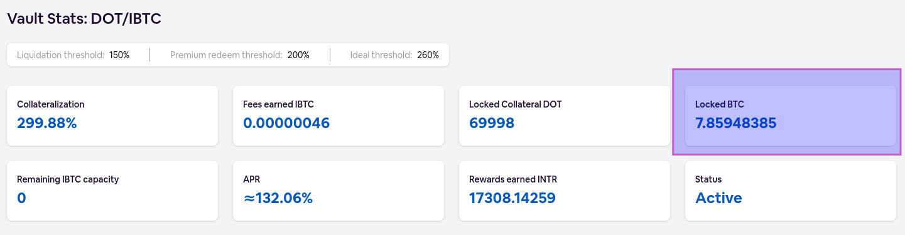
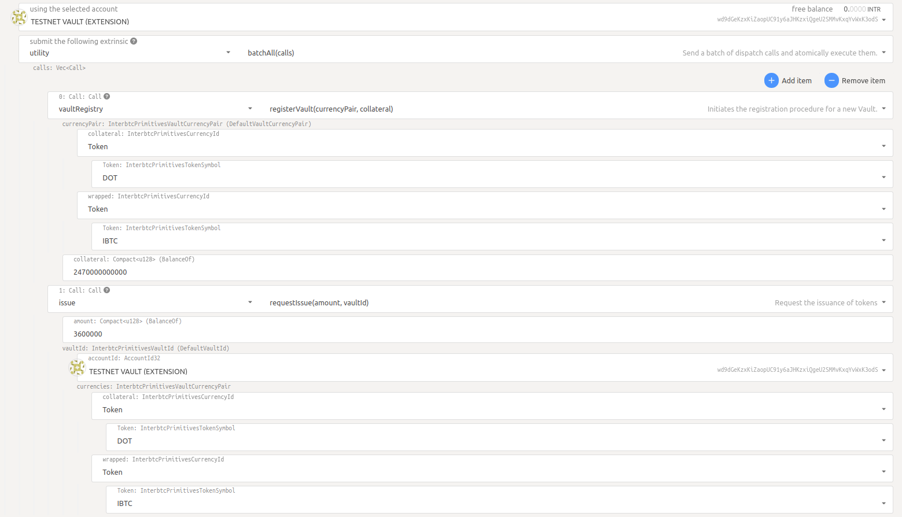

# Operating the Vault Client

Usually, you will not need to interact with your Vault client as it automatically executes its [main tasks](vault/overview?id=what-do-vaults-do).
However, sometimes it is necessary to interact with the Vault client, for example, if you would like to add or withdraw collateral.

At the end of this document you will have:

- [x] [Visited the Vault dashboard and checked the logs](#vault-dashboard-and-logs)
- [x] [Learned about automatic actions of your Vault](#automatic-actions)
- [x] [Upgraded the Vault client](#upgrading-the-vault-client)
- [x] [Maintain your collateralization rate](#managing-collateral)
- [x] [Ensure that there are enough BTC in the Vault's wallet](#bitcoin-balance-check)
- [x] [Self-Minted KBTC/IBTC](#self-minting)
- [x] [Set up Prometheus and Grafana for monitoring your Vault](#prometheus-and-grafana)
- [x] [Improved the security of your Vault](#security)
- [x] [Left the Interlay/Kintsugi bridge](#leaving-interlaykintsugi)

## Vault Dashboard and Logs

Congratulations on successfully installing the Vault client!

### Visit your Vault Dashboard

?> Make sure you have added the Vault substrate key to a compatible web wallet extension like polkadot.js or Talisman wallet.

Once your Vault is registered, the app on [Kintsugi](https://kintsugi.interlay.io) and [Interlay](https://app.interlay.io) as well as the [Interlay Testnet](https://testnet.interlay.io/) and [Kintsugi Testnet](https://kintnet.interlay.io/) will show you an overview of all your registered Vaults.


### Vault Logs

Your Vault client will print out logs to inform you of its operation and any potential errors.

```sh
Sep 19 11:06:02.428  INFO vault::system: Adding keys from past issues...
Sep 19 11:06:03.021  INFO vault::issue: Rescanning bitcoin chain from height 740163...
Sep 19 11:07:38.905  INFO vault::system: Initializing metrics...
Sep 19 11:07:39.656  INFO vault::system: Adding derivation key...
Sep 19 11:07:39.920  INFO vault::system: Adding keys from past issues...
Sep 19 11:07:40.590  INFO vault::issue: Rescanning bitcoin chain from height 730755...
Sep 19 11:10:24.057  INFO vault::system: Initializing metrics...
Sep 19 11:10:24.642  INFO vault::system: Waiting for new block...
Sep 19 11:10:36.672  INFO vault::system: Got new block...
Sep 19 11:10:36.673  INFO vault::system: Checking for open requests...
Sep 19 11:10:37.140  INFO vault::system: Done processing open requests
```

### Checking your Vault

The dashboard and the logs give you a basic way to keep an eye on the Vault. More sophisticated methods and actions are described further down on this page.

## Automatic Actions

### Registering The Vault

On start-up, the Vault client will try to automatically register itself if you set the flags described in the installation instructions.
While it's possible to manually register the Vault with, e.g., polkadot.js.org/apps, we do not recommend this as it requires manual creation of a BTC master key and submitting the public key in its raw format to the parachain as part of the registration.

### Earning Fees and Block Rewards

The Vault client is automatically receiving fees and block rewards as described in the [Fee Model](vault/overview?id=fee-model).

### Accepting Issue and Redeem Requests

Issue and Redeem requests are processed automatically, signing transactions on the Bitcoin and Interlay/Kintsugi networks using the mnemonic/account credentials you provide to the Vault client when running it.

### Submitting BTC Block Headers

Following the installation instructions, the Vault client will submit new BTC block headers to the parachain contributing to the overall availability of the BTC-Relay.

### Replace Requests

By default, Vault client will try to accept replace requests by other Vaults to take over their locked BTC. Accepting replace requests increases the relative share of locked BTC for the Vault and hence increases the earned fees and block rewards of the Vault client.

## Upgrading the Vault Client

The Vault client is constantly being improved. Follow this guide to get the latest version of the Vault client.

We will announce on public channels when a new release is made available for the Vault client. The changelog and binaries will be published on the [release page](https://github.com/interlay/interbtc-clients/releases). Depending on the method of installation:

!> Occasionally, breaking changes will be introduced to the Vault client. In these cases it is important to update your Vault client in a timely manner to not run the risk of being slashed. We will notify on our channels (Discord, Twitter, Telegram) when this is the case.

### Standard Installation

#### 1. Stop the service

<!-- tabs:start -->

#### **Testnet-Kintsugi**

```shell
sudo systemctl stop testnet-vault.service
```

#### **Testnet-Interlay**

```shell
sudo systemctl stop testnet-interlay-vault.service
```

#### **Kintsugi**

```shell
sudo systemctl stop kintsugi-vault.service
```

#### **Interlay**

```shell
sudo systemctl stop interlay-vault.service
```

<!-- tabs:end -->

OR terminate the process with `Ctrl+C`.

#### 2. Re-download the binary and setup script

<!-- tabs:start -->

#### **Testnet-Kintsugi**

```shell
wget -O vault https://github.com/interlay/interbtc-clients/releases/download/1.17.5/vault-parachain-metadata-kintsugi-testnet

wget https://raw.githubusercontent.com/interlay/interbtc-docs/master/scripts/vault/setup -O setup
chmod +x ./setup && sudo ./setup testnet-kintsugi vault
```

#### **Testnet-Interlay**

```shell
wget -O vault https://github.com/interlay/interbtc-clients/releases/download/1.17.5/vault-parachain-metadata-interlay-testnet

wget https://raw.githubusercontent.com/interlay/interbtc-docs/master/scripts/vault/setup -O setup
chmod +x ./setup && sudo ./setup testnet-interlay vault
```

#### **Kintsugi**

```shell
wget -O vault https://github.com/interlay/interbtc-clients/releases/download/1.17.5/vault-parachain-metadata-kintsugi

wget https://raw.githubusercontent.com/interlay/interbtc-docs/master/scripts/vault/setup -O setup
chmod +x ./setup && sudo ./setup kintsugi vault
```

#### **Interlay**

```shell
wget -O vault https://github.com/interlay/interbtc-clients/releases/download/1.17.5/vault-parachain-metadata-interlay

wget https://raw.githubusercontent.com/interlay/interbtc-docs/master/scripts/vault/setup -O setup
chmod +x ./setup && sudo ./setup interlay vault
```

<!-- tabs:end -->

#### 3. Restart the service

<!-- tabs:start -->

#### **Testnet-Kintsugi**

```shell
sudo systemctl start testnet-vault.service
```

#### **Testnet-Interlay**

```shell
sudo systemctl start testnet-interlay-vault.service
```

#### **Kintsugi**

```shell
sudo systemctl start kintsugi-vault.service
```

#### **Interlay**

```shell
sudo systemctl start interlay-vault.service
```

<!-- tabs:end -->

OR start the [process manually](vault/installation?id=_5-start-the-vault-client).

## Managing Collateral

Vaults need to maintain their collateral above the [secure collateral threshold](vault/overview?id=secure-collateral) to be able to back new iBTC/kBTC.

If Vaults fall below the [premium redeem threshold](vault/overview?id=premium-redeem), anyone can redeem against these Vaults and receive a premium that is slashed from the Vault's collateral.

Most importantly, Vaults need to ensure [that at all times they are above the liquidation threshold](vault/overview?id=vault-liquidation).

### Increasing Collateral

Adding new collateral will increase the collateralization rate.

**Web UI**

Go to the Vault navigation item in the sidebar and click on the `Deposit Collateral` button. Then follow the instructions.

**polkadot.js**

1. Go to polkadot.js.org/apps and ensure you have the correct nextwork selected
2. Click on Developer -> Extrinsics
3. Select your existing Vault account, the `vaultRegistry` pallet and the `depositCollateral` extrinsic
4. Enter the collateral asset, e.g., LKSM is `ForeignAssets.2` or KSM is `Tokens.KSM`,  as the collateral and the wrapped asset, e.g., `KBTC` as the wrapped currency, and the amount of additional collateral to provide. Example, deposit 1 LKSM = 10^12 Planck (1000000000000).
5. Sign and submit the transaction


### Withdrawing Collateral

Removing collateral will decrease the collateralization rate.

**Web UI**

Go to the Vault navigation item in the sidebar and click on the `Withdraw Collateral` button. Then follow the instructions.

**polkadot.js**

1. Go to polkadot.js.org/apps and ensure you have the correct nextwork selected
2. Click on Developer -> Extrinsics
3. Select your existing Vault account, the `vaultRegistry` pallet and the `withdrawCollateral` extrinsic
4. Enter the collateral asset, e.g., `ForeignAssets.2` as the collateral and the wrapped asset, e.g., `KBTC` as the wrapped currency, and the amount of additional collateral to withdraw. Example, withdraw 1 LKSM = 10^12 Planck (1000000000000).
5. Sign and submit the transaction

### Setting a custom secure threshold

The secure threshold is a collateralization threshold that acts as a buffer above the thresholds that penalize a Vault. Being below the secure threshold incurs no penalty, but it disables the Vault's ability to accept issue requests, limiting the risk of its collateralization falling further.

There is a minimum global secure threshold enforced across all Vaults. However, Vault operators may optionally set a custom, higher threshold if they wish for a bigger security margin.

**Polkadot.js**

1. Go to polkadot.js.org/apps -> extrinsics -> VaultRegistry -> setCustomSecureThreshold
2. Set the collateral and wrapped currency pair (e.g., KSM/KBTC) and the threshold parameter

The threshold is an optional parameter - submitting with an empty threshold will _reset_ your vault to use the global threshold (if a custom one had been previously set).

?> It is not possible to set an individual secure threshold that is below the globally enforced secure threshold. The parachain will always pick the higher of the two.

Including this parameter will instead set a custom threshold, provided it is higher than the default global one. Enter a number equal to the percentage (e.g., 300%) multiplied by 10^16 (e.g, 3000000000000000000).

### Activate/Deactive the Vault for new Issue Requests

You can decide if your Vault should accept new issue requests by users.

**Polkadot.js**

1. Go to polkadot.js.org/apps -> extrinsics -> VaultRegistry -> acceptNewIssues
2. Set the collateral and wrapped currency pair (e.g., KSM/KBTC) and if you want to accept new requests (e.g., Yes or No)

## Bitcoin Balance Check

If you don't use the full [monitoring](#monitoring) described below, you should still check once in a while if your Vault client has equal or more BTC in its Bitcoin wallet than the amount of BTC locked on the Interlay or Kintsugi chains. You can compare the two as follows:

1. Navigate to your Vault dashboard and check the "Locked BTC". This gives you the locked BTC that the Interlay or Kintsugi chain assume the Vault holds. In the example below, the `DOT/IBTC` Vault has `7.85948385` BTC locked.

2. Connect to the system running the Bitcoin node for your Vault client. You can list the BTC balance of the `DOT/IBTC` Vault by running the following command on the CLI with the keyname you specified when running the Vault client (from the [installation instructions](vault/installation?id=_5-start-the-vault-client)):

```sh
bitcoin-cli -rpcwallet=<INSERT_YOUR_KEYNAME, example: 0x0e5aabe5ff862d66bcba0912bf1b3d4364df0eeec0a8137704e2c16259486a71>-DOT-IBTC getbalance
```

The output will look like

```sh
$ bitcoin-cli -rpcwallet=0x0e5aabe5ff862d66bcba0912bf1b3d4364df0eeec0a8137704e2c16259486a71-DOT-IBTC getbalance
> 7.8678
```

In the example given here, the Vault client is healthy: the Vault client has `7.8678` BTC in its Bitcoin wallet and the Interlay chain assumes that it has `7.85948385` BTC locked. That means, even if the Vault is requested to return all BTC, it will have enough BTC to fulfill those requests.

?> If you are unsure about the Bitcoin wallets or you used an alternative for specifiying the Vault keyfile, you can run `bitcoin-cli listwalletdir` to see all your Vault wallets. You can then insert each item of the returned rpc wallets to check their balance.

### What if my BTC balance in the Bitcoin wallet is higher than the BTC Locked on the App Dashboard?

In this case, all is well with your Vault. You do not need to do anything. We do not recommend withdrawing any surplus, instead leaving it as a buffer for the vault to use for future tx fees.

### What if my BTC balance in the Bitcoin wallet is smaller than the BTC Locked on the App Dashboard?

**What does this mean?**

The BTC balance in your Vault's Bitcoin wallet is too low to fulfill a redeem request that would redeem all of the Vault's BTC locked according to the Interlay or Kintsugi chain.

?> If your Vault is currently processing a redeem request, BTC will already have been sent from its Bitcoin wallet. However, the BTC will still appear as locked on the Interlay or Kintsugi chains. Once the redeem request confirms, the Bitcoin and Interlay/Kintsugi balances should be the same/similar again.

**What should be done about that?**

You have two options:

1. *Wait and observe*: On redeem requests, users tend to pay more for BTC transaction fees to the Vault than the actual BTC transaction fee that the Vault has to pay. If the difference between the Bitcoin wallet balance and the Interlay/Kintsugi chain balance is quite small, it might be OK to wait for a couple of redeem request. Ideally, the Vault will have enough BTC in its wallet.
2. *Insufficient BTC to fulfill a redeem request*: If a user request to redeem more BTC from your Vault than the Vault has in its wallet, the Vault client will show a `BitcoinError ... Insufficient funds...` in the logs. Typically, you would need to send BTC from another source to your Vault wallet.

If you encounter errors with the Vault client, we recommend to reach out to the Interlay team in the #vault-lounge in the [Interlay Discord](https://discord.com/invite/KgCYK3MKSf). We can help investigate the issue.

**Adding BTC to a Vault's wallet**

Generate a new address for the Bitcoin wallet, e.g., for the `DOT/IBTC` Vault.

```sh
bitcoin-cli -rpcwallet=<INSERT_YOUR_KEYNAME, example: 0x0e5aabe5ff862d66bcba0912bf1b3d4364df0eeec0a8137704e2c16259486a71>-DOT-IBTC getnewaddress
```

This will return a new address for your Vault. You can then use any Bitcoin wallet of your choice to send BTC to that address to refund the Vault's wallet.

## Self-Minting

### Step 1. Create Request via Polkadot.js

The current bridge user interface randomizes Vaults during the issue process.

To mint with your own (or another specific) Vault, you can use the Polkadot.js interface:

1. Select Extrinsics in the Developer tab
2. Select "issue" in the "state query" drop down
3. Select "requestIssue" as the function to be executed
4. Enter your Vault account and the issue amounts.

   -  The BTC amount must be entered with 8 decimals (1 BTC = 100000000)
   -  On Kintsugi, select "KSM" as the collateral token and KBTC as the wrapped token (DOT and interBTC on Interlay)
   -  Enter 1000000000000 (= 1 KINT) as griefing collatral, you will get this back once you complete the issue operation. You can also check see how griefing collateral is needed via the "Issue" UI but 1 KINT will suffice in most cases.


### Step 2. Get BTC Deposit Address and Send BTC

Now you must send the BTC to the Bitcoin address **generated by the parachain**.

!> **Attention**: you **MUST** send the BTC to the **address generated by the system** (derived from your Vault's main BTC account). Otherwise, the issue request will not count! Do not send to the main Bitcoin address!

1.  **To get the BTC deposit address, go to the "Transaction" page on the UI** and find the pending issue request there.


2. Click on it to see the BTC deposit address.


3. Make the BTC transfer. Your Vault will then automatically handle everything else (proof submission,..)

### Why Self-Mint?

You Vault only starts earning rewards once BTC is locked - and rewards are determined by your share of the total BTC locked in the system. Hence, you can increase your rewards by bringing your own BTC into the system.

### Atomic Collateral Deposit & Self-mint

Sometimes you may prefer to _only_ self mint. However, it's possible that you receive issue requests shortly after registration or depositing additional collateral. To prevent this, you can use polkadot-js to do the two actions atomically.

#### If vault is not yet registered

If you have not registered the vault yet, you can atomically register with collateral and do the self-issue.

1. First start your vault client without the `--auto-register` CLI argument. When the client starts up, it will register your public bitcoin key, which is a prerequisite to vault registration.

2. Next, you use the polkadot.js app to do a batch of `registerVault` and `requestIssue`. Go to "Extrinsics", select `utility` > `batchAll` in the dropdowns. You can then add multiple calls that will be executed all at once (see screenshot below).

?> The amount of collateral required to request a given number of IBTC/KBTC can be calculated as `BTC * secure_collateral_threshold * exchange_rate`. The secure collateral threshold for DOT/KSM at the time of writing is 2.6. The exchange rate can be found on the dashboard page of the Interlay/Kintsugi app. The collateral uses 10 digits for DOT (1 DOT  = 10000000000) and 12 digits for KSM (1 KSM = 1000000000000). If using other currencies, adapt accordingly.



#### If vault is registered

If you have already registered a vault, you can atomically add additional collateral and do the self-issue.

1. Use the polkadot.js app to do a batch of `depositCollateral` and `requestIssue`.  Go to "Extrinsics", select `utility` > `batchAll` in the dropdowns. You can then add multiple calls that will be executed all at once (see screenshot below).

?> The amount of collateral required to request a given number of IBTC/KBTC can be calculated as `BTC * secure_collateral_threshold * exchange_rate`. The secure collateral threshold for DOT/KSM at the time of writing is 2.6. The exchange rate can be found on the dashboard page on the Interlay/Kintsugi app. The collateral uses 10 digits for DOT (1 DOT  = 10000000000) and 12 digits for KSM (1 KSM = 1000000000000). If using other currencies, adapt accordingly.


## Monitoring with Prometheus and Grafana

Vault operators can monitor their clients using both the [Vault dashboard and logs](vault/guide?id=vault-dashboard-and-logs) and [Prometheus / Grafana](vault/guide?id=prometheus-and-grafana).

### Prometheus and Grafana

!> **Note:** Monitoring with Prometheus is in beta stage and the interface is subject to change. [Check the Prometheus exporter endpoint](#querying-the-prometheus-exporter) to see the currently exposed metrics.

Similar to how Substrate provides functionality for [monitoring Nodes](https://wiki.polkadot.network/docs/maintain-guides-how-to-monitor-your-node), Vault operators have the option to monitor their clients using [Prometheus](https://prometheus.io/) and [Grafana](https://grafana.com/).

The Vault client exposes data such as collateralization, Bitcoin balance, CPU seconds, memory usage of your machine, and more. To monitor this data, Prometheus is used to collect metrics and Grafana for displaying them on a dashboard.

The key used for tracking the metrics is a concatenation of the collateral and wrapped currencies of the client (e.g. "KSM_KBTC"). This allows for tracking clients with different currency combinations in Grafana.

#### Example Visualisation


### Metrics

A list of currently tracked custom metrics can be found [here](https://github.com/interlay/interbtc-clients/blob/61f2ae95d8716a8ac2b3b16d70abf2f91ef0f399/vault/src/metrics.rs#L247). These are in addition to the OS metrics tracked by default by Prometheus, such as CPU seconds, virtual memory bytes, and open file descriptors.

Check the [Prometheus exporter](#querying-the-prometheus-exporter) section to find out how to query all the currently exposed metrics.

Bridge-specific metrics (Collateralization, Locked Collateral, Required Collateral) get updated on each `FeedValues` oracle event. These are quite costly to update as they call parachain RPCs.

### Running instructions

Vault monitoring is enabled by default. The client provides the following configuration flags, identical to the ones used for monitoring Substrate nodes:

```bash
--no-prometheus
   Do not expose a Prometheus metric endpoint
--prometheus-external
   Expose Prometheus exporter on all interfaces.
   Default is local.
--prometheus-port <PROMETHEUS_PORT>
   Specify Prometheus exporter TCP Port
   [default: 9615]
```

If monitoring is enabled, the client will log the metrics endpoint on startup. Below is an example:

```
./vault \
   --bitcoin-rpc-url http://localhost:18332 \
   --keyfile keyfile.json \
   --keyname "0x0e5aabe5ff862d66bcba0912bf1b3d4364df0eeec0a8137704e2c16259486a71" \
   --auto-register-with-faucet-url 'https://api-testnet.interlay.io/faucet' \
   --btc-parachain-url 'wss://api-testnet.interlay.io:443/parachain' \
   --prometheus-external
...
Mar 23 14:25:20.451  INFO vault: Starting Prometheus exporter at http://0.0.0.0:9615
```

#### Querying the Prometheus exporter

To fetch the exported metrics, query the `/metrics` endpoint exposed by the Prometheus exporter with the command below. This will show all the available metrics.

```bash
curl http://HOST_IP:9615/metrics
```

#### Running Prometheus

Configuration files for the Prometheus service are provided in the [interbtc-clients repo](https://github.com/interlay/interbtc-clients/tree/master/vault/src/monitoring).

To customize the configuration of the Prometheus service, edit the `prometheus.yml` file using the command below.

```bash
git clone https://github.com/interlay/interbtc-clients
cd interbtc-clients
vim .deploy/monitoring/prometheus.yml
```

Run the service:

```bash
git clone https://github.com/interlay/interbtc-clients
cd interbtc-clients/.deploy/monitoring
chmod +x download_latest
./download_latest prometheus
./prometheus --config.file=prometheus.yml
```

### Running AlertManager

The Prometheus AlertManager can be configured to send notifications on certain triggers. These include email, Slack, and PagerDuty.

To customize the AlertManager alerting rules, edit `rules.yml`. To customize the destination of the alert, edit `alertmanager.yml`. Check [this guide](https://grafana.com/blog/2020/02/25/step-by-step-guide-to-setting-up-prometheus-alertmanager-with-slack-pagerduty-and-gmail/) for more details about configuring AlertManager.

Once AlertManager is configured, make sure that `prometheus` is installed and you can access the `promtool`. For example in Ubuntu use:

```bash
apt-get install prometheus
```

Then add unit tests to `tests.yml` and run them with:

```bash
promtool test rules test.yml
```

Run the service:

```bash
git clone https://github.com/interlay/interbtc-clients
cd interbtc-clients/.deploy/monitoring
chmod +x download_latest
./download_latest alertmanager
./alertmanager --config.file=alertmanager.yml
```

#### Running Grafana

If the default Prometheus port is used (`9615`), the default instructions from the Grafana docs will work by default: https://grafana.com/docs/grafana/latest/installation/debian

Once Grafana is up and running, [import](https://grafana.com/docs/grafana/latest/dashboards/export-import/#import-dashboard) the [Vault client configuration](../_assets/config/grafana.json  ':ignore') file to see the metrics.

#### Running Node Exporter

For a better overview of the host hardware and kernel, operators are encouraged to monitor more than the OS-level metrics provided by default. Node Exporter is a Prometheus service that can be run to collect such metrics. Follow [this guide](https://prometheus.io/docs/guides/node-exporter/) to set up Node Exporter. We recommend using [this Grafana template](https://grafana.com/grafana/dashboards/1860) to visualise the metrics collected by Prometheus.


### Questions monitoring aims to answer

#### How can I know if my client is offline?

When the Vault client crashes, the metrics endpoint will not reachable any longer. This means that the Grafana dashboard will stop showing data points,
as in the screenshot below (yellow line). This behaviour can be observed for all Grafana tiles on a crash.


#### How can I know if a redeem request is about to expire?

The *Remaining Time to Redeem* tile displays the time, in hours, left to execute the oldest redeem request with the vault. After this period elapses, the vault will get slashed. If there is no open redeem request, the default value of this metric is 24. The default AlertManager rules configuration in this documentation sends an alert when there is one hour left to execute (see [here](https://github.com/interlay/interbtc-clients/blob/d585af332d33ae763c1941eed5d63e73fe61ab52/.deploy/monitoring/rules.yml#L14)).


## Monitoring via Squid and polkadot.js

### Checking issue and redeem requests through Squid

Checking Issues and Redeems against your Vault will require issuing a manual GraphQL query against our indexing service.

<!-- tabs:start -->

#### **Kintsugi**

https://api-kusama.interlay.io/graphql/graphql

#### **Interlay**

https://api.interlay.io/graphql/graphql

<!-- tabs:end -->

#### Issue requests

Enter the following query to view the Issue requests against your vault:

```graphql
{
  issues(where: {vault: {accountId_eq: "enter your account ID between these quotes, e.g. a3addPTx9ngWGKq3dguw7vs7NA2PimcDUHWJ32HsuoFL74zdo", collateralToken_eq: DOT}}) {
    id
    status
    userParachainAddress
    griefingCollateral
    vaultBackingAddress
    request {
      amountWrapped
      height {
        active
      }
      backingHeight
      timestamp
    }
    execution {
      timestamp
      amountWrapped
      bridgeFeeWrapped
      height {
        active
      }
    }
    cancellation {
      timestamp
      height {
        active
      }
    }
  }
}
```

Edit the string after `accountId_eq` to match the account ID of your vault. Press the Play button above the query editing field to run the query.

- The `request` field contains the data about the request the user has submitted.
- The `execution` field will be `null` until the Issue request has been executed. After execution, it will contain the details of the execution - including potentially a different KBTC amount (`amountWrapped`), in case the user underpaid or overpaid.
- The `cancellation` field will similarly be `null` unless the request has expired and has been cancelled.

The information otherwise matches what you see in the tables in the UI dashboards.

To view any BTC transactions associated with a request, enter the value for the `vaultBackingAddress` into a BTC blockchain explorer - this is the address (unique for every Issue request) that the user is required to send their BTC to.

You can additionally filter requests by status (or any number of other fields, if you are comfortable with  GraphQL). For example, to view only pending requests, change the first line of the query to be:

```graphql
  issues(where: {vault: {accountId_eq: "<address here>", collateralToken_eq: KINT}, status_eq: Pending}) {
```

#### Redeem requests

The process for Redeem requests is near-identical. Use the following query:

```graphql
{
  redeems(where: {vault: {accountId_eq: "your account ID here", collateralToken_eq: DOT}}) {
    id
    status
    bridgeFee
    btcTransferFee
    collateralPremium
    userBackingAddress
    userParachainAddress
    request {
      timestamp
      requestedAmountBacking
      height {
        active
      }
    }
    execution {
      timestamp
      height {
        active
      }
    }
    cancellation {
      timestamp
      slashedCollateral
      reimbursed
      height {
        active
      }
    }
  }
}
```

Here, the `userBackingAddress` is the BTC address that the Redeem request will be paid out to. `collateralPremium` contains the owed premium in case this was a premium redeem - it will be 0 otherwise. The `cancellation` field contains some extra data - `reimbursed` will be `true` if the user chose to burn their KBTC for collateral, or `false` if the user chose to retry instead.

### Viewing stats through polkadot.js

In polkadot.js, you can view some information about the current state of your vault.

#### Viewing locked KBTC/IBTC (and other information)

1. Go to polkadot.js.org/apps and ensure you have the right network selected
2. Click on Developer -> Chain State
3. Select your existing Vault account, the `vaultRegistry` pallet and the `vaults` query
4. Enter the collateral and the wrapped currency, e.g., `KSM` and `KBTC`
5. Click the `+` icon in the top-right of the screen.

This will show you the on-chain data about the vault, including:

- The status
- Whether it has been banned, and if so, for how long
- The amount of issued IBTC/KBTC held (in Satoshi)
- The amount of IBTC/KBTC in currently pending Issue and Redeem requests
- Information about Replaces and liquidation, if any has happened

#### Viewing locked collateral

1. Go to polkadot.js.org/apps and ensure you have the right network selected
2. Click on Developer -> Chain State
3. Select your existing Vault account, the `vaultStaking` pallet and the `nonce` query
4. Enter the collateral and the wrapped currency, e.g., `KSM` and `KBTC`
5. Click the `+` icon in the to-right to run the query, and note down the number returned
6. Switch to the `totalCurrentStake` query
7. Enter the nonce you found in step 5 as the first argument ("u32"); enter, e.g, `KSM` as the collateral and `KBTC` as the wrapped currency
8. Click the `+` icon in the top-right of the screen.

This will return your current locked collateral amount, in KSM multiplied by 10^30 (1000000000000000000000000000000) (or equivalently, in Planck multiplied by 10^18).

#### Calculating collateralization manually through polkadot.js

If you are not running Prometheus and don't want to rely on the UI, you can calculate the collateralization rate manually using on-chain data directly.

1. Perform the steps, detailed above, to [obtain the locked KBTC amount and locked collateral of your vault](#viewing-stats-through-polkadotjs). Ensure you convert the values from Plank to KINT (divide by 10^12) and from Satoshi to KBTC (divide by 10^8).
2. Similarly, query the `oracle` pallet for the `aggregate` value, and enter "ExchangeRate", "Token" and "KINT" as the parameters.
3. Divide the returned value by 10^22 to obtain the exchange rate. For example, for a return of `80,250,381,189,311,293,237,950,000`, the exchange rate is approximately 8025.038.
4. Use the following formula: `collateralization = collateral / exchangeRate / KBTC`. For example, for a vault with 16050 KINT of collateral locked, 0.5 KBTC issued, and an exchange rate of 8025, the collateralization rate will be 16050 / 8025 / 0.5 = 4, or 400%.

## Security

### Encrypting Bitcoin Keys

For added security, you may want to encrypt the Bitcoin wallet with a password.

<!-- tabs:start -->

#### **Regtest**

```shell
bitcoin-cli -regtest -rpcwallet=interbtcvault encryptwallet "password"
bitcoin-cli -regtest -rpcwallet=interbtcvault walletpassphrase "password" 100000000
```

#### **Testnet**

```shell
bitcoin-cli -testnet -rpcwallet=interbtcvault encryptwallet "password"
bitcoin-cli -testnet -rpcwallet=interbtcvault walletpassphrase "password" 100000000
```

#### **Mainnet**

```shell
bitcoin-cli -rpcwallet=interbtcvault encryptwallet "password"
bitcoin-cli -rpcwallet=interbtcvault walletpassphrase "password" 100000000
```

<!-- tabs:end -->

This will keep the decryption key in memory for the specified timeout - in this example 100000000 seconds or 3 years.
Once this timeout expires (or if the node is terminated) the wallet must be unlocked manually.

## Leaving Interlay/Kintsugi

The process to leave Interlay/Kintsugi depends on whether or not your Vault client holds BTC in custody.

If you Vault has _no BTC in custody_, you can withdraw all your collateral at any time and leave the system. It is safe to stop the Vault client without risking being penalized. You will not participate in any issue or redeem requests once you have removed your collateral.

If your Vault clients holds at least _some BTC in custody_, you have two options to leave the system. Both options require that the BTC that you have in custody is moved.

- **Replace**: leaving through _replace_, requires you to request being replaced by another Vault. You can request to be replaced through the Vault dashboard by replace 100% of the BTC that is locked with the Vault and waiting for other Vaults to accept the request. Once the replace request is accepted, your Vault client will execute the replace request by sending BTC to the accepting Vault and executing the request on the parachain.
- **Redeem**, leaving through _redeem_ requires you to wait for a user or yourself to redeem the entire amount of BTC that the Vault has in custody. Only after you have 0 BTC, can the Vault client withdraw its entire collateral. If you redeem with your own Vault, the Vault will not receive fees for this such that 0 BTC remains in your Vault client.
