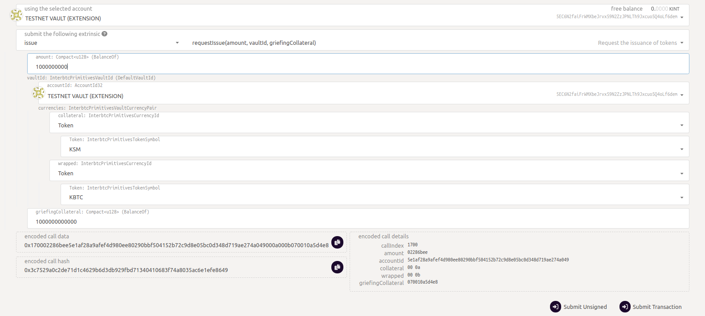
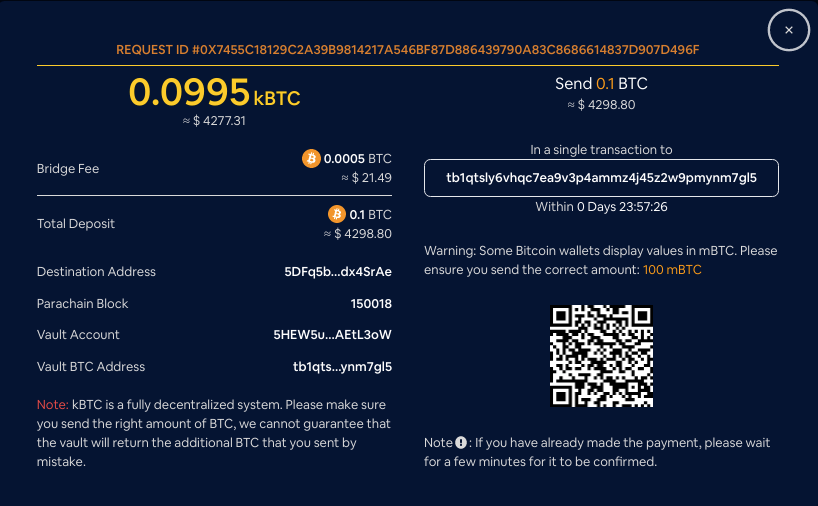
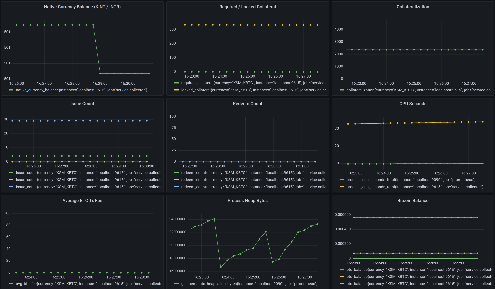
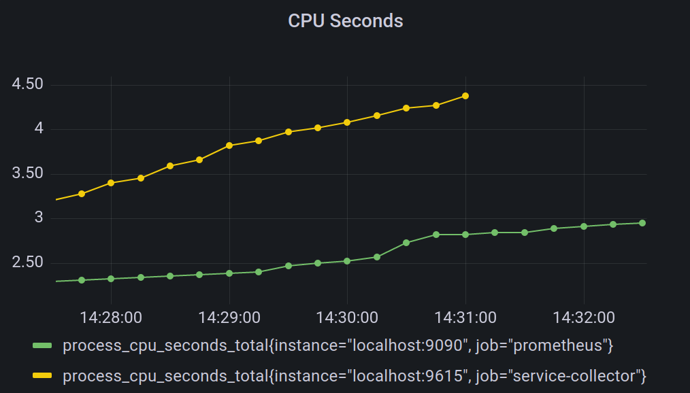

# Operating the Vault Client

Usually, you will not need to interact with your Vault client as it automatically executes its [main tasks](vault/overview?id=what-do-vaults-do).
However, sometimes it is necessary to interact with the Vault client, for example, if you would like to add or withdraw collateral.

At the end of this document you will have:

- [x] [Deposited additional collateral](#increasing-collateral)
- [x] [Withdrawn surplus collateral](#withdrawing-collateral)
- [x] [Learned about automatic actions of your Vault](#automatic-actions)
- [x] [Self-Minted kBTC](#self-minting)
- [x] [Visited the Vault dashboard](#dapp-vault-dashboard)
- [x] [Set up Prometheus and Grafana for monitoring your Vault](#prometheus-and-grafana)
- [x] [Supplied additional BTC to cover fees](#bitcoin-fees)
- [x] [Improved the security of your Vault](#security)

## Changing Collateral

### Increasing Collateral

**Web UI**

Go to the Vault tab and click on the `Deposit Collateral` tab. Then follow the instructions.

**interbtc-js library**

You can use [interbtc-js](https://github.com/interlay/interbtc-js) to lock additional collateral.

```js
import { createinterbtcAPI } from "@interlay/interbtc";

const interbtc = await createinterbtcAPI("ws://127.0.0.1:9944", "testnet");
interbtc.setAccount(KEYRING);

// 100 DOT denominated in Planck
const additionalCollateralInPlanck = "1000000000000";
await interbtc.vaults.lockAdditionalCollateral(additionalCollateralInPlanck);
```

### Withdrawing Collateral

**Web UI**

Go to the Vault tab and click on the `Withdraw Collateral` button. Then follow the isntructions.

**interbtc-js library**

You can use [interbtc-js](https://github.com/interlay/interbtc-js) to withdraw collateral.

```js
import { createinterbtcAPI } from "@interlay/interbtc";

const interbtc = await createinterbtcAPI("ws://127.0.0.1:9944", "testnet");
interbtc.setAccount(KEYRING);

// 100 DOT denominated in Planck
const collateralToWithdrawInPlanck = "1000000000000";
await interbtc.vaults.withdrawCollateral(collateralToWithdrawInPlanck);
```

## Automatic Actions

### Registering your Vault

The default behavior on testnet is **automatic registration** using Interlay's DOT faucet as set in the `auto-register-with-faucet-url` arg. Another option for registering is the `auto-register-with-collateral` flag, as described in the [README](https://github.com/interlay/interbtc-clients/tree/master/vault).

You can also register your Vault through our web UI, going to the "Vault" tab, clicking the `Register` button and completing the steps.

Moreover, you can interact with the Vault pallet directly using [interbtc-js](https://github.com/interlay/interbtc-js).

```js
import { createinterbtcAPI } from "@interlay/interbtc";

const interbtc = await createinterbtcAPI("ws://127.0.0.1:9944", "testnet");
interbtc.setAccount(KEYRING);

// 100 DOT denominated in Planck
const collateralInPlanck = "1000000000000";
await interbtc.vaults.register(collateralInPlanck, BTC_PUBLIC_KEY);
```

### Earning Fees

The Vault client is automatically earning fees as described in the [Fee Model](vault/overview?id=fee-model).

### Accepting Issue and Redeem Requests

Issue and Redeem requests are processed automatically at the moment, signing transactions on the Bitcoin and Polkadot networks using the mnemonic/account credentials you provide to the client when running it.

### Leaving interBTC

The process to leave interBTC depends on whether or not your Vault client holds BTC in custody.

If you Vault has _no BTC in custody_, you can withdraw all your DOT collateral at any time and leave the system. It is safe to stop the Vault client without risking being penalized. You will not participate in any issue or redeem requests once you have removed your DOT collateral.

If your Vault clients holds at least _some BTC in custody_, you have two options to leave the system. Both options require that the BTC that you have in custody is moved. Option A, leaving through _replace_, requires you to request being replaced by another Vault. You can request to be replaced through the [Vault dashboard](https://testnet.interlay.io/vault). Option B, leaving through _redeem_ requires you to wait for a user to redeem the entire amount of BTC that the Vault has in custody. Only after you have 0 BTC, can the Vault client withdraw its entire collateral.

## Self-Minting

### Step 1. Create Request via Polkadot.js

The current bridge user interface randomizes Vaults during the issue process.

To mint with your own (or another specific) Vault, you can use the Polkadot.js interface:

1. Select Extrinsics in the Developer tab
2. Select "issue" in the "state query" drop down
3. Select "requestIssue" as the function to be executed
4. Enter your Vault account and the issue amounts.

   -  The BTC amount must be entered with 8 decimals (1 BTC = 100000000)
   -  On Kintsugi, select "KSM" as the collateral token and kBTC as the wrapped token (DOT and interBTC on Interlay)
   -  Enter 1000000000000 (= 1 KINT) as griefing collatral, you will get this back once you complete the issue operation. You can also check see how griefing collateral is needed via the "Issue" UI but 1 KINT will suffice in most cases.





### Step 2. Get BTC Deposit Address and Send BTC

Now you must send the BTC to the Bitcoin address **generated by the parachain**.

!> **Attention**: you **MUST** send the BTC to the **address generated by the system** (derived from your Vault's main BTC account). Otherwise, the issue request will not count! Do not send to the main Bitcoin address!

1.  **To get the BTC deposit address, go to the "Transaction" page on the UI** and find the pending issue request there.


2. Click on it to see the BTC deposit address.




3. Make the BTC transfer. Your Vault will then automatically handle everything else (proof submission,..)

### Why Self-Mint?

You Vault only starts earning rewards once BTC is locked - and rewards are determined by your share of the total BTC locked in the system. Hence, you can increase your rewards by bringing your own BTC into the system.

## Monitoring

Vault operators can monitor their clients using both the [Dapp Vault Dashboard](vault/guide?id=dapp-vault-dashboard) and [Prometheus / Grafana](vault/guide?id=prometheus-and-grafana).

### Dapp Vault Dashboard

You can monitor the operation of your Vault on the Vault dashboard in the Dapp, by adding the key to the [polkadot{.js} extension](https://polkadot.js.org/extension/).

Once the Vault is up and running, a "Vault" tab will appear in the sidebar of the Dapp at [testnet.interlay.io](https://testnet.interlay.io/) (or you can access directly at [testnet.interlay.io/vault](https://testnet.interlay.io/vault)).

### Prometheus and Grafana

!> **Note:** Monitoring with Prometheus is in beta stage and the interface is subject to change. [Check the Prometheus exporter endpoint](#querying-the-prometheus-exporter) to see the currently exposed metrics.

Similar to how Substrate provides functionality for [monitoring Nodes](https://wiki.polkadot.network/docs/maintain-guides-how-to-monitor-your-node), Vault operators have the option to monitor their clients using [Prometheus](https://prometheus.io/) and [Grafana](https://grafana.com/).

The Vault client exposes data such as collateralization, Bitcoin balance, CPU seconds, memory usage of your machine, and more. To monitor this data, Prometheus is used to collect metrics and Grafana for displaying them on a dashboard.

The key used for tracking the metrics is a concatenation of the collateral and wrapped currencies of the client (e.g. "KSM_KBTC"). This allows for tracking clients with different currency combinations in Grafana.

### Metrics
A list of currently tracked custom metrics can be found [here](https://github.com/interlay/interbtc-clients/blob/61f2ae95d8716a8ac2b3b16d70abf2f91ef0f399/vault/src/metrics.rs#L247). These are in addition to the OS metrics tracked by default by Prometheus, such as CPU seconds, virtual memory bytes, and open file descriptors.

Check the [Prometheus exporter](#querying-the-prometheus-exporter) section to find out how to query all the currently exposed metrics.


Bridge-specific metrics (Collateralization, Locked Collateral, Required Collateral) get updated on each `FeedValues` oracle event. These are quite costly to update as they call parachain RPCs.

### Running instructions

Vault monitoring is enabled by default. The client provides the following configuration flags, identical to the ones used for monitoring Substrate nodes:
```bash
--no-prometheus
   Do not expose a Prometheus metric endpoint
--prometheus-external
   Expose Prometheus exporter on all interfaces.
   Default is local.
--prometheus-port <PROMETHEUS_PORT>
   Specify Prometheus exporter TCP Port
   [default: 9615]
```

If monitoring is enabled, the client will log the metrics endpoint on startup. Below is an example:
```
./vault \
   --bitcoin-rpc-url http://localhost:18332 \
   --keyfile keyfile.json \
   --keyname "0x0e5aabe5ff862d66bcba0912bf1b3d4364df0eeec0a8137704e2c16259486a71" \
   --auto-register-with-faucet-url 'https://api-testnet.interlay.io/faucet' \
   --btc-parachain-url 'wss://api-testnet.interlay.io:443/parachain' \
   --prometheus-external
...
Mar 23 14:25:20.451  INFO vault: Starting Prometheus exporter at http://0.0.0.0:9615
```

#### Querying the Prometheus exporter
To fetch the exported metrics, query the `/metrics` endpoint exposed by the Prometheus exporter with the command below. This will show all the available metrics.
```bash
curl http://HOST_IP:9615/metrics
```

#### Running Prometheus
Configuration files for the Prometheus service are provided in the [interbtc-clients repo](https://github.com/interlay/interbtc-clients/tree/master/vault/src/monitoring).

To customize the configuration of the Prometheus service, edit the `prometheus.yml` file using the command below.
```bash
git clone https://github.com/interlay/interbtc-clients
cd interbtc-clients
vim .deploy/monitoring/prometheus.yml
```

Run the service:

```bash
git clone https://github.com/interlay/interbtc-clients
cd interbtc-clients/.deploy/monitoring
chmod +x download_latest
./download_latest prometheus
./prometheus --config.file=prometheus.yml
```

### Running AlertManager
The Prometheus AlertManager can be configured to send notifications on certain triggers. These include email, Slack, and PagerDuty.

To customize the AlertManager alerting rules, edit `rules.yml`. To customize the destination of the alert, edit `alertmanager.yml`. Check [this guide](https://grafana.com/blog/2020/02/25/step-by-step-guide-to-setting-up-prometheus-alertmanager-with-slack-pagerduty-and-gmail/) for more details about configuring AlertManager.


Once AlertManager is configured, make sure that `prometheus` is installed and you can access the `promtool`. For example in Ubuntu use:
```bash
apt-get install prometheus
```

Then add unit tests to `tests.yml` and run them with:
```bash
promtool test rules test.yml
```

Run the service:
```bash
git clone https://github.com/interlay/interbtc-clients
cd interbtc-clients/.deploy/monitoring
chmod +x download_latest
./download_latest alertmanager
./alertmanager --config.file=alertmanager.yml
```

#### Running Grafana
If the default Prometheus port is used (`9615`), the default instructions from the Grafana docs will work by default: https://grafana.com/docs/grafana/latest/installation/debian

Once Grafana is up and running, [import](https://grafana.com/docs/grafana/latest/dashboards/export-import/#import-dashboard) the [Vault client configuration](../_assets/config/grafana.json  ':ignore') file to see the metrics.

### Example Visualisation


### Questions monitoring aims to answer

#### How can I know if my client is offline?
When the Vault client crashes, the metrics endpoint will not reachable any longer. This means that the Grafana dashboard will stop showing data points,
as in the screenshot below (yellow line). This behaviour can be observed for all Grafana tiles on a crash.



## Bitcoin Fees

It is the responsibility of the Vault operator to ensure that they can cover excess Bitcoin fees when spending from additional UTXOs. To do this they can list addresses held by their wallet and transfer BTC from an [external source](https://bitcoin.org/en/exchanges).

<!-- tabs:start -->

#### **Regtest**

```shell
bitcoin-cli -regtest -rpcwallet=interbtcvault listaddressgroupings
```

#### **Testnet**

```shell
bitcoin-cli -testnet -rpcwallet=interbtcvault listaddressgroupings
```

#### **Mainnet**

```shell
bitcoin-cli -rpcwallet=interbtcvault listaddressgroupings
```

<!-- tabs:end -->

## Security

For added security, you may want to encrypt the Bitcoin wallet with a password.

<!-- tabs:start -->

#### **Regtest**

```shell
bitcoin-cli -regtest -rpcwallet=interbtcvault encryptwallet "password"
bitcoin-cli -regtest -rpcwallet=interbtcvault walletpassphrase "password" 100000000
```

#### **Testnet**

```shell
bitcoin-cli -testnet -rpcwallet=interbtcvault encryptwallet "password"
bitcoin-cli -testnet -rpcwallet=interbtcvault walletpassphrase "password" 100000000
```

#### **Mainnet**

```shell
bitcoin-cli -rpcwallet=interbtcvault encryptwallet "password"
bitcoin-cli -rpcwallet=interbtcvault walletpassphrase "password" 100000000
```

<!-- tabs:end -->

This will keep the decryption key in memory for the specified timeout - in this example 100000000 seconds or 3 years.
Once this timeout expires (or if the node is terminated) the wallet must be unlocked manually.
