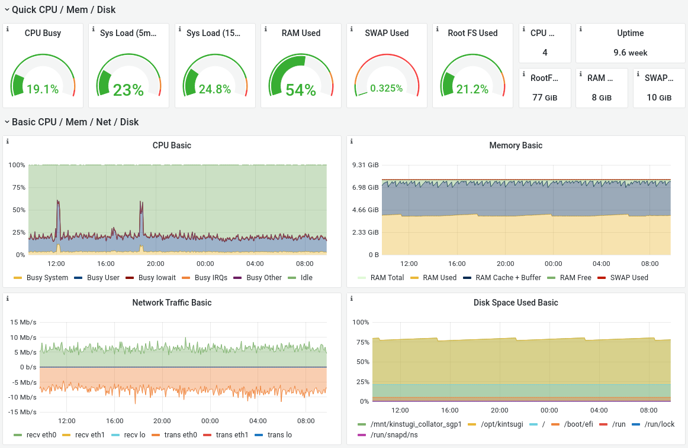
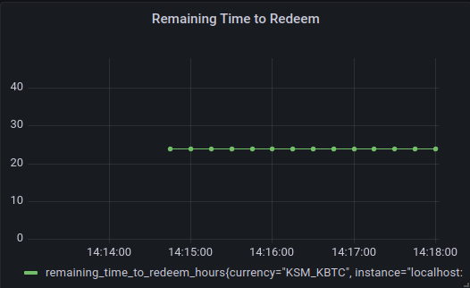

# Operating the Vault Client

Usually, you will not need to interact with your Vault client as it automatically executes its [main tasks](vault/overview?id=what-do-vaults-do).
However, sometimes it is necessary to interact with the Vault client, for example, if you would like to add or withdraw collateral.

At the end of this document you will have:

- [x] [Learned about automatic actions of your Vault](#automatic-actions)
- [x] [Deposited and withdrawn collateral](#collateral)
- [x] [Activated and deactivated the Vault](#activatedeactive-the-vault-for-new-issue-requests)
- [x] [Self-Minted kBTC/iBTC](#self-minting)
- [x] [Visited the Vault dashboard](#dapp-vault-dashboard)
- [x] [Set up Prometheus and Grafana for monitoring your Vault](#prometheus-and-grafana)
- [x] [Supplied additional BTC to cover fees](#bitcoin-fees)
- [x] [Improved the security of your Vault](#security)
- [x] [Left the Interlay/Kintsugi bridge](#leaving-interlaykintsugi)

## Automatic Actions

### Registering The Vault

On start-up, the Valt client will try to automaticlly register itself if you set the flags described in the installation instructions.
While it's possible to manually register the Vault with, e.g., polkadot.js.org/apps, we do not recommend this as it requires manual creation of a BTC master key and submitting the public key in its raw format to the parachain as part of the registration.

### Earning Fees and Block Rewards

The Vault client is automatically receiving fees and block rewards as described in the [Fee Model](vault/overview?id=fee-model).

### Accepting Issue and Redeem Requests

Issue and Redeem requests are processed automatically, signing transactions on the Bitcoin and Interlay/Kintsugi networks using the mnemonic/account credentials you provide to the Vault client when running it.

### Submitting BTC Block Headers

Following the installation instructions, the Vault client will submit new BTC block headers to the parachain contributing to the overall availability of the BTC-Relay.

### Reporting Vault Theft

Following the installation instructions, the Vault client automatically monitors the Bitcoin blockchain for potential theft transactions of other Vaults and will report them to the parachain. A successful theft report results in a reward for the reporting Vault.

### Replace Requests

By default, Vault client will try to accept replace requests by other Vaults to take over their locked BTC. Accepting replace requests increases the relative share of locked BTC for the Vault and hence increases the earned fees and block rewards of the Vault client.

## Collateral

### Increasing Collateral

**Web UI**

Go to the Vault navigation item in the sidebar and click on the `Deposit Collateral` button. Then follow the instructions.

### Withdrawing Collateral

**Web UI**

Go to the Vault navigation item in the sidebar and click on the `Withdraw Collateral` button. Then follow the instructions.

## Activate/Deactive the Vault for new Issue Requests

You can decide if your Vault should accept new issue requests by users.

**Polkadot.js**

1. Go to polkadot.js.org/apps -> extrinsics -> VaultRegistry -> acceptNewIssues
2. Set the collateral and wrapped currency pair (e.g., KSM/KBTC) and if you want to accept new requests (e.g., Yes or No)

## Self-Minting

### Step 1. Create Request via Polkadot.js

The current bridge user interface randomizes Vaults during the issue process.

To mint with your own (or another specific) Vault, you can use the Polkadot.js interface:

1. Select Extrinsics in the Developer tab
2. Select "issue" in the "state query" drop down
3. Select "requestIssue" as the function to be executed
4. Enter your Vault account and the issue amounts.

   -  The BTC amount must be entered with 8 decimals (1 BTC = 100000000)
   -  On Kintsugi, select "KSM" as the collateral token and kBTC as the wrapped token (DOT and interBTC on Interlay)
   -  Enter 1000000000000 (= 1 KINT) as griefing collatral, you will get this back once you complete the issue operation. You can also check see how griefing collateral is needed via the "Issue" UI but 1 KINT will suffice in most cases.


### Step 2. Get BTC Deposit Address and Send BTC

Now you must send the BTC to the Bitcoin address **generated by the parachain**.

!> **Attention**: you **MUST** send the BTC to the **address generated by the system** (derived from your Vault's main BTC account). Otherwise, the issue request will not count! Do not send to the main Bitcoin address!

1.  **To get the BTC deposit address, go to the "Transaction" page on the UI** and find the pending issue request there.


2. Click on it to see the BTC deposit address.


3. Make the BTC transfer. Your Vault will then automatically handle everything else (proof submission,..)

### Why Self-Mint?

You Vault only starts earning rewards once BTC is locked - and rewards are determined by your share of the total BTC locked in the system. Hence, you can increase your rewards by bringing your own BTC into the system.

## Monitoring

Vault operators can monitor their clients using both the [Dapp Vault Dashboard](vault/guide?id=dapp-vault-dashboard) and [Prometheus / Grafana](vault/guide?id=prometheus-and-grafana).

### Dapp Vault Dashboard

You can monitor the operation of your Vault on the Vault dashboard in the Dapp, by adding the key to the [polkadot{.js} extension](https://polkadot.js.org/extension/).

Once the Vault is up and running, a "Vault" tab will appear in the sidebar of the Dapp at [testnet.interlay.io](https://testnet.interlay.io/) (or you can access directly at [testnet.interlay.io/vault](https://testnet.interlay.io/vault)).

### Prometheus and Grafana

!> **Note:** Monitoring with Prometheus is in beta stage and the interface is subject to change. [Check the Prometheus exporter endpoint](#querying-the-prometheus-exporter) to see the currently exposed metrics.

Similar to how Substrate provides functionality for [monitoring Nodes](https://wiki.polkadot.network/docs/maintain-guides-how-to-monitor-your-node), Vault operators have the option to monitor their clients using [Prometheus](https://prometheus.io/) and [Grafana](https://grafana.com/).

The Vault client exposes data such as collateralization, Bitcoin balance, CPU seconds, memory usage of your machine, and more. To monitor this data, Prometheus is used to collect metrics and Grafana for displaying them on a dashboard.

The key used for tracking the metrics is a concatenation of the collateral and wrapped currencies of the client (e.g. "KSM_KBTC"). This allows for tracking clients with different currency combinations in Grafana.

#### Example Visualisation


### Metrics

A list of currently tracked custom metrics can be found [here](https://github.com/interlay/interbtc-clients/blob/61f2ae95d8716a8ac2b3b16d70abf2f91ef0f399/vault/src/metrics.rs#L247). These are in addition to the OS metrics tracked by default by Prometheus, such as CPU seconds, virtual memory bytes, and open file descriptors.

Check the [Prometheus exporter](#querying-the-prometheus-exporter) section to find out how to query all the currently exposed metrics.

Bridge-specific metrics (Collateralization, Locked Collateral, Required Collateral) get updated on each `FeedValues` oracle event. These are quite costly to update as they call parachain RPCs.

### Running instructions

Vault monitoring is enabled by default. The client provides the following configuration flags, identical to the ones used for monitoring Substrate nodes:

```bash
--no-prometheus
   Do not expose a Prometheus metric endpoint
--prometheus-external
   Expose Prometheus exporter on all interfaces.
   Default is local.
--prometheus-port <PROMETHEUS_PORT>
   Specify Prometheus exporter TCP Port
   [default: 9615]
```

If monitoring is enabled, the client will log the metrics endpoint on startup. Below is an example:

```
./vault \
   --bitcoin-rpc-url http://localhost:18332 \
   --keyfile keyfile.json \
   --keyname "0x0e5aabe5ff862d66bcba0912bf1b3d4364df0eeec0a8137704e2c16259486a71" \
   --auto-register-with-faucet-url 'https://api-testnet.interlay.io/faucet' \
   --btc-parachain-url 'wss://api-testnet.interlay.io:443/parachain' \
   --prometheus-external
...
Mar 23 14:25:20.451  INFO vault: Starting Prometheus exporter at http://0.0.0.0:9615
```

#### Querying the Prometheus exporter

To fetch the exported metrics, query the `/metrics` endpoint exposed by the Prometheus exporter with the command below. This will show all the available metrics.

```bash
curl http://HOST_IP:9615/metrics
```

#### Running Prometheus

Configuration files for the Prometheus service are provided in the [interbtc-clients repo](https://github.com/interlay/interbtc-clients/tree/master/vault/src/monitoring).

To customize the configuration of the Prometheus service, edit the `prometheus.yml` file using the command below.

```bash
git clone https://github.com/interlay/interbtc-clients
cd interbtc-clients
vim .deploy/monitoring/prometheus.yml
```

Run the service:

```bash
git clone https://github.com/interlay/interbtc-clients
cd interbtc-clients/.deploy/monitoring
chmod +x download_latest
./download_latest prometheus
./prometheus --config.file=prometheus.yml
```

### Running AlertManager

The Prometheus AlertManager can be configured to send notifications on certain triggers. These include email, Slack, and PagerDuty.

To customize the AlertManager alerting rules, edit `rules.yml`. To customize the destination of the alert, edit `alertmanager.yml`. Check [this guide](https://grafana.com/blog/2020/02/25/step-by-step-guide-to-setting-up-prometheus-alertmanager-with-slack-pagerduty-and-gmail/) for more details about configuring AlertManager.

Once AlertManager is configured, make sure that `prometheus` is installed and you can access the `promtool`. For example in Ubuntu use:

```bash
apt-get install prometheus
```

Then add unit tests to `tests.yml` and run them with:

```bash
promtool test rules test.yml
```

Run the service:

```bash
git clone https://github.com/interlay/interbtc-clients
cd interbtc-clients/.deploy/monitoring
chmod +x download_latest
./download_latest alertmanager
./alertmanager --config.file=alertmanager.yml
```

#### Running Grafana

If the default Prometheus port is used (`9615`), the default instructions from the Grafana docs will work by default: https://grafana.com/docs/grafana/latest/installation/debian

Once Grafana is up and running, [import](https://grafana.com/docs/grafana/latest/dashboards/export-import/#import-dashboard) the [Vault client configuration](../_assets/config/grafana.json  ':ignore') file to see the metrics.

#### Running Node Exporter

For a better overview of the host hardware and kernel, operators are encouraged to monitor more than the OS-level metrics provided by default. Node Exporter is a Prometheus service that can be run to collect such metrics. Follow [this guide](https://prometheus.io/docs/guides/node-exporter/) to set up Node Exporter. We recommend using [this Grafana template](https://grafana.com/grafana/dashboards/1860) to visualise the metrics collected by Prometheus.



### Questions monitoring aims to answer

#### How can I know if my client is offline?

When the Vault client crashes, the metrics endpoint will not reachable any longer. This means that the Grafana dashboard will stop showing data points,
as in the screenshot below (yellow line). This behaviour can be observed for all Grafana tiles on a crash.


#### How can I know if a redeem request is about to expire?

The *Remaining Time to Redeem* tile displays the time, in hours, left to execute the oldest redeem request with the vault. After this period elapses, the vault will get slashed. If there is no open redeem request, the default value of this metric is 24. The default AlertManager rules configuration in this documentation sends an alert when there is one hour left to execute (see [here](https://github.com/interlay/interbtc-clients/blob/d585af332d33ae763c1941eed5d63e73fe61ab52/.deploy/monitoring/rules.yml#L14)).



## Bitcoin Fees

It is the responsibility of the Vault operator to ensure that they can cover excess Bitcoin fees when spending from additional UTXOs. To do this they can list addresses held by their wallet and transfer BTC from an [external source](https://bitcoin.org/en/exchanges).

<!-- tabs:start -->

#### **Regtest**

```shell
bitcoin-cli -regtest -rpcwallet=interbtcvault listaddressgroupings
```

#### **Testnet**

```shell
bitcoin-cli -testnet -rpcwallet=interbtcvault listaddressgroupings
```

#### **Mainnet**

```shell
bitcoin-cli -rpcwallet=interbtcvault listaddressgroupings
```

<!-- tabs:end -->

## Security

### Encrypting Bitcoin Keys

For added security, you may want to encrypt the Bitcoin wallet with a password.

<!-- tabs:start -->

#### **Regtest**

```shell
bitcoin-cli -regtest -rpcwallet=interbtcvault encryptwallet "password"
bitcoin-cli -regtest -rpcwallet=interbtcvault walletpassphrase "password" 100000000
```

#### **Testnet**

```shell
bitcoin-cli -testnet -rpcwallet=interbtcvault encryptwallet "password"
bitcoin-cli -testnet -rpcwallet=interbtcvault walletpassphrase "password" 100000000
```

#### **Mainnet**

```shell
bitcoin-cli -rpcwallet=interbtcvault encryptwallet "password"
bitcoin-cli -rpcwallet=interbtcvault walletpassphrase "password" 100000000
```

<!-- tabs:end -->

This will keep the decryption key in memory for the specified timeout - in this example 100000000 seconds or 3 years.
Once this timeout expires (or if the node is terminated) the wallet must be unlocked manually.

## Leaving Interlay/Kintsugi

The process to leave Interlay/Kintsugi depends on whether or not your Vault client holds BTC in custody.

If you Vault has _no BTC in custody_, you can withdraw all your collateral at any time and leave the system. It is safe to stop the Vault client without risking being penalized. You will not participate in any issue or redeem requests once you have removed your collateral.

If your Vault clients holds at least _some BTC in custody_, you have two options to leave the system. Both options require that the BTC that you have in custody is moved.

- **Replace**: leaving through _replace_, requires you to request being replaced by another Vault. You can request to be replaced through the Vault dashboard by replace 100% of the BTC that is locked with the Vault and waiting for other Vaults to accept the request. Once the replace request is accepted, your Vault client will execute the replace request by sending BTC to the accepting Vault and executing the request on the parachain.
- **Redeem**, leaving through _redeem_ requires you to wait for a user or yourself to redeem the entire amount of BTC that the Vault has in custody. Only after you have 0 BTC, can the Vault client withdraw its entire collateral. If you redeem with your own Vault, the Vault will not receive fees for this such that 0 BTC remains in your Vault client.

## Replace-By-Fee

When the Bitcoin mempool is significantly congested it may take some time for redeem payments to be included on mainnet. In the worst case this could lead to a theft report on the parachain if the request period has elapsed. For this reason, all transactions made by the Vault should be "bip125-replaceable" to allow Vault operators to set a higher fee.

!> The following instructions are for advanced users only, in most cases the Vault client should automatically bump the fee if required. Manually bumping the fees may cause the wallet to not contain sufficient Bitcoin to fulfil future redeem requests. It may also be a possibility to consider third-party transaction acceleration services.

Note the `$TXID` which is the transaction identifier of that which will be replaced.

### Simple

The easiest way to bump the transaction fees is by using the `bumpfee` command.

```shell
bitcoin-cli bumpfee $TXID
```

This is not recommended however since it may insert an additional (unregistered) change address.

### Advanced

This approach is slightly more involved but the following commands will reduce some overhead.

You will need to set `-rpcwallet` when using `bitcoin-cli`. For example if the transaction was made by your `KSM-KBTC` wallet this should be `$KEYNAME-KSM-KBTC` where `$KEYNAME` is the `AccountId` your Vault would point to.

Before continuing you will need to set the `$CHANGE_ADDRESS` to an address already registered by your Vault. List those addresses and set the `CHANGE_ADDRESS` variable.

```shell
bitcoin-cli listunspent
...

CHANGE_ADDRESS="<INSERT_HERE>"
```

Review the optimal `feeRate` in BTC/kvB and set `$FEE_RATE` (for example `0.0001`).

?> This was only tested on `regtest` so caution is to be advised for `mainnet` usage.

```shell
# get the previous inputs
rawinputs=$(bitcoin-cli decoderawtransaction $(bitcoin-cli getrawtransaction $TXID) | jq '.vin[] | {txid, vout, sequence}' | jq -cs)
# get the previous outputs
rawoutputs=$(bitcoin-cli decoderawtransaction $(bitcoin-cli getrawtransaction $TXID) | jq '.vout[] | {value, address: .scriptPubKey.address} | ({(.address): .value})' | jq -cs)
# use those to create a new transaction
rawtx=$(bitcoin-cli createrawtransaction $rawinputs $rawoutputs)
# fund that tx with a better fee rate
fundedtx=$(bitcoin-cli fundrawtransaction $rawtx "{\"changeAddress\": \"$CHANGE_ADDRESS\", \"feeRate\": $FEE_RATE}" | jq -r .hex)
# sign that with your wallet
signedtx=$(bitcoin-cli signrawtransactionwithwallet $fundedtx | jq -r .hex)
# finally broadcast the replaced tx
bitcoin-cli sendrawtransaction $signedtx
```