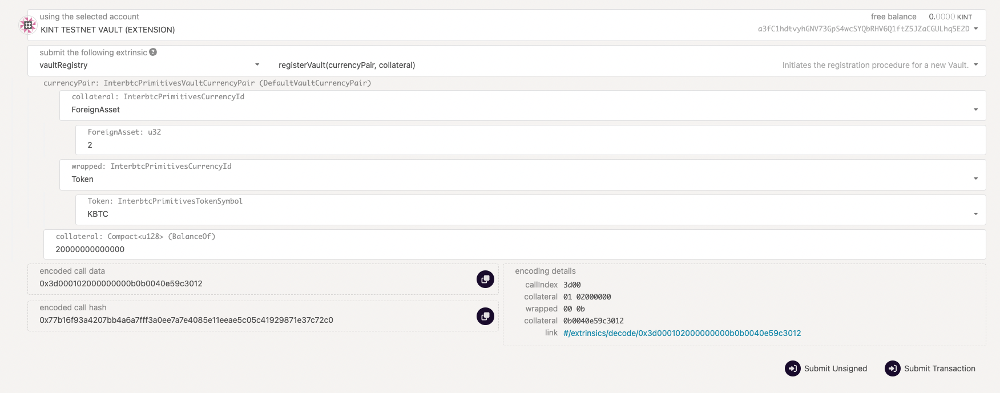
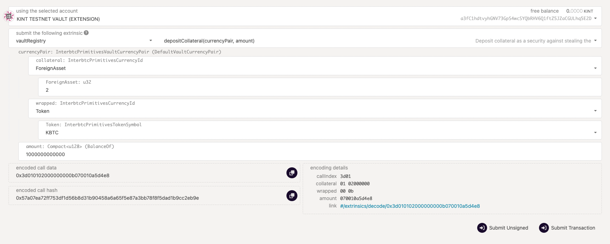

# Operating LKSM vaults through polkadot.js

LKSM Vaults are currently live and enabled on Kusama; they can be initialized both via UI or polkadot.js

At the end of this document you will have:

- [x] [Learned about running multiple collateral vaults](#multiple-collateral-operation)
- [x] [Registered a LKSM vault](#registration)
- [x] [Deposited and withdrawn collateral](#managing-collateral-through-polkadotjs)
- [x] [Observed the pending requests for your vault through Squid](#checking-requests-through-squid)
- [x] [Observed the collateral amount and minted KBTC amount](#viewing-stats-through-polkadotjs)
- [x] [Calculated the collateralization rate of your vault](#calculating-the-collateralization-rate)

## Multiple collateral operation
The Vault client can internally run multiple Vaults with different collateral currencies, while being managed mostly the same way as a single-collateral Vault. However, internally, each Vault is treated as a separate entity on the blockchain. This means:
 * Incoming Issue, Redeem and Replace requests can only be addressed to one Vault and do not affect the other Vaults
 * Collateralization ratios are independent, and must be managed separately
 * If one Vault gets liquidated or banned, any other Vaults running under the same client will not be affected

## Registration
There are two ways to register a Vault: through the `--auto-register` argument when running the client, or through polkadot.js.

### Registering through the CLI
This method is suitable both for adding LKSM if you are already running a KSM vault, or for brand new installations.

Follow the instructions as in [the vault installation guide](vault/installation.md#_5-start-the-vault-client). However, modify the `--auto-register=KSM=3000000000000` argument to specify `LKSM` instead of `KSM` as the currency. Then launch the daemon, or if your vault client is currently running then restart it.

Note that the minimum collateral amount is 20 LKSM, i.e. use no less than `--auto-register=LKSM=20000000000000`.

Note that this argument can also be specified multiple times - however it is no longer necessary after initial registration, so if you are already running a registered KSM vault, you do not need to keep the `--auto-register=LKSM` argument. If you are starting a brand new vault and with to use both collaterals, specify both arguments.

### Registering through polkadot.js
This method is suitable if you are already running a Vault client and wish to register a LKSM Vault using the same account.

1. Go to polkadot.js.org/apps and ensure you have the Kintsugi network selected
2. Click on Developer -> Extrinsics
3. Select your existing Vault account, the `vaultRegistry` pallet and the `registerVault` extrinsic
4. Enter `ForeignAsset` as the collateral, `2` for the u32 value and `KBTC` as the wrapped currency, and the amount of LKSM to use as initial collateral in Planck. 1 LKSM = 10^12 Planck (1000000000000). The minimum collateral amount is 20 LKSM, or 20000000000000 Planck.
5. Sign and submit the transaction

The Vault client running for your account will automatically being to operate the newly registered Vault.


## Managing the Vault via the UI

?> This is still in beta at the moment. Expect missing features and bugs until this feature is officially released on the UI.

Adding an LKSM vault via UI is straightforward if you already have a KSM vault setup. Within the "My Vaults" dashboard, you will see the option to add an LKSM vault either via an LKSM vault card or an "add" option in the table below the cards. 

Once you add the LKSM vault, you will be asked to acceptn the terms and conditions, after which you need to deposit collateral. 
If you do not have any LKSM available on Kintsugi, you can transfer LKSM to the parachain using the [Karura bridge](https://apps.karura.network/bridge). 

## Managing collateral
After adding the LKSM vault if you wish to deposit or withdraw collateral, go to your LKSM vaults page (you can find it in the "My Vaults" page on the Kintsugi dapp) and you will see two buttons for depositing and withdrawing collateral.

### Depositing collateral via polkadot.js
1. Go to polkadot.js.org/apps and ensure you have the Kintsugi network selected
2. Click on Developer -> Extrinsics
3. Select your existing Vault account, the `vaultRegistry` pallet and the `depositCollateral` extrinsic
4. Select `ForeignAsset`as the collateral, `2` for the u32 value and `KBTC` as the wrapped currency, and the amount of LKSM to deposit in Planck. 1 LKSM = 10^12 Planck (1000000000000).
5. Sign and submit the transaction



### Withdrawing collateral
Follow the steps as above, except select the `withdrawCollateral` extrinsic at step 3. Then enter the amount of collateral you would like to withdraw.

## Checking requests through Squid
Pending the UI upgrade, checking Issues and Redeems against your Vault will require issuing a manual GraphQL query against our indexing service. This can be found at https://api-kusama.interlay.io/graphql/graphql.

### Issue requests
Enter the following query to view the Issue requests against your vault:

```
{
  issues(where: {vault: {accountId_eq: "enter your account ID between these quotes, e.g. a3addPTx9ngWGKq3dguw7vs7NA2PimcDUHWJ32HsuoFL74zdo", collateralToken_eq: KINT}}) {
    id
    status
    userParachainAddress
    griefingCollateral
    vaultBackingAddress
    request {
      amountWrapped
      height {
        active
      }
      backingHeight
      timestamp
    }
    execution {
      timestamp
      amountWrapped
      bridgeFeeWrapped
      height {
        active
      }
    }
    cancellation {
      timestamp
      height {
        active
      }
    }
  }
}
```

Edit the string after `accountId_eq` to match the account ID of your vault. Press the Play button above the query editing field to run the query.

 * The `request` field contains the data about the request the user has submitted.
 * The `execution` field will be `null` until the Issue request has been executed. After execution, it will contain the details of the execution - including potentially a different KBTC amount (`amountWrapped`), in case the user underpaid or overpaid.
 * The `cancellation` field will similarly be `null` unless the request has expired and has been cancelled.

The information otherwise matches what you would normally see in the tables in our UI dashboards.

To view any BTC transactions associated with a request, enter the value for the `vaultBackingAddress` into a BTC blockchain explorer - this is the address (unique for every Issue request) that the user is required to send their BTC to.

You can additionally filter requests by status (or any number of other fields, if you are comfortable with  GraphQL). For example, to view only pending requests, change the first line of the query to be:

```
  issues(where: {vault: {accountId_eq: "<address here>", collateralToken_eq: KINT}, status_eq: Pending}) {
```

### Redeem requests

The process for Redeem requests is near-identical. Use the following query:

```
{
  redeems(where: {vault: {accountId_eq: "your account ID here", collateralToken_eq: KINT}}) {
    id
    status
    bridgeFee
    btcTransferFee
    collateralPremium
    userBackingAddress
    userParachainAddress
    request {
      timestamp
      requestedAmountBacking
      height {
        active
      }
    }
    execution {
      timestamp
      height {
        active
      }
    }
    cancellation {
      timestamp
      slashedCollateral
      reimbursed
      height {
        active
      }
    }
  }
}
```

Here, the `userBackingAddress` is the BTC address that the Redeem request will be paid out to. `collateralPremium` contains the owed premium in case this was a premium redeem - it will be 0 otherwise. The `cancellation` field contains some extra data - `reimbursed` will be `true` if the user chose to burn their KBTC for collateral, or `false` if the user chose to retry instead.

## Viewing stats through polkadot.js
In polkadot.js, you can view some information about the current state of your vault.

### Viewing locked KBTC (and other information)
1. Go to polkadot.js.org/apps and ensure you have the Kintsugi network selected
2. Click on Developer -> Chain State
3. Select your existing Vault account, the `vaultRegistry` pallet and the `vaults` query
4. Enter `ForeignAsset` as the collateral, `2` for the u32 value and `KBTC` as the wrapped currency
5. Click the `+` icon in the top-right of the screen.

This will show you the on-chain data about the vault, including:
 * The status
 * Whether it has been banned, and if so, for how long
 * The amount of issued KBTC held (in Satoshi)
 * The amount of KBTC in currently pending Issue and Redeem requests
 * Information about Replaces and liquidation, if any has happened

### Viewing currently locked collateral
1. Go to polkadot.js.org/apps and ensure you have the Kintsugi network selected
2. Click on Developer -> Chain State
3. Select your existing Vault account, the `vaultStaking` pallet and the `nonce` query
4. Enter `ForeignAsset` as the collateral, `2` for the u32 value and `KBTC` as the wrapped currency
5. Click the `+` icon in the to-right to run the query, and note down the number returned
6. Switch to the `totalCurrentStake` query
7. Enter the nonce you found in step 5 as the first argument ("u32"); enter `ForeignAsset` as the collateral, `2` for the asset's u32 value and `KBTC` as the wrapped currency
5. Click the `+` icon in the top-right of the screen.

This will return your current locked collateral amount, in LKSM multiplied by 10^30 (1000000000000000000000000000000) (or equivalently, in Planck multiplied by 10^18).

## Calculating the collateralization rate
You can easily check your collateralization rate by visiting your LKSM vault page

### Viewing collateralization through Prometheus
If your Vault has [Prometheus and Grafana set up](vault/guide.md#prometheus-and-grafana), then you can view the collateralization rate in the Grafana dashboard.

### Calculating collateralization manually through polkadot.js
If you are not running Prometheus, you can calculate the collateralization rate manually using on-chain data directly.

1. Perform the steps, detailed above, to [obtain the locked KBTC amount and locked collateral of your vault](#viewing-stats-through-polkadotjs). Ensure you convert the values from Plank to LKSM (divide by 10^12) and from Satoshi to KBTC (divide by 10^8).
2. Similarly, query the `oracle` pallet for the `aggregate` value, and enter "ExchangeRate", "Token" and "KINT" as the parameters.
3. Divide the returned value by 10^22 to obtain the exchange rate. For example, for a return of `80,250,381,189,311,293,237,950,000`, the exchange rate is approximately 8025.038.
4. Use the following formula: `collateralization = collateral / exchangeRate / KBTC`. For example, for a vault with 16050 LKSM of collateral locked, 0.5 KBTC issued, and an exchange rate of 8025, the collateralization rate will be 16050 / 8025 / 0.5 = 4, or 400%.
