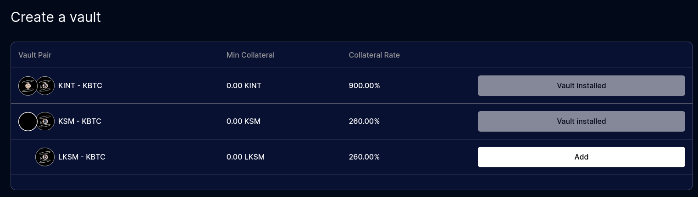
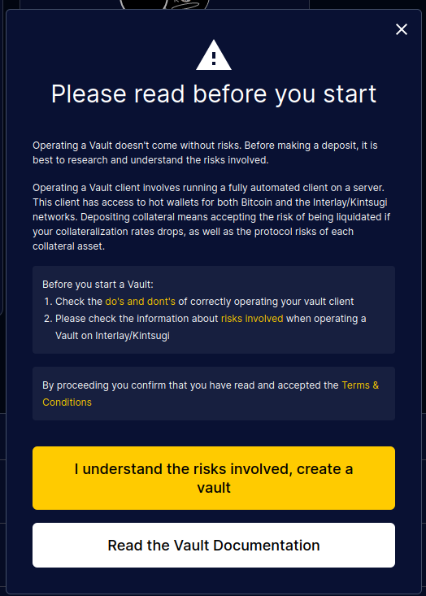
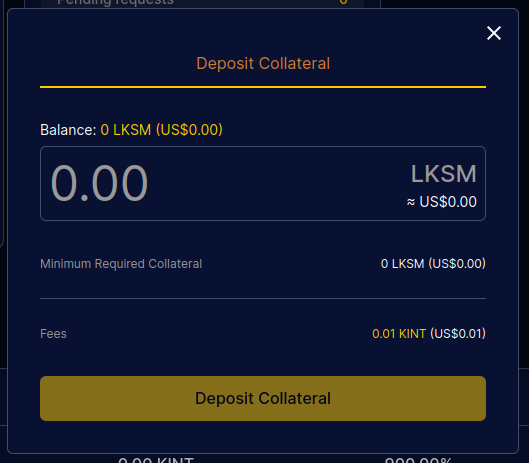
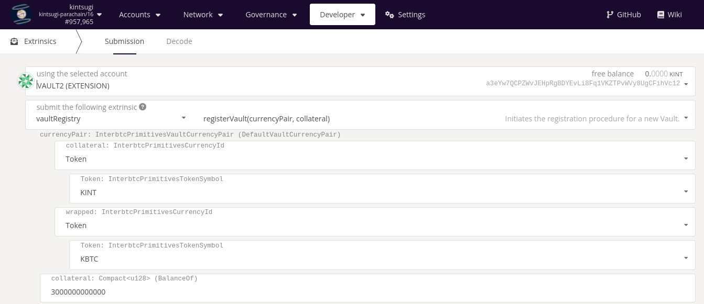
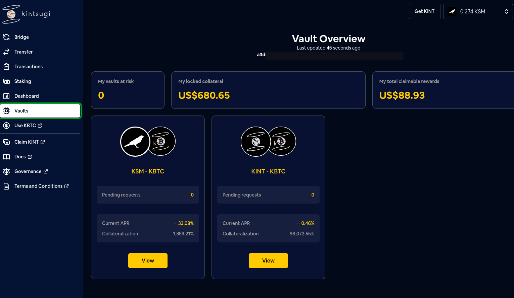

# Multi-Collateral Vaults

A single Vault account can support more than one collateral asset.

Follow this guide to add more collateral assets:

- [x] [Learn about how multi-collateral Vaults work](#multi-collateral-operation)
- [x] [Transfer foreign assets](#transfer-foreign-assets)
- [x] [Register a new collateral asset](#registration)
- [x] [Manage a multi-collateral Vault](#managing-a-multi-collateral-vault)

## Multi-Collateral Operation

The [installed Vault client](vault/installation.md) supports multiple collateral currencies, while being managed the same way as a single-collateral Vault.

Multi-collateral Vaults have isolated collateral positions:

- Incoming Issue, Redeem and Replace requests can only be addressed to one collateral asset and do not affect the other collateral assets
- Collateralization ratios are independent, and must be managed separately
- If one collateral asset gets liquidated or banned, any other collateral assets managed under the same account will not be affected

## Transfer Foreign Assets

**Web UI**

Follow the guide for [cross-chain transfers](guides/transfers?id=cross-chain-transfers).

**Third Party Applications**

Use the following third party applications to bring in collateral assets from other chains.

- Interlay <> Moonbeam: https://apps.moonbeam.network/moonbeam
- Interlay <> Acala: https://apps.acala.network/bridge
- Kintsugi <> Moonriver: https://apps.moonbeam.network/moonriver
- Kintsugi <> Karura: https://apps.karura.network/bridge

## Registration

There are three ways to register a Vault:

1. **Vault dashboard**: Add new collateral assets via the [Vault dashboard](vault/guide?id=visit-your-vault-dashboard)
2. **CLI argument**: Add the `--auto-register` argument when (re)starting the Vault client
3. **(Advanced) Polkadot.js**: or through polkadot.js.

Each approach is explained below.

?> It does not matter in which way new collateral assets are registered. The Vault client will pick up the new collateral asset with either approach.

?> Ensure that the Vault account has sufficient balance for each token that is going to be registered as collateral. If the Vault account does not have sufficient tokens, the registration will fail.

### 1. Registering through the Vault dashboard

?> This method is suitable if you are already running a Vault client and wish to register a Vault using the same account.

#### Navigate to "Create a Vault" and Add

Click on the "Add" button next to the collateral asset you wish to register.



#### Make sure to understand the riks



#### Deposit collateral

Deposit collateral in the new collateral assets. Once this is done, the new collateral Vault will appear in the cards in the Vault dashboard.



### 2. Registering through the CLI

?> This method is suitable both for adding a new collateral asset if you are already running a Vault, or for brand new installations.

Follow the instructions as in [the vault installation guide](vault/installation.md#_5-start-the-vault-client).

For each collateral asset that should be registered, add the auto register flag with the token name and the amount of collateral in its smallest denomination, e.g., `--auto-register=LKSM=20000000000000`.

```sh
vault \
  --bitcoin-rpc-url http://localhost:8332 \
  --bitcoin-rpc-user <INSERT_CUSTOM_USERNAME> \
  --bitcoin-rpc-pass <INSERT_YOUR_PASSWORD> \
  --keyfile keyfile.json \
  --keyname <INSERT_YOUR_KEYNAME, example: 0x0e5aabe5ff862d66bcba0912bf1b3d4364df0eeec0a8137704e2c16259486a71> \
  --auto-register=KSM=3000000000000 \
  # newly added collateral assets here
  --auto-register=LKSM=20000000000000 \
  --btc-parachain-url 'wss://api-kusama.interlay.io:443/parachain'
```

Note that the `auto-register` argument can be specified multiple times. After the specific collateral asset is registered, the `auto-register` argument is no longer necessary and can be safely removed.

### 3. (Advanced) Registering through polkadot.js

?> This method is suitable if you are already running a Vault client and wish to register a Vault using the same account.

1. Go to polkadot.js.org/apps and ensure you have the right network selected, e.g., Kintsugi, Interlay, or one of the testnets.
2. Click on Developer -> Extrinsics
3. Select your existing Vault account, the `vaultRegistry` pallet and the `registerVault` extrinsic
4. Enter the collateral currency and the wrapped currency pair plus the minimum amount of collateral

  a. **Collateral currency**: select the collateral currency. For Kintsugi/Interlay native assets, select e.g., `Token.KSM` or `Token.KINT`. For foregin assets from other parachains, select `ForeignAsset` and the number of the foreign asset. See [this overview for all foreign assets](developers/api?id=overview-of-assets-in-the-assetregistry-pallet). *Example:* `LKSM` is `ForeignAsset.2`.
  b. **Wrapped currency**: select `Token.KBTC` on Kintsugi or `Token.IBTC` on Interlay
  c. **Minimum collateral**: select the [minimum collateral amount](vault/overview?id=minimum-collateral) and convert this to the smallest denomination. *Example:* 1 LKSM = 10^12 Planck (1000000000000). The minimum collateral amount is 20 LKSM, or 20000000000000 Planck.

5. Sign and submit the transaction

The Vault client running for your account will automatically begin to operate the newly registered collateral asset.



## Managing a Multi-Collateral Vault

Each registered collateral asset for your Vault has its own card in the Vault dashboard. All [Vault guides](vault/guide) are applicable to multi-collateral Vaults.

To view each collateral asset Vault, click on the "View" button on each card.



